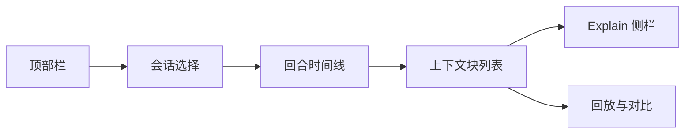
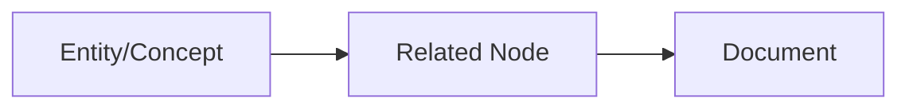

# Agent 上下文面板规范（Agent_Context_UI）

> 文档状态：Final v1.0  
> 维护者：PowerX CoreX 团队  
> 上次更新：2025-10-13

---

## 1. 目标与范围

- 面向运营/开发者，观察与调试智能体对话中**上下文注入**的全过程（检索 → 重排 → 图谱 → 拼装）。
- 提供**可解释**视图：`scores/explain`、来源锚点、图谱增益、参数覆盖。
- 支持**回放与对比**：不同参数下的上下文选择、答案差异。

---

## 2. 信息架构



**模块说明**

- **顶部栏**：租户/空间/环境切换，`trace_id` 展示，时间窗筛选。
- **会话选择**：按 `conversation_id`/用户/渠道搜索。
- **回合时间线**：按 turn 展示（T1、T2…），显示每次查询的 `query_id`。
- **上下文块列表**：Top-N 片段卡片（snippet、score、explain、来源）。
- **Explain 侧栏**：分数分解、图谱路径、文档锚点、调参覆盖摘要。
- **回放与对比**：选择两次注入结果并排对比（参数、Top-N 差异）。

---

## 3. 数据契约（展示用字段）

### 3.1 会话与回合

- `trace_id`、`conversation_id`、`turn_no`
- `space_id`、`profile_id`、`override`（JSON 哈希与具体值）
- `query_id`、`query_text`、`created_at`

### 3.2 上下文注入块（Context Block）

```json
{
  "rank": 1,
  "document_id": "d_456",
  "version_no": 3,
  "chunk_id": "c_123",
  "snippet": "……截断后的内容……",
  "highlights": ["关键词1", "关键词2"],
  "score": 0.842,
  "scores": {
    "semantic": 0.91,
    "keyword": 0.62,
    "recency": 0.05,
    "source_boost": 0.3,
    "sensitivity_penalty": 0.0,
    "feedback": 0.02,
    "rerank": 0.12,
    "graph": 0.08
  },
  "explain": "语义为主 + 来源加权 + 近期更新 + 图谱增益",
  "tags": ["media", "config"],
  "source_type": "kb_spec",
  "space_id": "crm_docs",
  "source_link": "powerx://doc/d_456?v=3#c_123"
}
```

> 注：以上对象来自 `/api/v1/knowledge/search` 的 `items[]` 映射或回放快照。

---

## 4. 交互流程

1. 选择会话与回合（turn） → 读取 `query_id` 与 `query_text`。
2. 加载该次注入的 Top-N 片段列表（支持分页与排序）。
3. 点击任一片段 → 右侧打开 Explain 侧栏（显示分数分解与图谱路径）。
4. 可点击“回放”按钮，输入/选择另一组参数覆盖，生成对照结果。
5. 对比视图显示新增/丢失片段、分数变化、答案差异概要。

---

## 5. 上下文块列表（UI 细则）

- **卡片字段**：标题（文档名/ID+版本）、`snippet`、`score`、`source_type`、`tags`。

- **高亮**：展示 `highlights[]`；命中词以下划线或背景高亮。

- **操作**：
  - 打开 Explain 侧栏
  - 打开文档（新页，`powerx://doc/<id>?v=<no>#<chunk>` 或 Admin 文档页）
  - 复制片段
  - 反馈 👍/👎（写入 `/api/v1/knowledge/feedback`）

- **排序**：默认按 `score` 降序；可选“仅语义/仅关键词/时间”。

- **Top-N 控制**：8/12/20；与搜索后台 `k` 同步或二次过滤。

---

## 6. Explain 侧栏

### 6.1 分数分解

表格或图表展示各分量：`semantic`、`keyword`、`recency`、`source_boost`、`sensitivity_penalty`、`feedback`、`rerank`、`graph`，并给出简短文案解释（非公式）。

### 6.2 图谱路径（最多 depth=2）



### 6.3 其他信息

- `document_id / version_no / chunk_id / source_type / tags`
- `profile_id` 与 `override` 摘要（指明本次是否应用了临时覆盖）
- 审计入口：复制 `query_id`、打开回放或审计页

---

## 7. 回放与对比

### 7.1 回放参数

- 可在面板内临时设置：`semantic_weight`、`mmr_beta`、`graph_weight`、`recency_weight`、`rerank.enabled/topk/provider`。
- 仅对回放生效，不更改 Space 默认配置。

### 7.2 对比视图

- **左/右两栏**：原始结果 vs 回放结果。
- **差异标记**：
  - 新增片段（+）/丢失片段（−）
  - 分数变化（↑/↓，显示 Δscore）
  - 答案差异（摘要对比：长度、引用数量、来源覆盖）

---

## 8. API 交互

- **读取注入结果**
  - 方案 A（推荐）：展示当时保存的**快照**（由服务端在检索时落盘）。
  - 方案 B：以 `query_id` 触发**回放**（复用 `GET /api/v1/knowledge/search` 参数），两者呈现一致结构。

- **Graph 联动**
  - `GET /api/v1/knowledge/graph/neighbors?node_id=&depth=1&limit=30`
  - 在 Explain 侧栏异步加载，不阻塞主列表。

- **反馈**
  - `POST /api/v1/knowledge/feedback`，体例：`{query_id, chunk_id, rating, comment?}`
  - 成功后将卡片标记为“已反馈”。

> 所有请求需携带：`Authorization: Bearer <token>` 与 `JWT claims（tid/tenant_uuid）: <uuid>`。

---

## 9. 状态与错误处理

- **加载**：列表与侧栏独立骨架屏；回放过程在对比面板内显示进度。
- **401/403**：弹窗提示；引导重新登录或申请权限。
- **429**：顶部警示“请求过频，已降级”；自动退避并允许手动重试。
- **5xx**：提示“服务异常，已返回缓存或空结果”；保留最近一次成功快照。
- **空结果**：给出建议（放宽过滤、检查空间与权限、适度增大 `k`）。

---

## 10. 遥测与审计

### 10.1 埋点（示例）

- `ui_agent_ctx_open`（携带 `space_id/override_hash`）
- `ui_agent_ctx_replay`（参数集、耗时、是否成功）
- `ui_agent_ctx_compare`（差异统计）
- `ui_agent_ctx_feedback`（rating、chunk_id）

### 10.2 审计字段

- `trace_id`, `conversation_id`, `turn_no`, `query_id`, `space_id`, `profile_id`, `override`（JSON）
- 候选池与注入集合的**摘要**（避免直接落敏感原文）

---

## 11. 权限

- 页面可见：需 `knowledge:search.search`
- 打开文档：需 `knowledge:document.read`（按 space 限定）
- Graph 侧栏：需 `knowledge:graph.read`
- 写反馈：需 `knowledge:search.search`（同路由）

---

## 12. 性能建议

- 同屏最多保留 2 个“进行中的回放/对比”，超出进入排队。
- Explain 按需加载；关闭侧栏即取消未完成请求。
- 缓存：`query_hash + override_hash + page` 在 5 分钟内命中。

---

## 13. 无障碍与国际化

- 键盘可达：`Tab` 导航、`Enter` 操作，`[`/`]` 切换回合。
- ARIA：对列表、按钮、侧栏添加语义标签与 `aria-live`。
- 多语言：文本从 i18n 资源加载（至少 `zh-CN`、`en`）。

---

## 14. 快捷键（建议）

- `Ctrl/⌘ + J`：打开/关闭上下文面板
- `Ctrl/⌘ + E`：打开/关闭 Explain
- `Ctrl/⌘ + R`：回放并生成对比
- `[` / `]`：上一个/下一个回合

```

```
