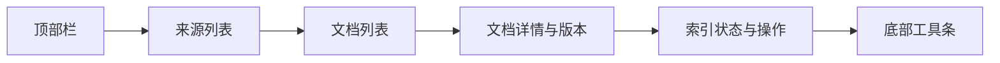

# 文档管理界面规范（Document_Management_UI）

> 文档状态：Final v1.0  
> 维护者：PowerX CoreX 团队  
> 上次更新：2025-10-13

---

## 1. 目标与范围

- 管理知识文档的**来源（Source）**、**上传**、**版本**、**索引状态**与**发布**。
- 支持批量操作（上传/发布/撤销发布/同步）、失败重试与重建索引（Reindex）。
- 提供可观测与审计字段，支撑问题定位与回放。

---

## 2. 页面信息架构



**模块说明**

- **顶部栏**：Space 选择、租户标识、环境标签、批量入口。
- **来源列表**：已注册 Source 的概览（类型、状态、最近同步）。
- **文档列表**：支持过滤与排序，展示文档基础元信息。
- **文档详情与版本**：查看版本时间线、版本差异与属性。
- **索引状态与操作**：解析/分块/向量/关键词/发布的阶段状态与重试操作。
- **底部工具条**：批量上传、同步、发布/撤销、导出。

---

## 3. 主要操作与 API 交互

### 3.1 上传/创建文档

- **API**：`POST /api/v1/knowledge/documents`（multipart 或 JSON）
- **请求头**：`Authorization: Bearer <token>`, `X-PowerX-Tenant: <uuid>`
- **multipart 字段**
  - `file`：二进制文件
  - `metadata`：JSON（`space_id`, `title`, `tags[]`, `sensitivity`, `attributes`）

### 3.2 新版本与发布

- **新版本**：`POST /api/v1/knowledge/documents/{documentID}/versions`
- **发布**：`POST /api/v1/knowledge/documents/{documentID}/publish`
- **删除（软删）**：`DELETE /api/v1/knowledge/documents/{documentID}`（触发向量清理）

### 3.3 来源同步（Source Sync）

- **注册来源**：`POST /api/v1/knowledge/spaces/{spaceID}/sources`
- **列表**：`GET /api/v1/knowledge/spaces/{spaceID}/sources`
- **触发同步**：`POST /api/v1/knowledge/sources/{sourceID}:sync`

### 3.4 重建索引（Reindex）

- 通过“重建”按钮触发后台 Job（实现由后端提供），UI 展示任务进度与结果。

---

## 4. 列表与过滤

### 4.1 来源列表字段

- `id`、`type`（`webhook|file|url|plugin`）、`status`（活跃/暂停/失败）
- `last_sync_at`、`last_sync_result`（成功/失败+错误摘要）
- 操作：**同步** / **编辑** / **停用** / **删除**

### 4.2 文档列表字段

- `id`、`title`、`space_id`、`tags[]`、`version_no`、`status`（草稿/已发布/已删除）
- `updated_at`、`source_type`（来源类别）
- 操作：**查看** / **新版本** / **发布/撤销发布** / **删除** / **重建索引**

### 4.3 过滤与排序

- 过滤：`space_id`、`tags[]`、`source_type`、`status`、时间窗
- 排序：`updated_at`（默认 desc）、`title`、`version_no`

---

## 5. 文档详情与版本视图

### 5.1 版本时间线

- 显示每个版本的 `version_no/created_at/author/change_note/index_state`
- 支持**选择两版对比**（页数、chunk 数、敏感字段变化、主要差异摘要）

### 5.2 索引阶段看板


- 每个阶段显示：状态（待处理/进行中/成功/失败）、耗时、失败原因（如有）。
- 提供阶段级**重试**（例如仅重试向量阶段）。

### 5.3 文档属性与敏感级

- 可查看/编辑：`title`、`tags[]`、`sensitivity`、`attributes`（自定义 kv）
- 展示：`document_id`、`space_id`、`source_type`、`version_no`

---

## 6. 批量操作

- **批量上传**：拖拽或选择多文件（并发受限，显示逐项进度与失败原因）。
- **批量发布/撤销**：多选后操作；若遇失败项，保留成功项并汇总错误报告。
- **批量同步**：对选中来源执行同步；显示整体与逐项进度。
- **批量重建索引**：限量触发，排队执行，避免资源抢占。

---

## 7. 错误与降级

| 场景                  | 表现                            | 处理建议                           |
| --------------------- | ------------------------------- | ---------------------------------- |
| 解析失败（Parse）     | 阶段标红，错误摘要可展开        | 提供“重新上传/重试解析”            |
| 向量失败（Embed）     | 显示依赖错误（模型/服务不可用） | 重试或切换向量后端（后台配置）     |
| 关键词失败（Keyword） | 标红并显示索引器错误            | 重试或联系运维                     |
| 发布失败（Publish）   | 显示冲突/权限问题               | 校验权限、检查版本状态             |
| 同步失败（Source）    | 来源卡片标红                    | 显示最后一次失败日志，支持一键重试 |

- 速率限制：遇到 `429`，UI 顶部提示“请求过频”，自动退避并允许手动重试。
- 服务异常：遇到 `5xx`，提示“已降级或返回缓存结果”，可稍后重试。

---

## 8. 权限与审计

### 8.1 权限需求

- 查看：`knowledge:document.read`
- 上传/新版本/删除：`knowledge:document.update|delete`
- 发布：`knowledge:document.publish`
- 来源操作：`knowledge:space.update`

### 8.2 审计字段

- 操作者、时间、动作（上传/新版本/发布/删除/同步/重建索引）
- 目标对象（`document_id/version_no` 或 `source_id`）
- 结果（成功/失败 + 摘要）、`trace_id`
- 差异摘要（版本对比的主要变化项）

---

## 9. 遥测与性能

- 埋点：
  - `ui_doc_upload_start/success/fail`
  - `ui_doc_publish`、`ui_doc_reindex`、`ui_source_sync`

- 指标：平均上传时长、索引阶段耗时、失败率、重试次数
- 性能：
  - 上传与索引任务并发可配置，避免阻塞前端
  - 列表数据分页与增量刷新（长列表虚拟化）

---

## 10. 空状态与骨架屏

- **空来源**：引导注册来源（Webhook/URL/插件/文件）。
- **空文档**：引导上传文件或从来源同步。
- **骨架屏**：列表与详情在加载时显示占位，不阻塞其他操作。

---

## 11. 国际化与无障碍

- 所有文本经 i18n 管理（至少 `zh-CN`、`en`）。
- 键盘可操作：`Tab` 导航、`Enter` 确认、`Esc` 关闭弹窗。
- ARIA：列表、对话框与进度条添加语义属性与 `aria-live`。

---

## 12. 示例对象（简化）

### 12.1 文档列表项

```json
{
  "id": "d_456",
  "space_id": "crm_docs",
  "title": "媒体存储配置",
  "tags": ["media", "config"],
  "version_no": 3,
  "status": "published",
  "updated_at": "2025-10-12T12:30:00Z",
  "source_type": "kb_spec"
}
```

### 12.2 版本项

```json
{
  "version_no": 3,
  "created_at": "2025-10-12T10:00:00Z",
  "author": "ops@powerx",
  "change_note": "更新 S3 策略章节",
  "index_state": {
    "parse": "success",
    "chunk": "success",
    "embed": "success",
    "keyword": "success",
    "validate": "success",
    "publish": "success"
  }
}
```

---

## 13. 相关接口

- 上传/创建：`POST /api/v1/knowledge/documents`
- 新版本：`POST /api/v1/knowledge/documents/{documentID}/versions`
- 发布：`POST /api/v1/knowledge/documents/{documentID}/publish`
- 删除：`DELETE /api/v1/knowledge/documents/{documentID}`
- 来源：`POST|GET /api/v1/knowledge/spaces/{spaceID}/sources`
- 同步：`POST /api/v1/knowledge/sources/{sourceID}:sync`

```

```
