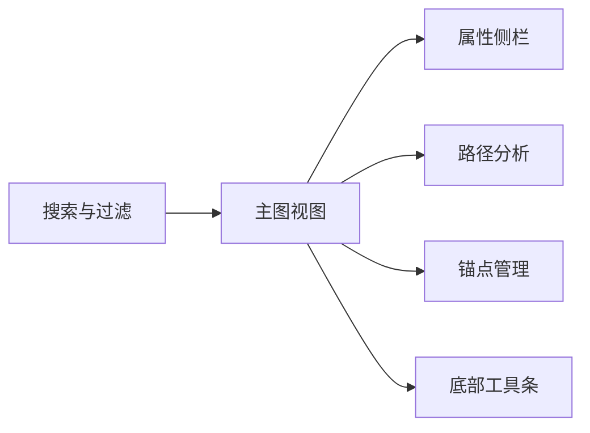
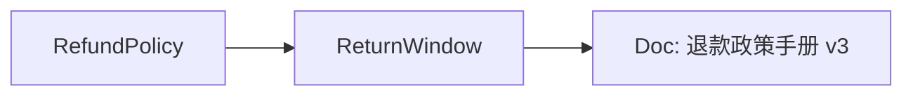

# 图谱可视化规范（Graph_Visualization）

> 文档状态：Final v1.0  
> 维护者：PowerX CoreX 团队  
> 上次更新：2025-10-13

---

## 1. 目标与范围

- 在 PowerX Web Admin 中直观呈现 **实体（entity）/概念（concept）/文档（document）** 之间的关系。
- 支持 **邻居拓展**、**路径分析**、**属性编辑（只读或受限写）**、**锚点（Workflow Anchor）管理**。
- 为检索调参与问题定位提供**可解释证据**（图谱增益）。

---

## 2. 典型场景

- **定位主题域**：从实体/概念出发，查看相关文档覆盖程度与连接强度。
- **解释召回**：回溯一次查询命中的片段与其关联实体/概念，说明`graph`分项分数来源。
- **流程锚点**：为常用实体/概念配置 Workflow Anchor，供工作流节点引用。
- **质量治理**：发现孤立节点、过密星团、重复概念，驱动清洗与合并。

---

## 3. 页面信息架构



**模块说明**

- **搜索与过滤**：按 `q`（名称/别名）、`type`（entity/concept/document）检索；过滤 `tags`、`degree`、`sensitivity`。
- **主图视图**：力导或层次布局；节点着色/形状按类型区分；边宽/透明度代表权重。
- **属性侧栏**：展示所选节点/边的元数据、关联文档列表、敏感级等。
- **路径分析**：选择起点与终点，查看 `max_depth` 内可达路径（按权重/长度排序）。
- **锚点管理**：为节点配置/取消 Workflow Anchor（仅具备权限的用户可操作）。
- **底部工具条**：缩放、布局重置、导出图快照（PNG/SVG）、导出节点/边列表（CSV）。

---

## 4. 交互细则

### 4.1 主图

- **点击节点**：高亮节点与 1 跳边；右侧打开属性侧栏。
- **双击节点**：触发**邻居拓展**（`depth=1`；可在工具栏调整为 2）。
- **拖动节点**：局部调位；“布局重置”可恢复初始布局。
- **多选**：按住 `Shift` 框选或点选；支持批量操作（如批量创建锚点）。
- **边信息**：悬停显示权重/来源；点击边打开边属性（只读）。

### 4.2 邻居拓展

- 默认 `depth=1`、`limit=30`；可在工具条调整 `limit`（10/30/50/100）。
- 同一节点重复拓展时进行**去重**与**增量渲染**；提供“折叠/展开子图”。

### 4.3 路径分析

- 支持从主图中选定 **起点** 与 **终点**（两节点）。
- 右侧面板显示前 `N` 条路径（默认 5），并可在主图上高亮其中一条。
- 排序策略可选：最短（跳数）、最大总权重、平均权重。

### 4.4 锚点管理（Anchor）

- 在节点侧栏点击“设为锚点” → 选择或输入锚点 key（如 `policy.refund`）。
- 保存成功后该节点显示锚点徽标；锚点列表可筛选、删除或重命名。
- 后端 API：`POST /api/v1/knowledge/graph/anchors`（写能力按版本/阶段开放）。

---

## 5. 数据契约与 API

### 5.1 搜索节点

**HTTP**

```
GET /api/v1/knowledge/graph/nodes?q={kw}&type={entity|concept|document}&page=1&page_size=20
Headers: Authorization（租户由 JWT claims 提供）
```

**返回（节点列表项）**

```json
{
  "id": "entity:RefundPolicy",
  "type": "entity",
  "name": "退款政策",
  "properties": {
    "alias": ["退货政策"],
    "sensitivity": "normal",
    "degree": 12
  },
  "tags": ["policy", "finance"]
}
```

### 5.2 邻居拓展

**HTTP**

```
GET /api/v1/knowledge/graph/neighbors?node_id={id}&depth=1&limit=30&types[]=entity&types[]=document
```

**返回**

```json
{
  "center": {
    "id": "entity:RefundPolicy",
    "type": "entity",
    "name": "退款政策"
  },
  "neighbors": [
    {
      "id": "concept:ReturnWindow",
      "type": "concept",
      "name": "退货时限",
      "weight": 0.74
    },
    {
      "id": "doc:d_456",
      "type": "document",
      "name": "退款政策手册 v3",
      "weight": 0.62
    }
  ]
}
```

### 5.3 路径分析

**HTTP**

```
GET /api/v1/knowledge/graph/paths?src_id={id1}&dst_id={id2}&max_depth=3
```

**返回**

```json
{
  "paths": [
    {
      "nodes": [
        { "id": "entity:RefundPolicy", "type": "entity", "name": "退款政策" },
        { "id": "concept:ReturnWindow", "type": "concept", "name": "退货时限" },
        { "id": "doc:d_456", "type": "document", "name": "退款政策手册 v3" }
      ]
    }
  ]
}
```

### 5.4 锚点管理（可选）

**HTTP**

```
POST /api/v1/knowledge/graph/anchors
Body: { "node_id": "entity:RefundPolicy", "anchor_key": "policy.refund", "op": "upsert|delete" }
```

---

## 6. 显示与样式规范

### 6.1 节点

- **形状**：entity=圆，concept=菱形，document=矩形（或带文档图标）。
- **颜色**：按类型区分；敏感级（`sensitivity=high/critical`）在边框上显眼警示。
- **大小**：与 `degree` 或 `pagerank` 成正比（设置范围避免过大/过小）。

### 6.2 边

- **线宽/透明度**：与 `weight` 正相关；阈值过滤开关（隐藏弱边）。
- **方向**：默认无向；若存在语义方向可开启箭头显示。

### 6.3 标签与悬浮

- 节点标签显示 `name`；较长名称截断并提供悬浮全文。
- 悬浮卡片：显示关键属性摘要（类型、敏感级、度、锚点标识等）。

---

## 7. 属性侧栏（字段）

**节点字段**

- 基本：`id/type/name/tags[]`
- 属性：`properties`（如别名、描述、权重、创建/更新时间）
- 图谱指标：`degree/betweenness/pagerank`（如有）
- 敏感级：`sensitivity`（normal/high/critical）
- 关联文档：列表（`document_id/title/version_no/updated_at`）
- 锚点：`anchor_key`（有则显示徽标与操作）

**边字段（只读）**

- `src_id/dst_id/type/weight/source`（来源渠道）

---

## 8. 权限与审计

- **读取**：`knowledge:graph.read`
- **锚点写入**：`knowledge:graph.update`
- 审计日志记录：查看/创建/删除锚点、拓展操作频次、导出行为（包含 `trace_id`、操作者、对象、结果）。

---

## 9. 错误与降级

- 邻居接口失败：提示“图谱服务暂不可用”，主图保留已加载部分；路径与锚点面板置灰。
- 路径计算超时：显示“超时，建议降低 max_depth 或缩小范围”。
- 权限不足：弹窗提示并隐藏相关操作按钮。
- 速率限制：遇 `429` 顶部条提示并自动退避；允许手动重试。

---

## 10. 性能与优化

- **渐进加载**：首次仅渲染中心节点及首批邻居；滚动或交互时增量渲染。
- **抽样与聚合**：度极高节点默认聚合展示；点击展开。
- **帧率保护**：大图场景启用 WebGL/Canvas 渲染；限制一次绘制元素数量。
- **缓存**：`neighbors(node_id, depth, limit, types)` 作为缓存键；5 分钟有效。

---

## 11. 国际化与无障碍

- 所有 UI 文案支持 i18n（至少 `zh-CN`、`en`）。
- 键盘操作：方向键移动焦点、`Enter` 打开侧栏、`Esc` 关闭。
- ARIA：为画布、侧栏、按钮添加语义标签；放大镜与颜色对比符合 WCAG AA。

---

## 12. 示例可视化（安全 Mermaid）



---

## 13. 相关接口速查

- **节点搜索**：`GET /api/v1/knowledge/graph/nodes`
- **邻居拓展**：`GET /api/v1/knowledge/graph/neighbors`
- **路径分析**：`GET /api/v1/knowledge/graph/paths`
- **锚点管理**：`POST /api/v1/knowledge/graph/anchors`
- **权限**：`knowledge:graph.read|update`
