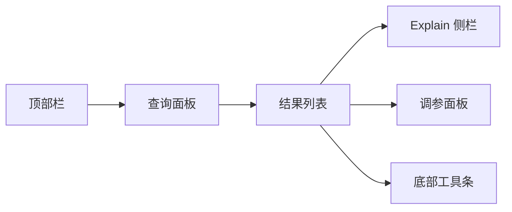

# 管理台检索界面规范（Knowledge_Query_UI）

> 文档状态：Final v1.0  
> 维护者：PowerX CoreX 团队  
> 上次更新：2025-10-13

---

## 1. 目标与范围

- 面向 Admin/运营：用于 **检索验证、Explain 调参、问题定位与审计追踪**。
- 与后端契约对齐：仅调用 `/api/v1/knowledge/...` 与 `knowledge.v1` gRPC（本文以 HTTP 为例）。
- **不改默认策略**：调参采用 `rank_profile_override`，仅对当前查询生效。

---

## 2. 页面信息架构



````

**模块说明**

- **顶部栏**：空间选择、租户标识、环境标签（prod/stg）、时间窗。
- **查询面板**：搜索框 + 高级筛选（标签、来源、敏感级、时间、实体）。
- **结果列表**：Top-N 片段卡片，支持排序/分页/反馈。
- **Explain 侧栏**：分数分解、图谱路径、来源锚点、审计跳转。
- **调参面板**：本次查询的覆盖参数（semantic/mmr/graph/rerank 等）。
- **底部工具条**：Top-N、分页、导出、保存查询（生成 `query_id`）、回放入口。

---

## 3. 查询面板（Search Panel）

### 3.1 基础元素

- **Space**（必选）：下拉（`space_id`）。
- **查询输入**：文本框，支持历史记录与快捷键 `Ctrl/⌘ + Enter` 执行。
- **执行**/**清空** 按钮。

### 3.2 高级筛选（折叠）

- **标签**：`filters.tags[]`
- **来源类型**：`filters.source_types[]`（如 `kb_spec/policy/faq/web`）
- **敏感级上限**：`filters.sensitivity_max`（`normal|high|critical`）
- **时间窗**：最近 7/30/90 天或自定义（仅用于 UI 展示/Explain）
- **实体/概念**（可选联动图谱）：输入即搜，建议集成 `/graph/nodes`

### 3.3 调参覆盖（轻量版）

- `semantic_weight`（默认 0.65）
- `mmr_beta`（默认 0.7）
- `graph_weight`（默认 0.15）
- `recency_weight`（默认 0.02 建议）
- `rerank.enabled/topk/provider`

> 面板底部明确提示：“**仅对本次查询生效**，不保存到空间默认配置。”

---

## 4. 结果列表（Results）

### 4.1 卡片字段

- **标题**：文档标题（或 ID），附 `version_no` 与片段锚点。
- **摘要**：`text_snippet`（按字符/Token 截断）。
- **高亮**：`highlights[]`。
- **得分**：主分 `score`；悬浮展示分量概览。
- **标签与来源**：`tags[]`、`source_type`、`space_id`。
- **操作**：
  - “查看详情”（打开 Explain）
  - “打开文档”（`powerx://doc/<id>?v=<no>#<chunk>` 或 Admin 文档页）
  - “复制片段”
  - 反馈 👍/👎（写 `/api/v1/knowledge/feedback`）

### 4.2 排序/分页/Top-N

- **排序**：默认 `score desc`；可切换“按 semantic/keyword/recency”。
- **Top-N**：8/12/20（与后端 `k` 同步，或作为二级过滤）。
- **分页**：`page/page_size` 保持调参覆盖不丢失。

---

## 5. Explain 侧栏（Explain Panel）

### 5.1 分数分解

- 展示 `scores`：`semantic/keyword/recency/source_boost/sensitivity_penalty/feedback/rerank/graph`。
- `explain`：自然语言摘要，说明命中原因与策略影响。

### 5.2 图谱路径（可选）

```mermaid
flowchart LR
    A[Query Entity]
    B[Related Concept]
    C[Document]
    A --> B
    B --> C
````

- 数据来源：`GET /api/v1/knowledge/graph/neighbors`（depth≤2），或从检索返回的 `graph` 证据（如有）。

### 5.3 来源与审计

- `document_id / version_no / chunk_id / source_type / tags`
- 复制 `query_id`；跳转“审计/回放”页面。

---

## 6. 调参面板（Rank Profile Override）

### 6.1 可配项

- `semantic_weight`（0–1）
- `mmr_beta`（0–1）
- `graph_weight`（0–1）
- `recency_weight`（0–0.1 建议）
- `source_priority`（kv：来源加权）
- `rerank.enabled`（bool）
- `rerank.topk`（5–50）
- `rerank.provider`（string）

### 6.2 交互原则

- 修改后出现“**重新检索**”按钮；保留旧结果快照用于对比。
- 提供“恢复默认”与“一键复制覆盖 JSON”。
- 可“保存为查询方案”（与 `query_id` 关联），便于回放与共享。

### 6.3 覆盖 JSON 示例

```json
{
  "semantic_weight": 0.7,
  "mmr_beta": 0.6,
  "graph_weight": 0.2,
  "recency_weight": 0.02,
  "source_priority": { "kb_spec": 0.3, "policy": 0.25, "faq": 0.1 },
  "rerank": {
    "enabled": true,
    "topk": 20,
    "provider": "cross-encoder/ms-marco-MiniLM-L-6-v2"
  }
}
```

---

## 7. API 交互规范

### 7.1 触发检索

- **HTTP**：`GET /api/v1/knowledge/search`
- **Headers**：`Authorization: Bearer <token>`, `X-Tenant-UUID: <uuid>`
- **Query**：
  - `space_id`, `query`, `k`
  - `filters.tags[]`, `filters.source_types[]`, `filters.sensitivity_max`
  - `rank_profile_override`（JSON 序列化后作为字符串或通过 POST:batch）

**返回（Envelope）**

```json
{
  "code": 0,
  "message": "ok",
  "data": {
    "query": "媒体存储如何配置",
    "top_n": 8,
    "items": [
      {
        "chunk_id": "c_123",
        "document_id": "d_456",
        "version_no": 3,
        "text_snippet": "……",
        "highlights": ["媒体", "存储"],
        "score": 0.842,
        "scores": {
          "semantic": 0.91,
          "keyword": 0.62,
          "recency": 0.05,
          "source_boost": 0.3,
          "sensitivity_penalty": 0.0,
          "feedback": 0.02,
          "rerank": 0.12,
          "graph": 0.08
        },
        "explain": "语义为主 + 来源加权 + 近期更新 + 图谱增益",
        "source_type": "kb_spec",
        "space_id": "crm_docs",
        "tags": ["media", "config"]
      }
    ],
    "query_id": "q_20251013_0001"
  },
  "trace_id": "..."
}
```

### 7.2 写反馈

- **HTTP**：`POST /api/v1/knowledge/feedback`
- **Body**：`{ "query_id": "...", "chunk_id": "c_123", "rating": 1, "comment": "命中准确", "user_id": "u_88" }`
- 成功后将卡片标记为“已反馈”（防重复）。

### 7.3 图谱联动

- **HTTP**：`GET /api/v1/knowledge/graph/neighbors?node_id=&depth=1&limit=30`
- 用途：Explain 侧栏展示“关系上下文”。

---

## 8. 状态与错误处理

### 8.1 加载状态

- 执行搜索：按钮进入加载；结果区骨架屏；Explain/调参保持可见。
- 图谱请求：侧栏独立骨架屏，不阻塞主列表。

### 8.2 错误反馈

- **401/403**：弹窗提示登录/权限。
- **429**：顶部提示“请求过频，已降级”；自动退避，允许手动重试。
- **5xx**：提示“服务异常，已返回缓存或空结果”；保留上次成功结果快照。
- **空结果**：展示建议（放宽过滤、检查空间/时间窗、适度增大 `k`）。

### 8.3 降级策略

- Rerank 或 Graph 失败仅标记 `Degraded` 徽标，不阻断主流程。
- Explain 仍可展示已有分数/片段信息。

---

## 9. 遥测与审计

### 9.1 埋点

- `ui_search_submit`（`space_id`、`override_hash`）
- `ui_result_click`（`document_id`、`rank`、`score`）
- `ui_feedback_submit`（`rating`、`chunk_id`）
- `ui_override_change`（参数名、旧值/新值）

### 9.2 审计字段

- `trace_id`, `query_id`, `space_id`, `profile_id`, `override`（JSON）
- 导出：CSV（query、top_n、命中文档/片段、评分等摘要）

---

## 10. 无障碍与国际化

- **键盘可达**：`Tab` 导航、`Enter` 搜索、`←/→` 翻页、`?` 快捷键帮助。
- **ARIA**：列表/按钮/侧栏加 `aria-*`，结果增量更新用 `aria-live`。
- **多语言**：文本资源由 i18n 管理（至少 `zh-CN`、`en`）。
- **对比度**：遵循 WCAG AA；高亮/分数色彩支持色盲安全方案。

---

## 11. 性能与配额

- 并发：同屏最多 2 个正在执行的检索任务，超出排队。
- 合并：Explain 按需加载；关闭侧栏取消未完成请求。
- 缓存：`query_hash + override_hash + page` 5 分钟内命中。
- Top-N：默认 8，最高不超过 20，避免上下文溢出。

---

## 12. 示例对象（简化）

### 12.1 查询返回数据（`data`）

```json
{
  "query": "媒体存储如何配置",
  "top_n": 8,
  "items": [
    {
      "chunk_id": "c_123",
      "document_id": "d_456",
      "version_no": 3,
      "text_snippet": "……",
      "highlights": ["媒体", "存储"],
      "score": 0.842,
      "scores": {
        "semantic": 0.91,
        "keyword": 0.62,
        "recency": 0.05,
        "source_boost": 0.3,
        "sensitivity_penalty": 0.0,
        "feedback": 0.02,
        "rerank": 0.12,
        "graph": 0.08
      },
      "explain": "语义为主 + 来源权重 + 近期更新 + 图谱增益",
      "source_type": "kb_spec",
      "space_id": "crm_docs",
      "tags": ["media", "config"]
    }
  ],
  "query_id": "q_20251013_0001"
}
```

### 12.2 覆盖参数（JSON）

```json
{
  "semantic_weight": 0.7,
  "mmr_beta": 0.6,
  "graph_weight": 0.2,
  "recency_weight": 0.02,
  "rerank": {
    "enabled": true,
    "topk": 20,
    "provider": "cross-encoder/ms-marco-MiniLM-L-6-v2"
  }
}
```

---

## 13. 快捷键（建议）

- `Ctrl/⌘ + K`：聚焦搜索框
- `Ctrl/⌘ + Enter`：执行搜索
- `e`：打开/关闭 Explain
- `o`：打开/关闭调参
- `[` / `]`：前一页 / 下一页
- `s`：保存为查询方案（生成 `query_id` 快照）

---

## 14. 权限与路由

- 路由：`/admin/knowledge/search`
- 权限：
  - 检索：`knowledge:search.search`
  - 打开文档：`knowledge:document.read`
  - 图谱侧栏：`knowledge:graph.read`
  - 写反馈：`knowledge:search.search`
