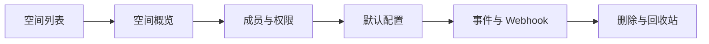

# 知识空间与配置界面规范（Knowledge_Space_UI）

> 文档状态：Final v1.0  
> 维护者：PowerX CoreX 团队  
> 上次更新：2025-10-13

---

## 1. 目标与范围

- 管理“空间（Space）”全生命周期：创建、可见性、成员权限、默认策略（Rank Profile）、分块与检索设置。
- 为检索/Agent 提供**空间级默认配置**与**按空间隔离**的权限与审计视图。
- 对齐后端契约：仅调用 `/api/v1/knowledge/...` 与 `knowledge.v1`（本文以 HTTP 为例）。

---

## 2. 页面信息架构



**模块说明**

- **空间列表**：所有可见空间（按租户与权限过滤），提供查询与批量操作。
- **空间概览**：统计卡片（文档数、索引状态、近期错误、查询热度）。
- **成员与权限**：用户/角色在该空间的权限集合管理。
- **默认配置**：Rank Profile、Chunker、Recency 与来源权重、Rerank 等。
- **事件与 Webhook**：订阅 `knowledge.*` 事件、签名密钥、测试投递。
- **删除与回收站**：软删与恢复；强删需高权限二次确认。

---

## 3. 空间列表（Spaces）

### 3.1 列表字段

- `id`、`name`、`slug`、`visibility`（`private/shared/public`）
- 文档统计：`documents_total`、已发布/草稿数
- 索引状态聚合：`index_ok/index_failed/indexing`
- 最近活动：最近一次错误/变更时间
- 操作：查看、编辑、成员、复制 ID、删除（软删）

### 3.2 过滤与排序

- 按 `visibility`、所属人/团队、标签、更新时间过滤
- 排序：`updated_at desc`（默认）、`name asc`

### 3.3 新建空间（弹窗）

- 字段：`name`（必填）、`slug`（自动生成可修改）、`visibility`
- 可选：预置标签、描述
- 创建成功后跳转到“默认配置”页面

---

## 4. 空间概览（Overview）

- **关键指标卡**：
  - 文档总数、已发布/草稿
  - 索引阶段健康度（成功率、平均耗时）
  - 近 7/30 天查询量、Top 查询关键词（仅做展示）

- **最近事件**：`knowledge.document.indexed/failed`/`space.updated` 等
- **快捷操作**：上传文档、创建来源、调参（跳至默认配置）、成员管理

---

## 5. 成员与权限（Members & RBAC）

### 5.1 权限模型（按空间维度）

- 资源：`space/document/search/graph`
- 动作：`create/read/update/delete/publish/admin/search` 等
- 绑定：用户/角色 → 权限集合（仅在本空间生效）

### 5.2 界面与交互

- 成员列表：显示用户/角色、邮箱、授权范围、最近访问时间
- 授权面板：勾选权限；支持模板（Reader/Editor/Publisher/Admin）
- 审计：显示最近权限变更记录（操作者/时间/差异）

---

## 6. 默认配置（Default Settings）

> 该区域定义**空间级默认 Rank Profile 与检索策略**。Admin 调参在此保存；查询时也可临时覆盖（见 Query UI 文档）。

### 6.1 Rank Profile

- `semantic_weight`（0–1，默认 0.65）
- `mmr_beta`（0–1，默认 0.7，控制多样性）
- `graph_weight`（0–1，默认 0.15）
- `recency_weight`（0–0.1，默认 0.02）
- `source_priority`（kv：来源加权，如 `kb_spec:0.3`）
- `rerank.enabled`（bool，默认关）
- `rerank.topk`（5–50，默认 20）
- `rerank.provider`（字符串，如 `cross-encoder/ms-marco-...`）

### 6.2 Chunker（分块）

- `window`（默认 512 tokens/char）
- `overlap`（默认 64）
- 高级：标题/小节断点优先、代码/表格处理策略（仅描述与选项）

### 6.3 保存与版本化

- 每次保存生成一条**配置版本**（记录 diff 与操作者）
- 支持一键回滚到任一历史版本
- 显示“当前生效版本 ID/时间/操作者”

---

## 7. 事件与 Webhook（Events & Webhook）

### 7.1 可订阅事件

- `knowledge.space.created`
- `knowledge.document.versioned`
- `knowledge.document.indexed`
- `knowledge.indexing.failed`
- `knowledge.feedback.submitted`
- `knowledge.graph.node.upserted` / `knowledge.graph.edge.upserted`

### 7.2 Webhook 配置

- 列表：目标 URL、签名密钥状态、最近投递结果
- 新建/编辑：`endpoint`、`secret`、订阅事件集合
- 签名头：`X-PowerX-Signature: sha256=<digest>`
- 测试：发送示例 Payload 并展示响应
- 重投：失败事件支持一键重投

---

## 8. 删除与回收站

- **软删除**：空间状态标记为 `deleted`；`documents` 仍保留但不可检索（或按策略处理）
- **恢复**：回收站内可恢复空间与其配置
- **强删**：需 `admin` 与二次确认；会清理向量与索引（谨慎使用）

---

## 9. API 交互规范

### 9.1 空间 CRUD

- `POST /api/v1/knowledge/spaces`（创建）
- `GET /api/v1/knowledge/spaces`（列表）
- `GET /api/v1/knowledge/spaces/{spaceID}`（详情）
- `PATCH /api/v1/knowledge/spaces/{spaceID}`（更新 Rank Profile/Settings）
- `DELETE /api/v1/knowledge/spaces/{spaceID}`（软删）

**创建请求体示例**

```json
{
  "name": "crm_docs",
  "slug": "crm_docs",
  "visibility": "private",
  "rank_profile": {
    "semantic_weight": 0.65,
    "recency_weight": 0.02,
    "normalize": "minmax",
    "mmr_beta": 0.7,
    "graph_weight": 0.15,
    "rerank": { "enabled": false, "topk": 20 }
  },
  "settings": { "chunker": { "window": 512, "overlap": 64 } }
}
```

### 9.2 Webhook

- `POST /api/v1/knowledge/spaces/{spaceID}/webhooks`（创建/更新）
- 事件投递示例字段：`event`, `space_id`, `resource_id`, `timestamp`, `signature`

> 所有请求必须携带：`Authorization: Bearer <token>`、`X-Tenant-UUID: <uuid>`。

---

## 10. 状态与错误处理

- **401/403**：提示登录/权限不足；隐藏不可用操作
- **409 冲突**：如 `slug` 重名，给出修正建议
- **429 频控**：顶部提示并自动退避；允许手动重试
- **5xx 异常**：展示“已降级”提示；保留最近一次有效配置
- **保存失败回滚**：本地保留未保存的输入，支持重试

---

## 11. 审计与遥测

### 11.1 审计日志字段

- 时间、操作者、动作（create/update/delete/webhook.update）
- 目标对象：`space_id`
- 差异摘要（配置 diff）
- `trace_id` 与请求来源（IP/UA）

### 11.2 遥测埋点

- `ui_space_create/update/delete`
- `ui_space_profile_save/rollback`
- `ui_space_webhook_test/retry`

---

## 12. 无障碍与国际化

- i18n：`zh-CN`、`en` 至少两套；日期/数字本地化
- 键盘导航：列表与表单可通过 `Tab/Enter/Esc` 完整操作
- ARIA：表格、对话框、进度条添加语义标签与 `aria-live`

---

## 13. 示例对象（简化）

### 13.1 Space

```json
{
  "id": "sp_001",
  "name": "crm_docs",
  "slug": "crm_docs",
  "visibility": "private",
  "rank_profile": {
    "semantic_weight": 0.65,
    "mmr_beta": 0.7,
    "graph_weight": 0.15,
    "recency_weight": 0.02,
    "rerank": { "enabled": false, "topk": 20 }
  },
  "settings": { "chunker": { "window": 512, "overlap": 64 } },
  "updated_at": "2025-10-12T12:30:00Z"
}
```

### 13.2 Webhook 订阅

```json
{
  "endpoint": "https://ops.yourdomain.com/hook",
  "events": ["knowledge.document.indexed", "knowledge.indexing.failed"],
  "secret": "****",
  "active": true,
  "last_delivery": { "status": 200, "latency_ms": 138 }
}
```

---

## 14. 路由与权限

- 路由：`/admin/knowledge/spaces`
- 权限：
  - 列表/查看：`knowledge:space.read`
  - 创建/更新/删除：`knowledge:space.create|update|delete`
  - 成员与权限：集成统一 IAM（按空间维度绑定）
  - Webhook：`knowledge:space.update`
