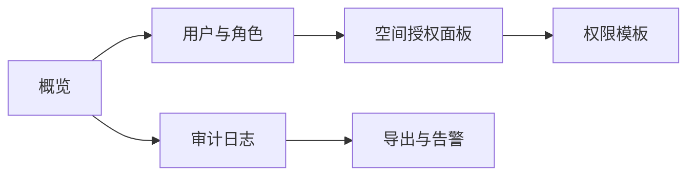

# 权限与审计界面规范（Permission_and_Audit_UI）

> 文档状态：Final v1.0  
> 维护者：PowerX CoreX 团队  
> 上次更新：2025-10-13

---

## 1. 目标与范围

- 为知识库在**空间（Space）维度**提供可视化的 **RBAC 权限管理** 与 **全量审计追踪**。
- 覆盖对象：Space / Document / Search / Graph 等资源的读写执行权限。
- 保障：最小权限、可追溯、可导出、可回放。

---

## 2. 信息架构



**模块说明**

- **概览**：当前租户权限与审计概况（用户数、角色数、近7天高危操作）。
- **用户与角色**：用户列表、角色列表与成员关系。
- **空间授权面板**：以 Space 为单位勾选权限。
- **权限模板**：Reader/Editor/Publisher/Admin 四类模板快捷应用。
- **审计日志**：全量记录，支持多维过滤与导出。
- **导出与告警**：CSV 导出、阈值告警订阅（如高危操作）。

---

## 3. 权限模型（RBAC）

### 3.1 资源与动作

- 资源：`space` / `document` / `search` / `graph`
- 动作（示例）：
  - `space`: `create|read|update|delete|admin`
  - `document`: `create|read|update|delete|publish`
  - `search`: `search`（检索与反馈）
  - `graph`: `read|update`（查询与锚点维护）

- 授权粒度：以 **Space 维度** 绑定用户/角色 → 权限集合。

### 3.2 权限模板（建议）

- **Reader**：`document.read`, `search.search`, `graph.read`
- **Editor**：Reader + `document.create|update`
- **Publisher**：Editor + `document.publish`
- **Admin**：全部 + `space.update|delete|admin`, `graph.update`

> 模板仅是快捷方式，应用后可微调单项权限。

---

## 4. 界面与交互

### 4.1 用户与角色页

- 列表字段：`name/email/类型(用户|角色)/成员数/最近活动`
- 操作：查看成员、添加/移除成员、重命名（角色）、删除（角色）
- 搜索与过滤：按名称、类型、最近活动时间

### 4.2 空间授权面板（关键）

- 目标空间选择（多选或单选）
- “用户/角色”切换
- 权限矩阵（资源 × 动作）复选
- 一键应用模板（Reader/Editor/Publisher/Admin）
- 批量应用到多个空间（仅对角色开放，需高权限）
- 右侧“变更预览”与“影响面”提示（涉及多少用户/空间）

### 4.3 变更确认

- 二次确认弹窗显示：操作者、目标对象、差异摘要
- 支持添加“变更说明”（写入审计）

---

## 5. 审计日志（Audit）

### 5.1 字段定义

- `time`：UTC ISO8601
- `actor`：操作者（用户/服务账号）
- `action`：例如 `space.update`, `document.publish`, `graph.anchor.upsert`, `rbac.grant`, `rbac.revoke`
- `resource`：资源类型（space/document/search/graph）
- `resource_id`：如 `sp_xxx` / `d_456`
- `space_id`：若目标可归属到某 Space
- `result`：`success|fail` + `reason`（失败原因）
- `diff`：**结构化**差异摘要（JSON）
- `trace_id`：链路标识
- `ip/ua`：来源信息（如有）

### 5.2 过滤与检索

- 条件：时间窗 / actor / resource / action / space_id / 结果 / 关键字（支持全文）
- 快捷筛选：
  - “仅高危操作”（删除/发布/权限变更）
  - “仅失败”
  - “我的变更”

### 5.3 展示与导出

- 表格列表 + 详情抽屉（展示 diff JSON 的美化视图）
- 支持 CSV 导出（字段见上）
- 支持将某次操作生成“审计链接”以内部共享

---

## 6. 告警与订阅（可选）

- 告警规则（示例）：
  - 30 分钟内 `rbac.*` 变更 ≥ N 次
  - 某 Space 在 1 小时内被强删或多次发布/撤销
  - `document.delete` 或 `graph.update` 失败率异常

- 订阅方式：
  - Email / Webhook

- Webhook 签名头：`X-PowerX-Signature: sha256=<digest>`
- 触发来源：审计日志流或事件总线 `knowledge.*`

---

## 7. API 交互（UI 侧重点）

> 鉴权与授权通常由统一 IAM 提供；以下为 UI 侧需要调用/依赖的接口与字段约定。

### 7.1 权限读取与变更

- **读取某空间已授权**

```

GET /api/v1/iam/spaces/{spaceID}/bindings

```

返回：`{ users: [...], roles: [...], grants: [{principal, permissions[]}] }`

- **更新授权（覆盖或增量）**

```

POST /api/v1/iam/spaces/{spaceID}/bindings:batchUpdate
Body: { ops: [ { op: "grant|revoke", principal: "user:xxx|role:xxx", permissions: ["document.read", ...] } ], message?: "说明" }

```

返回：`{ ok: true, trace_id: "..." }`

> 如果你的 IAM 在其它服务域，UI 只需按其契约适配；本规范不强制接口路径。

### 7.2 审计查询（平台统一）

```

GET /api/v1/audit/logs?resource=&action=&actor=&space_id=&from=&to=&q=&page=&page_size=
Headers: Authorization, X-Tenant-Id

```

返回（简化）：

```json
{
  "items": [
    {
      "time": "2025-10-13T07:20:01Z",
      "actor": "ops@powerx",
      "action": "rbac.grant",
      "resource": "space",
      "resource_id": "sp_001",
      "space_id": "sp_001",
      "result": "success",
      "diff": { "add": ["document.publish"] },
      "trace_id": "tr_abc",
      "ip": "203.0.113.10",
      "ua": "Admin/Chrome"
    }
  ],
  "page": 1,
  "page_size": 20,
  "total": 238
}
```

---

## 8. 错误与安全策略

| 场景                       | 表现                             | 建议处理                    |
| -------------------------- | -------------------------------- | --------------------------- |
| 未认证/权限不足（401/403） | 弹窗提醒并隐藏不可用操作         | 引导登录或申请权限          |
| 速率限制（429）            | 顶部条提示 + 自动退避            | 允许手动重试                |
| 冲突（409，例如并发授权）  | 弹窗提示“有新变更，请刷新后重试” | 支持“合并变更”策略          |
| 服务异常（5xx）            | 显示“已降级”，只读模式           | 保留最近一次可用数据快照    |
| 高危操作                   | 二次确认 + 输入“确认词”          | 审计记录 `reason` 与 `diff` |

- 所有变更请求需带 `Idempotency-Key`（可选，界面生成），避免重复提交。
- 对**批量授权**设置最大批次与速率阈值，超限需审批或拆分。

---

## 9. 遥测与合规

### 9.1 埋点

- `ui_rbac_open/apply_template/change/submit/cancel`
- `ui_audit_filter/export/detail_open`
- `ui_alert_subscribe/update`

### 9.2 合规

- 可配置数据保留策略（如审计保留 180/365 天）
- 导出时对 `diff` 中可能的敏感字段进行脱敏（如邮箱、IP 段）

---

## 10. 无障碍与国际化

- 完整键盘操作路径：矩阵勾选、对话框、分页。
- ARIA：表格、开关、弹窗与进度条添加语义标签与 `aria-live`。
- i18n：至少 `zh-CN`/`en` 两套；支持时区显示与本地化日期格式。

---

## 11. 示例对象

### 11.1 权限绑定（Binding）

```json
{
  "principal": "role:publisher",
  "space_id": "sp_001",
  "permissions": [
    "document.read",
    "document.update",
    "document.publish",
    "search.search"
  ]
}
```

### 11.2 审计条目（Audit Item）

```json
{
  "time": "2025-10-13T07:20:01Z",
  "actor": "ops@powerx",
  "action": "document.publish",
  "resource": "document",
  "resource_id": "d_456",
  "space_id": "sp_001",
  "result": "success",
  "diff": { "from": "draft", "to": "published", "version_no": 3 },
  "trace_id": "tr_abc",
  "ip": "203.0.113.10"
}
```

---

## 12. 路由与权限

- 路由：`/admin/knowledge/permissions`（权限页）、`/admin/knowledge/audit`（审计页）
- 页面可见权限：
  - 权限页：`knowledge:space.admin` 或具备组织级 RBAC 管理权限
  - 审计页：具备审计读取权限（平台统一）

- 跨页联动：从 Space 详情页跳入“该空间的授权视图”，带上 `space_id` 过滤

```

```
