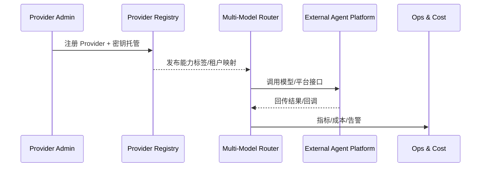

# Executive Summary

PowerX 需要统一管理 LLM、VLM、TTS、Embeddings 等基础模型，同时打通 Coze、n8n 等外部智能体平台，为主 Agent 提供安全、可控、可观测的推理与自动化能力。本场景覆盖 provider 注册、密钥治理、策略路由、平台连接器以及成本/配额与审计闭环，目标是“新增 provider 24 小时上线、模型路由命中率 ≥90%、外部平台回调全链可追溯、异常 5 分钟内可降级”。

# Positioning & Goals

- **平台定位**：成为 PowerX 智能体的“模型能力总线”，承载 provider onboarding、策略路由、外部平台桥接与成本治理四大职责。
- **业务目标**：在统一准入、安全与审计框架下，24 小时内引入新模型/平台，保持路由命中率 ≥90%，并让成本/配额在 <1 分钟内可观测。
- **成功信号**
  - Provider 接入到租户灰度 ≤24h，密钥 100% 托管。
  - 路由策略支持租户/业务线差异化并可 5 分钟内回滚。
  - 外部平台（Coze/n8n）调用具备端到端 Trace + 回调签名。
  - 成本/配额异常 5 分钟内触发告警并执行自动 Runbook。

# Core Capabilities

| 能力域 | 说明 | 关键系统/材料 |
|--------|------|---------------|
| Provider Onboarding | 模板化配置、密钥托管、健康验证与租户灰度 | `backend/config/agents/providers/*.yaml`, Secret Manager, Validator |
| Multi-Model Routing | 根据任务上下文/成本/健康信号选择主备模型、支持 A/B 与 safe-mode | `services/model-routing/decision_engine.ts`, `backend/config/agents/routing/*.yaml` |
| Platform Connectors | Coze/n8n 等平台的 OAuth/Token、上下文映射、Webhook 签名、降级 | `connectors/coze`, `connectors/n8n`, `services/security/webhook_guard.ts` |
| Governance & Ops | 成本/配额计量、告警与 Runbook、审计与报表 | `services/cost/metering.ts`, `services/quota/enforcer.go`, `scripts/qa/provider-drill.mjs` |

# Scope & Guardrails

- **In Scope**：`backend/config/agents/**` provider 注册、密钥/租户映射、多模型策略、平台连接器、成本与配额治理、指标与审计。
- **Out of Scope**：模型训练/微调、业务插件逻辑、第三方平台内部审批流程、前端 Prompt 设计。
- **Environment & Flags**：`model-provider-registry`、`multi-model-router`、`agent-platform-connectors`、`provider-cost-guard`；依赖 Vault、Quota Service、Telemetry、Webhook Gateway。

# Participants & Responsibilities

| Scope | Repository | Layer | 责任与交付物 | Owners |
|-------|------------|-------|--------------|--------|
| provider-registry | powerx | service | Provider 配置、密钥托管、租户映射、灰度控制 | Agent Platform Guild |
| model-routing | powerx | integration | 能力标签、策略权重、A/B 与 fallback | Agent Platform Guild |
| platform-connectors | powerx-plugin | integration | Coze/n8n 等连接器、回调签名、上下文映射 | Plugin Guild |
| governance & ops | powerx | ops | 成本/配额监控、告警、Runbook、审计 | Ops Reliability Center |

# End-to-End Flow

1. **Stage 1 – Provider Onboarding**：登记 provider、托管密钥、运行健康验证并发布到租户配置。
2. **Stage 2 – Capability Modeling & Routing**：根据任务标签和策略权重选择主/备模型，记录成本预估与追踪 ID。
3. **Stage 3 – Platform Connectors**：通过连接器调用 Coze/n8n 等平台，处理上下文映射、回调签名与异常重试。
4. **Stage 4 – Governance & Telemetry**：聚合成本/配额与健康信号，触发限流或降级，并向主任务执行链路曝光状态。

# Architecture Diagram

# Key Interactions & Contracts

- **APIs / Events**：`POST /internal/providers/register`、`GET /internal/providers/{id}`、`POST /internal/model-routing/route`、`EVENT agent.provider.health.updated`、`POST /platform/connectors/{platform}/invoke`、`EVENT agent.provider.cost.anomaly`。
- **Configs / Schemas**：`backend/config/agents/providers/*.yaml`、`backend/config/agents/routing/*.yaml`、`docs/standards/powerx/backend/integration/09_agent/Agent_Adaptor_and_Transport_Spec.md`、`docs/standards/powerx-plugin/contract/agent_contract.md`。
- **Security / Compliance**：密钥托管与轮换、租户隔离、回调签名、调用审计、成本审批、数据脱敏。

# Usecase Links

- `UC-AGENT-MODEL-PROVIDER-001` — Provider 注册与健康治理（service 层）。
- `UC-AGENT-MODEL-ROUTING-001` — 多模型路由与策略编排（integration 层）。
- `UC-AGENT-PLATFORM-COZE-001` — 外部智能体平台连接器（integration 层）。
- `UC-AGENT-MODEL-GOV-001` — 成本、配额与可观测治理（ops 层）。

# Acceptance Criteria

1. 新增 provider 在 24 小时内完成注册、密钥托管、健康验证并灰度上线。
2. 多模型路由命中率 ≥90%，fallback 成功率 ≥95%，策略回滚耗时 <5 分钟。
3. 外部平台调用具备端到端追踪与回调签名校验，异常 10 分钟内可定位并回滚。
4. 成本/配额仪表板延迟 <1 分钟，超阈值 5 分钟内告警并触发自动限流/降级。

# Telemetry & Ops

- 指标：`agent.provider.health_score`、`agent.routing.hit_rate`、`agent.platform.latency_p95`、`agent.provider.cost_per_call`、`agent.provider.quota_usage`。
- 告警阈值：健康评分 <0.7、成本超预算 10%、回调失败率 >5%、密钥 7 天内过期。
- 观测来源：Grafana「Model Hub」、Datadog `agent.provider.*`、Cost Warehouse、`scripts/qa/provider-drill.mjs`、Ops 告警面板。

# Validation Workflow

1. **Docmap & Taxonomy**：运行 `node scripts/qa/validate-docmap.mjs --docmap docs/_data/docmap.yaml --taxonomy docs/_data/taxonomy.yaml` 确认 scope/layer/domain 与 usecase seed 对齐。
2. **Scenario Rendering**：`npm run publish:scenarios -- --scn-id SCN-AGENT-MODEL-HUB-001 --dry-run` 验证结构、Mermaid 与 usecase 元数据。
3. **Usecase Seeds**：`npm run publish:usecases -- --scn-id SCN-AGENT-MODEL-HUB-001 --validate-only`，确保 seed frontmatter 与 docmap 一致。
4. **Operational Tests**：执行 `scripts/qa/provider-drill.mjs`、`scripts/ops/provider-release.mjs --dry-run`、`scripts/ops/platform-degrade.mjs --tenant <id>` 模拟成本突增、路由回滚与平台降级。

# Related Links

- 场景主文档索引：`docs/meta/scenarios/powerx/list.md`
- Agent Model Platform 纲领：`docs/meta/scenarios/powerx/agent-and-automation/agent-model-platform/primary.md`
- 任务执行链路：`docs/scenarios/agent-orchestration/SCN-AGENT-TASK-EXEC-001.md`
- 标准契约：`docs/standards/powerx/backend/integration/09_agent/Agent_Adaptor_and_Transport_Spec.md`

# Open Issues & Follow-ups

| 风险/事项 | 影响范围 | 负责人 | ETA |
|-----------|----------|--------|-----|
| 云厂商缺少多租户密钥隔离方案 | 安全与合规 | Agent Platform Guild | 2025-03-15 |
| Coze/n8n 回调协议差异大，需要统一适配层 | 平台互通稳定性 | Plugin Guild | 2025-03-10 |

# References

- `docs/meta/scenarios/powerx/agent-and-automation/agent-model-platform/primary.md`
- `backend/config/agents/providers/*.yaml`
- `backend/config/agents/routing/*.yaml`
- `docs/scenarios/agent-orchestration/SCN-AGENT-TASK-EXEC-001.md`
- `docs/meta/scenarios/powerx/list.md`
