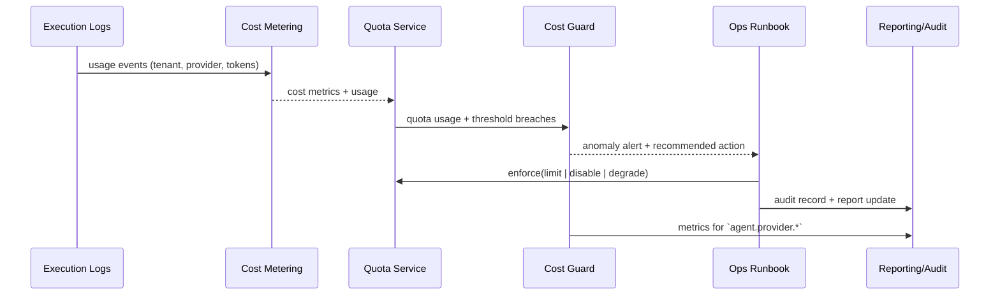

doc_id: UC-AGENT-MODEL-GOV-001
scn_id: SCN-AGENT-MODEL-HUB-001
title: PowerX (ops) - 模型成本与配额治理
status: Draft
version: v0.2.0
repo_key: powerx
scope: powerx
layer: ops
domain: agent-orchestration
scenario_title: "智能体模型与平台接入"
owners:
  - name: Ops Reliability Center
    role: Automation Co-owner
    contact: ops-center@artisan-cloud.com
  - name: Agent Platform Guild
    role: Scenario Steward
    contact: agent-platform@artisan-cloud.com
contributors:
  - name: FinOps Taskforce
    role: Cost Governance Partner
    contact: finops@artisan-cloud.com
linked_requirements:
  - id: SCN-AGENT-MODEL-GOV-001
    description: 模型成本与配额治理 Stage
code_refs:
  - repo: powerx
    path: services/cost/metering.ts
    description: Token / 调用计量、成本聚合
  - repo: powerx
    path: services/quota/enforcer.go
    description: 配额策略、限流、停用执行器
  - repo: powerx
    path: services/observability/model_cost_dashboard.ts
    description: 指标、报表、可视化
  - repo: powerx
    path: config/cost/provider_rates.yaml
    description: Provider 成本费率、阈值配置
  - repo: powerx
    path: config/quotas/model_usage.yaml
    description: 租户/项目配额、白名单规则
feature_flags:
  - provider-cost-guard
  - quota-enforcer
optional: false
last_reviewed_at: 2025-02-18

---

# Usecase Overview

- **业务目标**：实时掌握模型调用成本、配额与健康信号，在 5 分钟内发现异常并自动执行限流/降级，保障预算与合规。
- **成功度量**：成本数据延迟 <1 分钟；超配额告警送达 <5 分钟；限流/停用动作 100% 记录审计；自动恢复 <15 分钟；报表覆盖全部租户。
- **场景关联**：对接 `SCN-AGENT-MODEL-GOV-001` Stage（模型成本与配额治理），向路由与执行场景输出成本/配额信号，也依赖 Provider 与路由子用例提供能力与健康数据。

> 摘要：通过“计量 → 成本聚合 → 配额比较 → 告警/自动化 Runbook → 报表/审计”的闭环，实现模型能力的 FinOps 治理。

# Context & Assumptions

- **前置条件**
  - 所有模型调用均携带 `trace_id`、`tenant_id`、`provider_id`、`invocation_type`，写入执行日志或事件流。
  - Cost Warehouse（或 Lakehouse）已可接收流式计量数据；Quota Service 支持租户/项目/环境多维度配置。
  - Feature Flags `provider-cost-guard`、`quota-enforcer` 在配置中心登记，可按租户灰度。
  - `docs/_data/docmap.yaml` 中该 usecase 节点字段与此 Seed 完全一致。
- **输入**
  - Execution Logs、`agent.provider.*` 指标、Provider 成本费率表、租户配额配置、上限/告警阈值。
  - 运营方输入的预算周期、白名单 / 板块豁免、降级策略。
- **输出**
  - 成本/配额指标、`agent.provider.cost_total`、`agent.provider.quota_usage` 等监控数据。
  - 异常事件 `agent.provider.cost.anomaly`、告警通知、自动化 Runbook 执行结果。
  - 成本报表（租户/provider/能力维度）、审计日志、降级回执。
- **边界**
  - 不包含财务结算、合同谈判与价格策略。
  - 不直接修改调用链路，仅发出限流/停用指令或 Feature Flag。
  - 不负责 Provider 接入/路由策略，仅消费其输出。

# Solution Blueprint

## 体系分解

| 层 | 主要组件/模块 | 责任 | 代码入口 |
|----|---------------|------|---------|
| ops | Cost Metering Pipeline | 汇聚 Token/调用指标、计算实时成本并写入仓库 | `services/cost/metering.ts` |
| ops | Quota & Enforcement Service | 维护配额表、执行限流/停用、白名单管理 | `services/quota/enforcer.go` |
| ops | Cost Guard & Alerting | 检测异常趋势、推送 `provider-cost-guard` 告警、触发 Runbook | `services/observability/model_cost_dashboard.ts` |
| ops | Reporting & Audit Layer | 生成报表、输出给 FinOps/Ops，并记录操作审计 | `scripts/qa/provider-drill.mjs`, `services/audit/model_cost_audit.go` |

## 流程与时序

1. **Step 1 – Metering Intake**：Execution Logs -> Cost Metering，按照 `provider_rates.yaml` 计算实时成本并打上租户/项目标签。
2. **Step 2 – Quota Comparison**：Quota Service 将成本/用量与 `model_usage.yaml` 配额对比，生成使用率、剩余额度。
3. **Step 3 – Anomaly Detection**：Cost Guard 评估环比/同比、突增、预算消耗，超过阈值触发 `agent.provider.cost.anomaly` 事件与告警。
4. **Step 4 – Enforcement & Degrade**：`quota-enforcer` 根据策略调用限流/停用 API 或推送 Feature Flag，必要时执行 `scripts/ops/quota-degrade.mjs`。
5. **Step 5 – Reporting & Audit**：每日/每周生成报表、同步到 FinOps 仪表板，并把所有限流/恢复操作写入审计。

# Contracts & Interfaces

- **Inbound APIs / Events**
  - `POST /internal/provider-usage/report` — 写入计量数据；支持批量/流式模式。
  - `POST /internal/provider-cost/anomaly` — 手动报送异常或 FinOps 数据；生成审计。
  - `POST /internal/provider-quotas/enforce` — 执行限流、降级、停用操作，需 `quota.enforcer` 权限。
  - `EVENT agent.provider.cost.anomaly` — 自动告警事件（携带租户、provider、权重、建议动作）。
- **Outbound 调用**
  - `GET /internal/provider-quotas` — 查询最新配额/白名单。
  - `POST /internal/feature-flags/{flag}/toggle` — 打开/关闭 `provider-cost-guard`、`quota-enforcer`。
  - `Telemetry agent.provider.*` — 输出成本、配额、降级指标。
  - `Ops Pager / ChatOps` — 发布告警、Runbook 链接。
- **配置与脚本**
  - `config/cost/provider_rates.yaml`, `config/quotas/model_usage.yaml` — 费率与配额。
  - `scripts/qa/provider-drill.mjs` — 压测/模拟成本飙升。
  - `scripts/ops/quota-degrade.mjs` — 自动化降级/恢复操作。

# Implementation Checklist

| 项目 | 描述 | 完成状态 | 负责人 |
|------|------|----------|--------|
| 流式计量与聚合 | 接入执行日志、实时计算 Token/成本、写入仓库 | [ ] | Ops Reliability Center |
| 费率与预算配置 | 维护 `provider_rates.yaml`、支持多币种/折扣 | [ ] | FinOps Taskforce |
| 配额与白名单管理 | `model_usage.yaml` 模型、接口、租户多维配额 | [ ] | Agent Platform Guild |
| 异常检测与告警 | 指标阈值、趋势分析、`agent.provider.cost.anomaly` 事件 | [ ] | Ops Reliability Center |
| 限流/降级 Runbook | `quota-enforcer` API、脚本与审计 | [ ] | Ops Reliability Center |
| 报表与可视化 | Grafana/Datadog 面板、周期报表导出 | [ ] | FinOps Taskforce |

# Testing Strategy

- **单元测试**：成本计算函数、费率映射、配额比较、阈值判定。
- **集成测试**：模拟真实调用写入 `provider-usage/report`，验证成本聚合、配额 API、告警事件。
- **端到端**：借助 `scripts/qa/provider-drill.mjs` 在沙箱环境制造突增流量，观察告警 → 限流 → 恢复全链路。
- **Chaos / Failover**：注入计量延迟、Quota Service 不可用、Telemetry 丢失，确认降级策略与补偿（如缓存配额、手动审核）。

# Observability & Ops

- **指标**：`agent.provider.cost_total`, `agent.provider.cost_delta_percent`, `agent.provider.quota_usage`, `agent.provider.alert_total`, `agent.provider.degrade_total`, `agent.provider.cost_latency_ms`.
- **日志**：计量摄取日志、配额决策日志、限流/停用操作日志（含 `tenant`, `provider`, `policy_version`）、审计流水。
- **告警**：成本突增 >20%/5min、配额使用率 ≥90%、降级执行失败、计量延迟 >60s、报表生成失败。
- **Dashboards**：Grafana「Model Cost & Quota」、Datadog `agent.provider.*`、FinOps 月度报表。

# Rollback & Failure Handling

- 配额/费率配置支持版本化，异常发布可通过 Git revert + `npm run publish:usecases -- --scn-id SCN-AGENT-MODEL-HUB-001 --validate-only` 验证。
- `quota-enforcer` 提供 `POST /internal/provider-quotas/enforce/undo` 接口，回滚误限流。
- 计量管道异常时自动切换到批量补数模式，并标记数据质量。
- 告警/Runbook 失败时立即升级至人工值班，同时输出审计记录以备追踪。

# Follow-ups & Risks

| 风险/事项 | 影响 | 缓解方案 | 负责人 | ETA |
|-----------|------|----------|--------|-----|
| 成本数据源延迟或缺失 | 预算无法实时监控 | 引入 Kafka 重放 + 数据质量监控，建立 SLA 告警 | Ops Reliability Center | 2025-03-05 |
| 配额配置不一致 | 误限流或越权 | 建立审批工作流、自动校验脚本、双人复核 | Agent Platform Guild | 2025-03-01 |
| 报表与财务系统脱节 | 无法支撑结算/预算会议 | 与 FinOps DataMart 对接、导出标准化 CSV/Looker 视图 | FinOps Taskforce | 2025-03-12 |

# References & Links

- 场景：`docs/scenarios/agent-orchestration/SCN-AGENT-MODEL-GOV-001.md`
- Docmap：`docs/_data/docmap.yaml` (`SCN-AGENT-MODEL-HUB-001 -> UC-AGENT-MODEL-GOV-001`)
- Repo 元数据：`docs/_data/repos.yaml` (`key: powerx`)
- 配置：`config/cost/provider_rates.yaml`, `config/quotas/model_usage.yaml`
- 工具：`scripts/qa/provider-drill.mjs`, `scripts/ops/quota-degrade.mjs`
