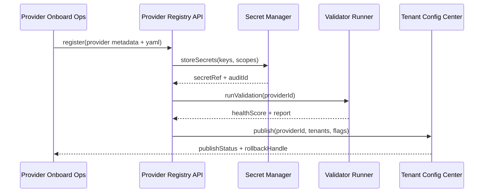

doc_id: UC-AGENT-MODEL-PROVIDER-001
scn_id: SCN-AGENT-MODEL-HUB-001
title: PowerX (service) - 基础模型 Provider 接入与治理
status: Draft
version: v0.2.0
repo_key: powerx
scope: powerx
layer: service
domain: agent-orchestration
scenario_title: "智能体模型与平台接入"
owners:
  - name: Agent Platform Guild
    role: Scenario Steward
    contact: agent-platform@artisan-cloud.com
contributors:
  - name: Ops Reliability Center
    role: Security & Ops Partner
    contact: ops-center@artisan-cloud.com
linked_requirements:
  - id: SCN-AGENT-MODEL-PROVIDER-001
    description: Provider onboarding & governance stage
code_refs:
  - repo: powerx
    path: backend/config/agents/providers/
    description: Provider 模板、参数与租户映射
  - repo: powerx
    path: services/provider/registry.ts
    description: Registry API、配置校验与发布
  - repo: powerx
    path: services/security/secret_manager.go
    description: 密钥托管、轮换、审计
  - repo: powerx
    path: scripts/ops/provider-validator.mjs
    description: 自动化健康验证脚本
  - repo: powerx
    path: scripts/ops/provider-release.mjs
    description: 灰度发布、回滚 orchestration
feature_flags:
  - model-provider-registry
  - provider-health-check
optional: false
last_reviewed_at: 2025-02-18

---

# Usecase Overview

- **业务目标**：标准化 LLM/VLM/TTS/Embeddings Provider 的接入、密钥托管、验证与租户映射，保证 24 小时内上线并满足安全合规。
- **成功度量**：接入时长 ≤24h；健康验证通过率 ≥99%；密钥 100% 纳入托管与轮换；回滚 ≤5 分钟；租户灰度覆盖率 ≥95%。
- **场景关联**：支撑 `SCN-AGENT-MODEL-PROVIDER-001` Stage 1（Provider Onboarding & Governance），为路由与治理用例提供能力元数据与健康信号。

> 摘要：该 Seed 把 Provider 登记、配置、验证、发布与运维视为一条流水线，确保平台可快速引入新模型同时具备可观测与回滚能力。

# Context & Assumptions

- **前置条件**
  - 场景文档 `docs/scenarios/agent-orchestration/SCN-AGENT-MODEL-PROVIDER-001.md` 已定义流程、指标与责任。
  - Vault/Secret Manager 在线，且具备租户/环境级密钥隔离与审计。
  - Feature Flags `model-provider-registry`、`provider-health-check` 已在配置中心登记。
  - `docs/_data/docmap.yaml` 中 `SCN-AGENT-MODEL-HUB-001` -> `UC-AGENT-MODEL-PROVIDER-001` 子节点与本 Seed 字段一致。
- **输入/输出**
  - 输入：Provider 资质、API 规格、密钥、配额与租户列表、成本/合规材料、自动化验证脚本参数。
  - 输出：`backend/config/agents/providers/*.yaml` 配置、Secret 引用、健康评分、租户配置中心 Delta、审计记录。
- **边界**
  - 不包含模型评估、成本治理、Prompt 策略（由其他子场景负责）。
  - 不负责跨仓模型代码实现，仅覆盖 PowerX Registry + Ops 交付物。
  - 训练/推理调用路径的性能优化在路由与执行场景处理。

# Solution Blueprint

## 体系分解

| 层 | 主要组件/模块 | 责任 | 代码入口 |
|----|---------------|------|---------|
| service | Provider Registry Service | 处理注册 API、YAML 模板生成、Schema 校验、租户发布 | `services/provider/registry.ts` |
| service | Secret Manager Adapter | 接收密钥、加密存储、轮换计划、审计事件 | `services/security/secret_manager.go` |
| service | Provider Validation Runner | 调用沙箱、验证脚本、健康评分和日志上传 | `scripts/ops/provider-validator.mjs` |
| ops | Provider Release Pipeline | 灰度发布、租户映射同步、回滚 orchestration | `scripts/ops/provider-release.mjs` |

## 流程与时序

1. **Step 1 – Intake**：`POST /internal/providers/register` 接收 Provider 元数据，写入 staging 配置并触发 Schema 校验。
2. **Step 2 – Secret托管**：密钥由 Secret Manager API 加密存储，生成引用写入 YAML，启动轮换计时器与审计。
3. **Step 3 – 自动化验证**：调用 `provider-validator.mjs` 执行功能/延迟/错误率检查，生成 `agent.provider.health_signal` 指标与报告。
4. **Step 4 – 租户发布**：通过 Provider Registry 发布 API，把配置推送到租户配置中心与 Feature Flag，支持灰度与租户白名单。
5. **Step 5 – 监控 & 回滚**：持续订阅健康信号、密钥轮换事件；异常时触发 `provider-release.mjs rollback` 恢复上一版本。

# Contracts & Interfaces

- **Inbound APIs / Events**
  - `POST /internal/providers/register` — 传入 provider profile、端点、租户矩阵；需具备 `agent.registry.write` 权限。
  - `POST /internal/providers/{id}/validate` — 触发或重跑自动验证，可指定能力套件与阈值。
  - `POST /internal/providers/{id}/publish` — 发布到租户配置中心，支持 `--tenants`、`--env`、`--dry-run`。
- **Outbound 调用**
  - `Vault Secret Manager /v1/provider-secrets` — 存储密钥，失败需级联回滚注册。
  - `Tenant Config Service /internal/config/tenants` — 写入租户/环境映射与灰度参数。
  - `Telemetry Pipeline agent.provider.health_signal` — 上报延迟、错误率、健康评分和回滚状态。
- **配置与脚本**
  - `backend/config/agents/providers/*.yaml` — Provider 模板、能力标签、限流、租户映射。
  - `config/feature_flags/provider.yaml` — 控制灰度启停、降级策略。
  - `scripts/ops/provider-validator.mjs` / `scripts/ops/provider-release.mjs` — 自动化验证、发布、回滚。

# Implementation Checklist

| 项目 | 描述 | 完成状态 | 负责人 |
|------|------|----------|--------|
| Schema 校验与模板生成 | 定义 YAML Schema、lint、CI 校验 | [ ] | Agent Platform Guild |
| Secret 托管与轮换 | 对接 Vault、实现轮换计划与告警 | [ ] | Ops Reliability Center |
| 自动化验证套件 | 扩充脚本覆盖 LLM/VLM/TTS/Embeddings | [ ] | Agent Platform Guild |
| 租户灰度与回滚 | 发布脚本 & 配置中心 API 集成 | [ ] | Agent Platform Guild |
| 观察性与审计 | 指标、日志、事件映射入监控面板 | [ ] | Ops Reliability Center |

# Testing Strategy

- **单元测试**：Registry Schema 校验器、Secret Manager 适配器、健康评分算法、回滚开关。
- **集成测试**：沙箱调用真实 Provider、验证脚本输出、密钥写入+引用替换、租户发布 API。
- **端到端验证**：从注册到灰度发布全链路，在 staging 环境运行 `provider-release.mjs --dry-run` 并验证指标曲线。
- **非功能/Chaos**：密钥失效、Provider 延迟超阈、Telemetry 延迟，确认自动阻断与回滚路径。

# Observability & Ops

- **指标**：`agent.provider.onboard_duration`, `agent.provider.health_success_total`, `agent.provider.secret_rotation_total`, `agent.provider.publish_latency`.
- **日志**：Registry 接口审计、Secret 引用生成、验证脚本输出、Tenant 发布事件（需包含 providerId/tenant/env/traceId）。
- **告警**：健康评分 < 阈值、密钥轮换失败、回滚触发、配置中心发布失败；通过 Ops Pager & Teams 频道投递。
- **Dashboards**：Grafana「Provider Onboarding」、Datadog `agent.provider.*`、Vault 轮换面板。

# Rollback & Failure Handling

- `provider-release.mjs rollback --provider <id> --tenant <t>` 回滚租户配置并撤销 Feature Flag。
- Secret Manager 失败时直接终止注册，清理 YAML 中的引用并生成审计事件。
- 验证失败自动标记 Provider 状态为 `pending_fix`，阻止发布并生成 JIRA 任务。
- 配置中心异常时使用缓存的上一版本配置，限制新租户接入并通知值班。

# Follow-ups & Risks

| 风险/事项 | 影响 | 缓解方案 | 负责人 | ETA |
|-----------|------|----------|--------|-----|
| Provider 资质与密钥审核流程未自动化 | 延迟上线、合规风险 | 引入表单/审批自动化，与 IAM 审批系统打通 | Agent Platform Guild | 2025-03-15 |
| 验证脚本未覆盖多区域端点 | 生产环境稳定性不确定 | 为每个区域配置调用样本与超时阈值，纳入 CI | Ops Reliability Center | 2025-03-05 |

# References & Links

- 场景：`docs/scenarios/agent-orchestration/SCN-AGENT-MODEL-PROVIDER-001.md`
- Docmap：`docs/_data/docmap.yaml` (SCN-AGENT-MODEL-HUB-001 -> UC-AGENT-MODEL-PROVIDER-001)
- Repo 元数据：`docs/_data/repos.yaml` 中 `key: powerx`
- 配置模板：`backend/config/agents/providers/*.yaml`
- 自动化脚本：`scripts/ops/provider-validator.mjs`, `scripts/ops/provider-release.mjs`
