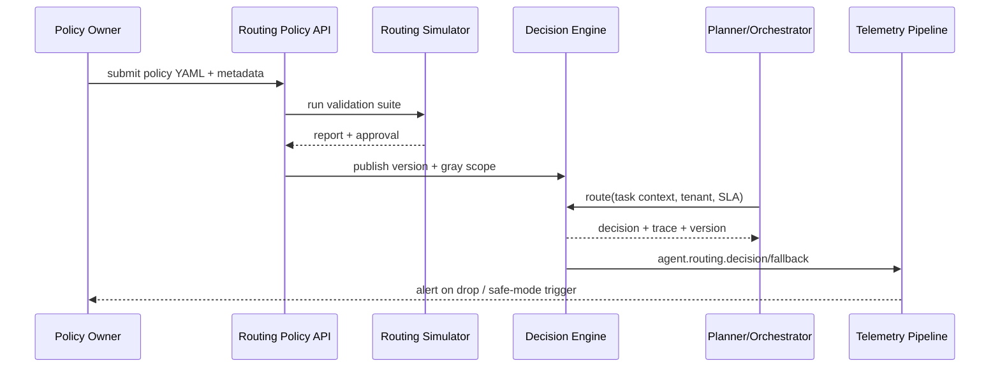

doc_id: UC-AGENT-MODEL-ROUTING-001
scn_id: SCN-AGENT-MODEL-HUB-001
title: PowerX (integration) - 多模型路由与策略编排
status: Draft
version: v0.2.0
repo_key: powerx
scope: powerx
layer: integration
domain: agent-orchestration
scenario_title: "智能体模型与平台接入"
owners:
  - name: Agent Platform Guild
    role: Scenario Steward
    contact: agent-platform@artisan-cloud.com
contributors:
  - name: Ops Reliability Center
    role: Telemetry & Ops Partner
    contact: ops-center@artisan-cloud.com
linked_requirements:
  - id: SCN-AGENT-MODEL-ROUTING-001
    description: 多模型路由与策略编排 Stage
code_refs:
  - repo: powerx
    path: services/model-routing/decision_engine.ts
    description: 策略解析、权重计算、fallback 决策
  - repo: powerx
    path: backend/config/agents/routing/
    description: 策略模板、灰度、A/B 配置
  - repo: powerx
    path: services/policy-center/routing_version_store.go
    description: 策略版本化、审核、回滚快照
  - repo: powerx
    path: services/telemetry/routing_metrics.go
    description: 命中率、延迟、fallback 指标采集
  - repo: powerx
    path: scripts/ops/routing-simulator.mjs
    description: 策略回放、灰度验证脚本
feature_flags:
  - multi-model-router
  - routing-safe-mode
optional: false
last_reviewed_at: 2025-02-18

---

# Usecase Overview

- **业务目标**：基于任务标签、成本、SLA 与风险等级，为 Planner/Orchestrator 提供可灰度、可回滚的多模型路由决策，降低人工配置并保障体验。
- **成功度量**：实时命中率 ≥90%；fallback 成功率 ≥95%；策略发布至生效 <5 分钟；决策延迟 <200ms；安全模式触发后 1 分钟内生效。
- **场景关联**：承接 `SCN-AGENT-MODEL-ROUTING-001` Stage 2，依赖 Provider 接入子用例输出的能力/健康数据，并向任务执行子场景提供模型决策。

> 摘要：该 Seed 把「策略配置 → 决策执行 → Telemetry 反馈 → 回滚/安全模式」串成闭环，确保模型组合能够按租户/业务线差异化供给。

# Context & Assumptions

- **前置条件**
  - Provider Registry 已同步能力标签、健康评分与租户可用性。
  - Feature Flags `multi-model-router`、`routing-safe-mode` 已接入配置中心，可按租户或业务线灰度。
  - `docs/_data/docmap.yaml` 中 `SCN-AGENT-MODEL-HUB-001 -> UC-AGENT-MODEL-ROUTING-001` 子节点字段（scope/layer/domain/path）与本文件保持一致。
  - Telemetry Pipeline 可实时写入 `agent.routing.*` 指标，并配置告警。
- **输入**
  - Planner 输出的任务上下文（任务类型、租户、SLA、隐私级别、预算、语言/模态需求）。
  - 策略模板（主/备模型列表、权重、约束条件、A/B 维度、版本标签）。
  - Provider 健康信号、成本权重、模型配额。
- **输出**
  - 路由决策（主模型、备用序列、Trace ID、成本估算、策略版本号）。
  - Telemetry 事件 `agent.routing.decision`、`agent.routing.fallback`。
  - 策略审计记录、灰度/回滚状态。
- **边界**
  - 不负责 Provider 接入与密钥托管（由 `UC-AGENT-MODEL-PROVIDER-001` 负责）。
  - 成本治理、配额结算由 `UC-AGENT-MODEL-GOV-001` 处理。
  - 不直接执行推理请求，只返回决策与上下文，执行链路由任务执行场景完成。

# Solution Blueprint

## 体系分解

| 层 | 主要组件/模块 | 责任 | 代码入口 |
|----|---------------|------|---------|
| integration | Multi-Model Decision Engine | 解析策略、结合健康/成本信号生成主/备模型 | `services/model-routing/decision_engine.ts` |
| integration | Policy Center & Version Store | 管理 YAML/JSON 策略、审批、版本、回滚点 | `services/policy-center/routing_version_store.go` |
| integration | Telemetry Feedback Loop | 采集命中率、fallback、safe-mode 触发数据 | `services/telemetry/routing_metrics.go` |
| ops | Routing Simulator & Release Pipeline | 在灰度前回放策略、验证 SLA、自动化回滚 | `scripts/ops/routing-simulator.mjs` |

## 流程与时序

1. **Step 1 – Policy Authoring**：在 `backend/config/agents/routing/*.yaml` 定义或更新策略，提交审批并生成版本号。
2. **Step 2 – Validation & Simulation**：运行 `routing-simulator.mjs`，针对关键任务模板回放决策，写入报告。
3. **Step 3 – Publish & Gray Release**：`POST /internal/model-routing/policies` 将策略推送到决策引擎，按租户/业务线灰度。
4. **Step 4 – Runtime Decision**：Planner 调用 `POST /internal/model-routing/route`，决策引擎基于策略 + 实时健康/成本信号输出主/备模型与 Trace。
5. **Step 5 – Feedback & Adaptation**：Telemetry 统计命中率和 fallback，若触发安全模式或回滚即调用对应 API 并记录审计。

# Contracts & Interfaces

- **Inbound APIs / Events**
  - `POST /internal/model-routing/policies` — 上传/更新策略，需附版本信息、灰度范围和审批人；支持 `--dry-run`。
  - `POST /internal/model-routing/route` — 输入任务上下文对象 `{tenant, taskType, sla, budget, modality}`，返回决策和 Trace；SLA <200ms。
  - `POST /internal/model-routing/rollback` — 指定 `policy_version` 或 `tenant` 回滚到上一个稳定版本。
  - `POST /internal/model-routing/safe-mode` — 启用/关闭安全模式，默认仅允许白名单模型。
- **Outbound 调用**
  - `Provider Registry /internal/providers/{id}/health` — 读取最新健康评分与容量。
  - `Cost Service /internal/cost/model-quote` — 评估成本上限、折扣策略。
  - `Telemetry Pipeline agent.routing.*` — 写入命中率、延迟、fallback 事件。
- **配置与脚本**
  - `backend/config/agents/routing/*.yaml`、`config/policies/model-routing.json` — 策略模板与默认值。
  - `scripts/ops/routing-simulator.mjs` — 策略仿真、A/B 回放。
  - `config/feature_flags/routing.yaml` — 灰度开关、安全模式阈值。

# Implementation Checklist

| 项目 | 描述 | 完成状态 | 负责人 |
|------|------|----------|--------|
| 策略 Schema & 校验器 | JSON Schema/YAML lint、CI 校验与差异审计 | [ ] | Agent Platform Guild |
| 决策引擎扩展 | 支持多模态标签、成本/SLA 权重、动态 fallback | [ ] | Agent Platform Guild |
| Telemetry 指标 | 打通 `agent.routing.hit_rate`, `decision_latency`, `fallback_total` | [ ] | Ops Reliability Center |
| 灰度/安全模式 API | 实现租户级灰度、safe-mode、审批流 | [ ] | Agent Platform Guild |
| 回滚与审计 | Version Store、审计日志、自动回滚脚本 | [ ] | Ops Reliability Center |

# Testing Strategy

- **单元测试**：策略解析、权重排序、健康信号融合、fallback 状态机。
- **集成测试**：Planner → Router → Provider sandbox，验证多租户灰度、成本 API、Telemetry 输出。
- **端到端**：使用 `routing-simulator.mjs --scenario <id>` 覆盖高价值任务模板，验证 A/B 与安全模式。
- **Chaos/非功能**：模拟主模型故障、延迟飙升、成本 API 超时，确保自动 fallback 与回滚在 SLA 内完成。

# Observability & Ops

- **指标**：`agent.routing.hit_rate`, `agent.routing.decision_latency`, `agent.routing.fallback_total`, `agent.routing.safe_mode_active`, `agent.routing.policy_publish_latency`.
- **日志**：策略发布/审批日志、决策 Trace（含 `tenant`, `policy_version`, `selected_model`, `fallback_path`）、safe-mode 操作记录。
- **告警**：命中率下降 >10%/5min、决策延迟 >200ms、fallback 失败率 >5%、策略发布失败、safe-mode 持续 >30min。
- **Dashboards**：Grafana「Model Routing」、Datadog `agent.routing.*`、Ops 中台安全模式看板。

# Rollback & Failure Handling

- 使用 `POST /internal/model-routing/rollback` 或 `routing-simulator.mjs rollback --policy <version>` 恢复上一稳定策略；自动通知 Planner。
- Safe Mode 可在策略异常时自动启用，仅允许受信模型；恢复后需手动解除。
- Provider 健康信号缺失时切换至上一可用模型并打标 `degraded`，提醒司机 teams.
- 策略发布失败时保持旧版本，生成审计事件并触发告警。

# Follow-ups & Risks

| 风险/事项 | 影响 | 缓解方案 | 负责人 | ETA |
|-----------|------|----------|--------|-----|
| 策略审批与审计未自动化 | 发布耗时、合规风险 | 引入审批流 + 自动化审计快照（Policy Center） | Agent Platform Guild | 2025-03-10 |
| Telemetry 反馈延迟导致命中率下滑 | 无法及时切换策略 | 建立实时阈值与自动 safe-mode 触发，优化指标刷新周期 | Ops Reliability Center | 2025-03-05 |
| 成本信号缺失影响权重 | 可能选择高成本模型 | 增加成本 API 重试与缓存、失败时回落到成本上限策略 | Agent Platform Guild | 2025-02-28 |

# References & Links

- 场景：`docs/scenarios/agent-orchestration/SCN-AGENT-MODEL-ROUTING-001.md`
- Docmap：`docs/_data/docmap.yaml` (`SCN-AGENT-MODEL-HUB-001 -> UC-AGENT-MODEL-ROUTING-001`)
- Repo 元数据：`docs/_data/repos.yaml` (`key: powerx`)
- 策略模板：`backend/config/agents/routing/*.yaml`
- Telemetry & 脚本：`services/telemetry/routing_metrics.go`, `scripts/ops/routing-simulator.mjs`
