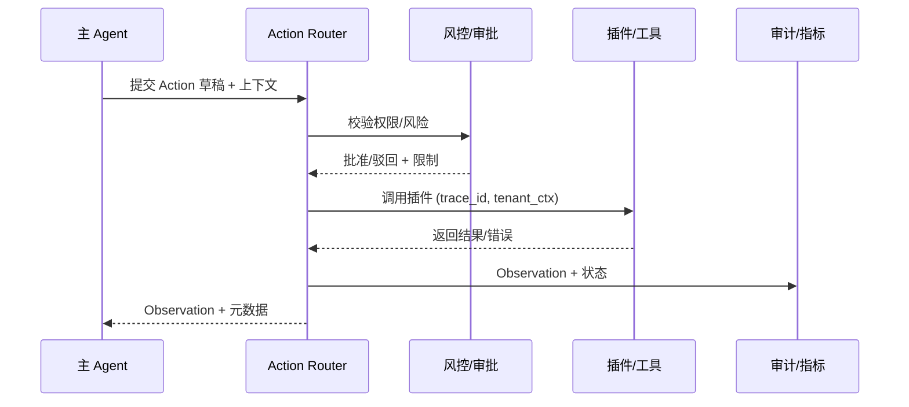

# Executive Summary

该子场景负责把 Thought 转化为可执行的 Action：评估所需插件、准备参数、校验权限与风险、执行调用并写入 Observation。目标是维持 ≥95% 行动成功率，并确保所有敏感操作经过审批或人工协同。成功信号：每个 Action 绑定追踪 ID、插件调用 <3 秒完成（p95）、失败自动重试或降级、审批待处理状态可视。

# Scope & Guardrails

- **In Scope**：Action 模板、插件能力匹配、参数填充与校验、租户/用户权限验证、风控策略与人工审批、调用执行、失败降级与重试、Observation 写入。
- **Out of Scope**：插件自身业务逻辑、知识检索步骤、通用工作流画布、成本计费策略。
- **Environment & Flags**：`react-action-router`、`plugin-risk-guard`、`agent-approval-flow`、`react-actor-telemetry`; 依赖 Plugin Registry、IAM、Workflow Engine、Audit/Telemetry。

# Participants & Responsibilities

| Scope | Repository | Layer | 责任与交付物 | Owners |
|-------|------------|-------|--------------|--------|
| action-router | powerx | service | Action 生成、插件能力匹配、参数模板、重试/降级策略 | Agent Platform Guild |
| plugin-catalog | powerx-plugin | integration | 插件元数据、权限/租户映射、执行器 SDK、健康探针 | Plugin Guild |
| risk-control | powerx | ops | 风险分级、审批编排、人工协同、告警 | Ops Reliability Center |

# End-to-End Flow

1. **Stage 1 – Action Drafting**：Thought 引擎传入目标、所需数据、风险标签；Action Router 选择模板、填充参数、生成调用意图。
2. **Stage 2 – Capability & Policy Check**：校验插件版本、租户权限、速率限制与敏感标签；若为高风险操作则触发审批或人工确认。
3. **Stage 3 – Execution & Observation Capture**：将 Action 转发至插件执行器，携带租户上下文、追踪 ID、Teleport token；收集响应并结构化为 Observation。
4. **Stage 4 – Failure Handling & Escalation**：失败则按照策略重试/降级/人工协同；所有动作结果写入审计并反馈给 Thought/Memory 子场景。

# Architecture Diagram

# Key Interactions & Contracts

- **APIs / Events**
  - `POST /internal/react/action`：Body 含 `thought_id`, `tool`, `params`, `risk_level`; 返回 Action ID、状态。
  - `POST /internal/react/action/{id}/approve`：审批接口，支持人工与策略自动通过。
  - `POST /internal/plugins/{plugin}/invoke`：插件执行入口，头部包含 `trace_id`, `tenant_uuid`, `auth_token`。
  - `EVENT react.action.state.changed`：状态 `draft/pending/approved/running/succeeded/failed/aborted`。
- **Configs / Schemas**
  - `config/react/action_templates.yaml`、`config/plugins/catalog.yaml`、`config/risk/agent_action_policies.yaml`。
  - `schemas/react_action.json`, `schemas/react_observation.json`。
- **Security / Compliance**
  - 所有调用需携带短期凭证与租户隔离标签。
  - 高风险操作需要双人审批或风控策略批准。
  - 失败日志需脱敏，且记录 Plugin 版本、参数哈希。

# Usecase Links

- `UC-AGENT-REACT-ACTION-001` — Action Router + 风控审批链路（integration 层，`docs/usecases-seeds/SCN-AGENT-REACT-ORCH-001/UC-AGENT-REACT-ACTION-001.md`）。

# Acceptance Criteria

1. Action 生成耗时 <800ms，模板命中率 ≥90%，缺失字段会返回提示。
2. 插件调用成功率 ≥95%，失败三次以内必须降级或切换备选插件。
3. 敏感操作 100% 触发审批或人工确认，审批平均耗时 <2 分钟。
4. 每个 Action/Observation 均绑定 Trace ID，并写入审计/Telemetry。

# Telemetry & Ops

- **指标**：`react.action.latency_ms`、`react.action.success_rate`、`react.action.retry_total`、`react.action.approval_pending_total`、`react.action.risk_block_total`。
- **日志/审计**：`audit.react_action` 记录插件、版本、参数哈希、审批结果、重试次数；执行器 INFO/ERROR 日志包含 Trace。
- **告警**：成功率 <95%、审批排队 >2 分钟、连续失败次数 >3、Trace 丢失；通知 PagerDuty + Teams #agent-react。
- **Runbooks**：`scripts/ops/react-action-drill.mjs`、`runbooks/agent/react_action_escalation.md`。

# Open Issues & Follow-ups

| 风险/事项 | 影响范围 | 负责人 | ETA |
|-----------|----------|--------|-----|
| 插件风控标签与 Marketplace 未完全同步 | 敏感操作判定滞后 | Plugin Guild | 2025-03-04 |
| 审批工作流缺乏批量/撤销能力 | 高并发审批、失败回滚 | Ops Reliability Center | 2025-03-10 |

# Appendix

- `docs/meta/scenarios/powerx/agent-and-automation/agent-orchestration/react-agent-orchestration/primary.md`
- `docs/_data/docmap.yaml`
