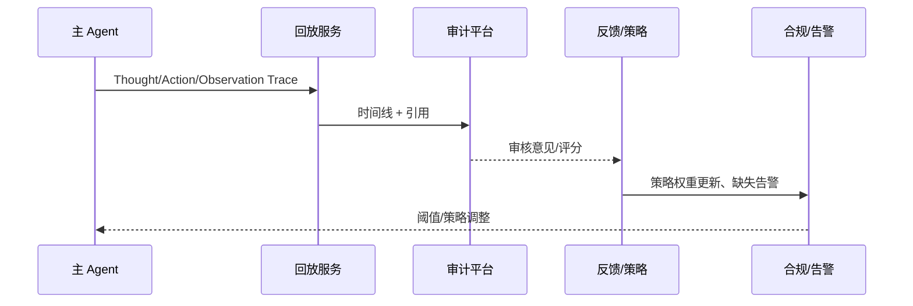

# Executive Summary

该子场景确保 ReAct 会话结束或被终止时，能够交付完整答案、生成可回放的时间线、触发审计/合规流程并回写策略。目标是让回放生成成功率达到 100%、关键节点拥有时间戳与操作者、审计可在 30 秒内完成读取；当日志缺失或检测到违规调用时，自动生成调查工单并阻断策略继续上线。

# Scope & Guardrails

- **In Scope**：结果汇总、引用与置信度展示、回放轨迹生成、审计查询、用户/审计反馈采集、策略权重/阈值更新、缺失日志检测、合规工单。
- **Out of Scope**：知识库更新流程、人工审批实现细节、业务报告排版。
- **Environment & Flags**：`react-audit-timeline`、`react-feedback-loop`、`audit-gap-detector`；依赖 Audit Service、Telemetry、Workflow/Compliance 平台、Dashboard。

# Participants & Responsibilities

| Scope | Repository | Layer | 责任与交付物 | Owners |
|-------|------------|-------|--------------|--------|
| playback-service | powerx | service | 回放轨迹生成、时间线可视化、引用/指标绑定 | Agent Platform Guild |
| audit-pipeline | powerx | ops | 审计查询、缺失检测、合规工单、报告生成 | Ops Reliability Center |
| feedback-loop | powerx | service | 用户评分、审计标注、策略权重/阈值更新 | Agent Platform Guild |

# End-to-End Flow

1. **Stage 1 – Closure Summary**：Reasoner 依据最终 Observation 生成答案、关键结论、引用与置信度，并写入回答模板。
2. **Stage 2 – Timeline Assembly**：回放服务收集所有 Thought/Action/Observation、插件日志与审批记录，生成有序时间线与差异比对。
3. **Stage 3 – Audit & Feedback**：审计员/用户可请求回放、标注“正确/需改进”，若发现缺失会触发 `audit-gap-detector` 自动生成工单。
4. **Stage 4 – Strategy Update & Reporting**：根据反馈更新策略权重或风险阈值，把指标写入监控平台并生成日报/周报。

# Architecture Diagram

# Key Interactions & Contracts

- **APIs / Events**
  - `POST /internal/react/playback`：输入 Trace ID 或会话 ID，返回时间线、引用、审批记录。
  - `GET /internal/react/playback/{id}`：供控制台/审计界面查询，支持分页与过滤。
  - `POST /internal/react/feedback`：记录用户/审计评价、标签、附件、策略建议。
  - `EVENT react.audit.gap_detected`：当日志缺失或数据不一致时触发，携带严重级别与处置建议。
- **Configs / Schemas**
  - `config/react/playback_layout.yaml`、`config/audit/reports/react_audit.yaml`、`schemas/react_feedback.json`。
  - 回放存储结构：`reports/react/<tenant>/<trace_id>.jsonl`。
- **Security / Compliance**
  - 回放仅对授权角色可见，需审计日志记录访问者。
  - 敏感数据在回放界面脱敏显示，并保留原始审计引用。

# Usecase Links

- `UC-AGENT-REACT-AUDIT-001` — ReAct 回放与审计闭环（ops 层，`docs/usecases-seeds/SCN-AGENT-REACT-ORCH-001/UC-AGENT-REACT-AUDIT-001.md`）。

# Acceptance Criteria

1. 回放生成成功率 100%，平均耗时 <5 秒；缺失字段立即告警。
2. 关键节点（Thought/Action/Observation/审批）均带时间戳、操作者、引用与结果。
3. 审计员可在 30 秒内检索任意 Trace，并导出报告或生成合规工单。
4. 用户/审计反馈将于 10 分钟内写回策略权重或风险阈值，并记录版本。

# Telemetry & Ops

- **指标**：`react.playback.latency_ms`、`react.playback.gap_total`、`react.audit.feedback_total`、`react.audit.approval_rate`、`react.strategy.update_total`。
- **日志/审计**：`audit.react_playback` 保存时间线摘要、访问者信息、缺失检测结果；`audit.react_feedback` 保存评分与标签。
- **告警**：回放失败、缺失日志、审计访问异常、反馈处理超时；通知 Ops on-call、Teams #agent-audit、合规邮箱。
- **工具**：`scripts/qa/react-playback-check.mjs --trace <id>`、`node scripts/qa/workflow-metrics.mjs --metric react.playback.latency_ms`。

# Open Issues & Follow-ups

| 风险/事项 | 影响范围 | 负责人 | ETA |
|-----------|----------|--------|-----|
| 回放存储增长与分层策略未评估 | 成本、查询延迟 | Ops Reliability Center | 2025-03-07 |
| 审计标注界面缺乏批量操作能力 | 审核效率 | Agent Platform Guild | 2025-03-11 |

# Appendix

- `docs/meta/scenarios/powerx/agent-and-automation/agent-orchestration/react-agent-orchestration/primary.md`
- `docs/_data/docmap.yaml`
