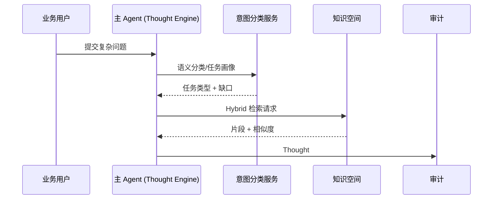

# Executive Summary

该子场景确保主 Agent 在接收到复杂问题后，能够在 1.5 秒内生成首个 Thought，选择最优的知识检索策略，并提供可回放的上下文。重点在于“意图理解 → 缺口识别 → 检索策略混合 → 片段裁剪”的闭环，避免思考链断点或低置信度片段污染后续行动。成功信号：Thought #1 包含假设与缺失信息、首轮检索命中率 ≥80%、检索耗时 <2 秒、片段附带引用 ID 与相似度评分。

# Scope & Guardrails

- **In Scope**：意图分类、任务类型识别、Thought/Plan 模板选择、缺口检测、检索策略路由（向量/关键词/图谱/Hybrid）、片段裁剪与脱敏、审计日志。
- **Out of Scope**：插件调用、风险审批、知识库构建或索引刷新流程、模型路由（由模型接入场景负责）。
- **Environment & Flags**：`react-thought-engine`、`knowledge-hub-mix-search`、`react-trace-persist`; 依赖 LLM Gateway、Knowledge Store、Audit Service。

# Participants & Responsibilities

| Scope | Repository | Layer | 责任与交付物 | Owners |
|-------|------------|-------|--------------|--------|
| intent-classifier | powerx | service | 意图/任务类型模型、Thought 模板渲染、缺口检测 | Agent Platform Guild |
| knowledge-router | powerx | integration | 检索策略路由、片段打分、置信度评估、审计写入 | Knowledge Intelligence Team |
| audit-hooks | powerx | service | 思考链持久化、引用 ID 生成、Trace 绑定 | Ops Reliability Center |

# End-to-End Flow

1. **Stage 1 – Intent Intake & Session Seeding**：生成会话 ID、Trace ID，运行意图分类模型，确定任务类型、语义槽位并渲染 Thought 模板。
2. **Stage 2 – Gap Analysis & Strategy Planning**：根据任务类型与租户策略识别缺失字段，挑选检索模式（向量/关键词/图谱/混合），附带策略原因。
3. **Stage 3 – Retrieval Execution & Scoring**：并发向知识空间发起请求，整合片段、相似度、来源元数据，对低置信度片段打标，并将摘要写入 Thought。
4. **Stage 4 – Logging & Handoff**：把 Thought/片段引用写入审计与指标，向行动子场景传递 enriched context；若置信度低于阈值则触发用户澄清或 fallback。

# Architecture Diagram

# Key Interactions & Contracts

- **APIs / Events**
  - `POST /internal/react/thought`：Body 含 `question`, `tenant_uuid`, `context`, `risk_profile`，返回 Thought ID、缺口列表。
  - `POST /internal/knowledge/search`：参数 `mode`, `filters`, `max_context_tokens`，返回 `snippets[]`、`score`, `source_ref`。
  - `EVENT react.thought.logged`：包括 Trace ID、策略、置信度、片段 ID，供 Observability 订阅。
- **Configs / Schemas**
  - `config/react/thought_templates.yaml`（按任务类型定义思考链模板）。
  - `config/knowledge/routing.yaml`（策略选择与阈值）。
  - `schemas/audit/react_thought.json`。
- **Security / Compliance**
  - Thought 日志需脱敏用户原文，仅保留引用 ID。
  - 检索请求包含租户/数据域标签，防止越权访问。

# Usecase Links

- `UC-AGENT-REACT-THOUGHT-001` — Thought 引擎与知识检索混合策略（service 层，`docs/usecases-seeds/SCN-AGENT-REACT-ORCH-001/UC-AGENT-REACT-THOUGHT-001.md`）。

# Acceptance Criteria

1. Thought #1 在 1.5 秒内生成，包含任务类型、假设、缺口与下一步计划。
2. 首轮检索命中率 ≥80%，相似度低于 0.6 的片段须打标并触发澄清/降级。
3. 检索耗时 <2 秒（p95），若超过则自动降级到缓存/摘要策略并记录告警。
4. 每个 Thought/片段均写入审计并附上 `trace_id`、`source_ref`、`score`。

# Telemetry & Ops

- **指标**：`react.thought.latency_ms`、`react.knowledge.hit_rate`、`react.knowledge.low_confidence_total`、`react.gap.prompt_rate`。
- **日志/审计**：`audit.react_thought` 记录模板版本、策略、片段 ID、缺口描述；INFO 日志保留裁剪后的上下文摘要。
- **告警**：Thought 生成失败率 >1%、检索超时率 >5%、低置信度占比 >30%；推送 Teams #agent-react 与 PagerDuty。
- **工具**：`scripts/qa/react-thought-lab.mjs --tenant tenant-react-lab`、`node scripts/qa/workflow-metrics.mjs --metric react.thought.latency_ms`。

# Open Issues & Follow-ups

| 风险/事项 | 影响范围 | 负责人 | ETA |
|-----------|----------|--------|-----|
| 意图分类模型行业/多语言样本覆盖不足 | Thought 模板准确率下降 | Agent Platform Guild | 2025-03-08 |
| 图谱检索接口缺少置信度解释字段 | 片段可解释性与审计说明 | Knowledge Intelligence Team | 2025-03-12 |

# Appendix

- `docs/meta/scenarios/powerx/agent-and-automation/agent-orchestration/react-agent-orchestration/primary.md`
- `docs/_data/docmap.yaml`（child_scenarios 配置）
