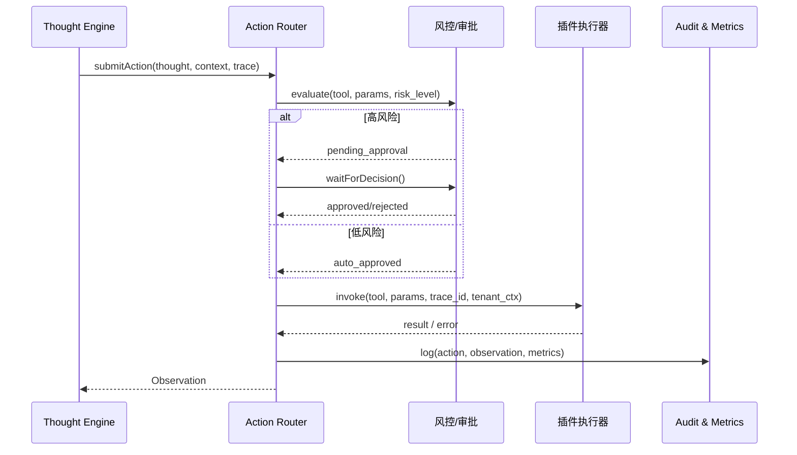

doc_id: UC-AGENT-REACT-ACTION-001
scn_id: SCN-AGENT-REACT-ORCH-001
title: PowerX (integration) - ReAct 行动计划与插件调用
status: Draft
version: v0.1.0
repo_key: powerx
scope: powerx
layer: integration
domain: agent-orchestration
scenario_title: "ReAct 智能体编排"
owners:
  - name: Agent Platform Guild
    role: Action Router Owner
    contact: agent-platform@artisan-cloud.com
contributors:
  - name: Plugin Guild
    role: Tooling Partner
    contact: plugins@artisan-cloud.com
  - name: Ops Reliability Center
    role: Risk & Approval Partner
    contact: ops-center@artisan-cloud.com
linked_requirements:
  - id: SCN-AGENT-REACT-ORCH-001
    description: 主场景 - ReAct 智能体编排
  - id: SCN-AGENT-REACT-ACTION-001
    description: 子场景 B - 行动计划与插件调用
code_refs:
  - repo: powerx
    path: services/react/action-router.ts
    description: Action 模板、参数填充、追踪 ID 管理
  - repo: powerx
    path: services/security/action_risk_guard.ts
    description: 风控策略、审批流触发、失败降级
  - repo: powerx
    path: services/plugins/catalog_client.ts
    description: 插件能力/版本/权限校验
  - repo: powerx
    path: workflow/agent_action_guard.yaml
    description: 人工审批与协作状态机
  - repo: powerx
    path: services/observability/react_action_metrics.ts
    description: 行动指标、Trace 写入、告警
feature_flags:
  - react-action-router
  - agent-action-approval
  - plugin-risk-guard
  - react-actor-telemetry
last_reviewed_at: 2025-02-21

---

# Usecase Overview

- **业务目标**：将 Thought 中的计划在 800ms 内转为可执行的 Action，选择最合适的插件/工具并完成权限校验、风险审批与执行，保证行动成功率 ≥95%。
- **成功度量**：`react.action.success_rate` ≥95%；审批平均耗时 <2 分钟；敏感操作审批覆盖率 100%；`react.action.latency_ms_p95` < 3000ms；追踪丢失率为 0。
- **场景关联**：为主场景 `SCN-AGENT-REACT-ORCH-001` 提供执行能力；其 Observation 输出被 `UC-AGENT-REACT-MEMORY-001` 与 `UC-AGENT-REACT-AUDIT-001` 消费。

> 摘要：该用例聚焦“Action 模板 → 风险与审批 → 插件调用 → Observation 反馈”链路，保障每次工具调用都可追踪、可降级、可被审计。

# Context & Assumptions

- **前置条件**
  - Feature Flags `react-action-router`, `agent-action-approval`, `plugin-risk-guard`, `react-actor-telemetry` 已启用。
  - 插件目录提供最新版本、权限、风险标签；IAM、Workflow、Notification 服务可用。
  - `docs/scenarios/agent-orchestration/SCN-AGENT-REACT-ACTION-001.md` 中的阶段定义已确认。
- **输入/输出**
  - 输入：`thought_id`, `action_template`, `tool_candidates[]`, `tenant_ctx`, `user_ctx`, `risk_level`, `trace_id`, `context`。
  - 输出：`action_id`, `tool`, `params`, `approval_state`, `status`, `observation`, `metrics`, `failure_reason?`, `fallback?`。
- **边界**
  - 不实现插件内部业务逻辑，仅负责调用和治理。
  - 不处理长期记忆或知识写入（由 Memory 用例负责）。
  - 不输出最终回答或回放报告（由 Audit 用例负责）。

# Solution Blueprint

## 体系分解

| 层 | 主要组件/模块 | 责任 | 代码入口 |
|----|---------------|------|---------|
| integration | `services/react/action-router.ts` | Action 模板渲染、参数合成、工具匹配、Trace 管理 | `services/react/action-router.ts` |
| service | `services/security/action_risk_guard.ts` | 风险分级、审批/人工协同触发、失败阈值 | `services/security/action_risk_guard.ts` |
| integration | `services/plugins/catalog_client.ts` | 查询插件能力、权限、速率限制、租户授权 | `services/plugins/catalog_client.ts` |
| ops | `workflow/agent_action_guard.yaml` | 审批状态机、通知、升级策略 | `workflow/agent_action_guard.yaml` |
| service | `services/observability/react_action_metrics.ts` | 指标与审计写入、Grafana 面板、告警钩子 | `services/observability/react_action_metrics.ts` |

## 流程与时序

1. **Step 1 – Draft Action**：收到 Thought 草稿，选择模板、填充参数、设置追踪/重试/超时策略。
2. **Step 2 – Capability & Policy Check**：校验工具版本、租户授权、速率限制、敏感标签；若不满足则切换备选或请求补充信息。
3. **Step 3 – Risk & Approval**：调用 `agent_action_guard`：低风险自动批准，高风险进入人工或多级审批；审批结果写入状态机并通知。
4. **Step 4 – Execution & Observation Capture**：调用插件执行器，收集响应、指标、错误、回显；失败按策略重试/降级/人工协同。
5. **Step 5 – Logging & Handoff**：将行动状态、Observation、风险结果写入 Audit/Telemetry，并回传给 Memory/Audit 流程。

# Contracts & Interfaces

- **Inbound APIs / Events**
  - `POST /internal/react/action` — Body: `thought_id`, `tool_candidates`, `params`, `risk_level`, `tenant_ctx`, `trace_id`; 返回 `action_id`, `approval_state`, `status`, `retries`.
  - `EVENT react.action.state.changed` — 供 UI / 监控消费，包含 `action_id`, `state`, `tool`, `trace_id`, `reason`.
- **Outbound 调用**
  - `POST /internal/plugins/{tool}/invoke` — 插件执行器；超时 3s，失败后指数退避重试 2 次。
  - `POST /internal/workflow/agent_action_guard` — 创建或更新审批；支持回退/加签、SLA 升级。
  - `POST /internal/iam/policies/validate` — 校验权限/速率策略。
- **配置与脚本**
  - `config/react/action_templates.yaml`, `config/risk/agent_action_policies.yaml`, `config/plugins/catalog.yaml`。
  - `scripts/ops/react-action-drill.mjs`, `scripts/qa/plugin-risk-sim.mjs`。

# Implementation Checklist

| 项目 | 描述 | 完成状态 | 负责人 |
|------|------|----------|--------|
| Action 模板与风险标注 | 设计模板、变量映射、风险级别 | [ ] | Agent Platform Guild |
| 插件目录同步 | 提供能力、权限、速率、风险标签 API | [ ] | Plugin Guild |
| 风控/审批编排 | 实现敏感操作审批、人工协同、降级路径 | [ ] | Ops Reliability Center |
| Telemetry & Audit | `react.action.*` 指标、审计 Schema、仪表盘 | [ ] | Ops Reliability Center |
| CLI & Runbooks | `react-action-drill.mjs`、审批/降级 Runbook | [ ] | Agent Platform Guild |

# Testing Strategy

- **单元**：模板渲染、参数校验、工具匹配、追踪 ID 绑定、审批状态机、降级矩阵。
- **集成**：Mock IAM/Workflow/Plugin Runner，覆盖成功、审批中、拒绝、失败/重试、降级等路径。
- **端到端**：使用 `scripts/ops/react-action-drill.mjs --tool crm-query --risk medium` 在 `tenant-react-lab` 执行，验收 Trace、审批、Observation、指标。
- **非功能**：100 RPS 压测 Action Router；Chaos（Workflow 延迟、IAM 超时、插件 500）；验证自动降级与人工协同触发。

# Observability & Ops

- **指标**：`react.action.latency_ms`, `react.action.success_rate`, `react.action.retry_total`, `react.action.approval_pending_total`, `react.action.risk_block_total`, `react.action.trace_missing_total`。
- **日志**：`audit.react_action` 记录 `action_id`, `trace_id`, `tool`, `params_hash`, `risk_level`, `approval_state`, `retries`, `result`; ERROR 日志附失败原因与降级动作。
- **告警**：成功率 <95%、审批排队 >2 分钟、敏感操作未审批、Trace 丢失、连续失败 ≥3、降级率 >10%；通知 PagerDuty + Teams #agent-react-action。
- **Dashboards**：Grafana「ReAct Action」、Datadog `react.action.*`、Workflow SLA 面板。

# Rollback & Failure Handling

- **回滚步骤**：通过 Feature Flag 停用新模板/策略；回退 Action Router/Guard 服务；恢复旧配置。
- **补救措施**：自动降级到备选工具、切换人工模式、暂停故障插件并通知 Vendor；审批阻塞时自动升级到值班。
- **数据修复**：`scripts/ops/react-action-replay.mjs --action <id>` 重放审计；在 Catalog 中解绑错误权限或风险标签。

# Follow-ups & Risks

| 风险/事项 | 影响 | 缓解方案 | 负责人 | ETA |
|-----------|------|----------|--------|-----|
| 插件风险标签滞后 | 敏感操作被绕过或误杀 | 与 Marketplace 风控建立实时同步、校验脚本 | Plugin Guild | 2025-03-04 |
| 审批不支持批量/撤销 | 高并发审批效率低、回滚困难 | 扩展 Workflow API 支持批量/撤销、引入 SLA 升级 | Ops Reliability Center | 2025-03-10 |
| Trace 丢失导致不可审计 | 合规风险 | 强制 Trace 校验、失败时中断循环并提示人工 | Agent Platform Guild | 2025-03-08 |

# References & Links

- 场景文档：`docs/scenarios/agent-orchestration/SCN-AGENT-REACT-ACTION-001.md`
- 主场景：`docs/scenarios/agent-orchestration/SCN-AGENT-REACT-ORCH-001.md`
- 标准：`docs/standards/powerx/backend/integration/09_agent/Agent_Manager_and_Lifecycle_Spec.md`
- Runbook：`runbooks/agent/react_action_escalation.md`
- QA：`scripts/ops/react-action-drill.mjs`
