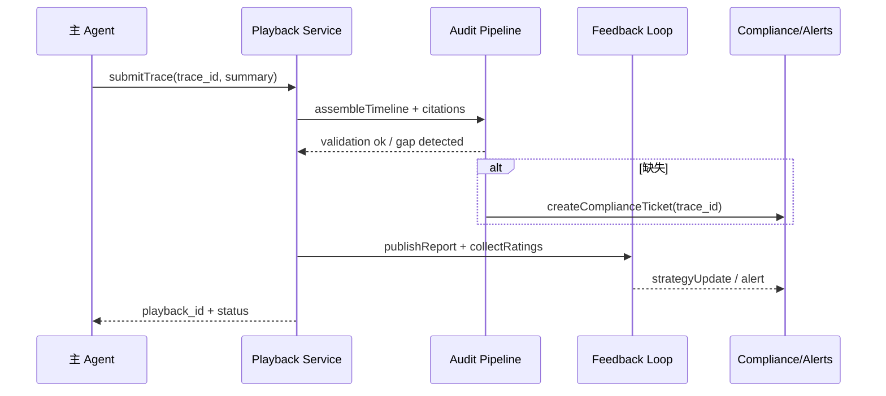

doc_id: UC-AGENT-REACT-AUDIT-001
scn_id: SCN-AGENT-REACT-ORCH-001
title: PowerX (ops) - ReAct 闭环交付与审计回放
status: Draft
version: v0.1.0
repo_key: powerx
scope: powerx
layer: ops
domain: agent-orchestration
scenario_title: "ReAct 智能体编排"
owners:
  - name: Ops Reliability Center
    role: Audit & Compliance Owner
    contact: ops-center@artisan-cloud.com
contributors:
  - name: Agent Platform Guild
    role: Playback Tooling Partner
    contact: agent-platform@artisan-cloud.com
  - name: Knowledge Intelligence Team
    role: Feedback Insights
    contact: knowledge@artisan-cloud.com
linked_requirements:
  - id: SCN-AGENT-REACT-ORCH-001
    description: 主场景 - ReAct 智能体编排
  - id: SCN-AGENT-REACT-AUDIT-001
    description: 子场景 D - 闭环交付与审计回放
code_refs:
  - repo: powerx
    path: services/observability/react_playback.ts
    description: 回放轨迹组装、时间线渲染
  - repo: powerx
    path: services/audit/react_report_writer.ts
    description: 审计报告 / 合规工单生成
  - repo: powerx
    path: services/feedback/react_feedback_handler.ts
    description: 用户/审计反馈采集、策略权重更新
  - repo: powerx
    path: scripts/qa/react-playback-check.mjs
    description: 回放完整性校验脚本
  - repo: powerx
    path: config/audit/react_playback_layout.yaml
    description: 回放布局、引用展示、敏感字段脱敏配置
feature_flags:
  - react-audit-timeline
  - react-feedback-loop
  - audit-gap-detector
last_reviewed_at: 2025-02-21

---

# Usecase Overview

- **业务目标**：在 ReAct 会话结束后 30 秒内生成可回放的时间线、引用与审批记录，交付最终回答与指标，并在日志缺失或违规时自动发起合规工单/策略更新。
- **成功度量**：回放生成成功率 100%；`react.playback.latency_ms_p95` < 5000；缺失检测误报 <1%；反馈处理时延 <10 分钟；审计查询 P95 < 2 秒。
- **场景关联**：消费 Thought/Action/Observation 轨迹，向 `SCN-AGENT-REACT-ORCH-001` 提供闭环指标，支撑合规/运营审计流程。

> 摘要：该用例定义 ReAct 会话的“总结→回放→审计→反馈→策略更新”闭环，保证交付结果可追溯、可标注、可治理。

# Context & Assumptions

- **前置条件**
  - Feature Flags `react-audit-timeline`, `react-feedback-loop`, `audit-gap-detector` 启用。
  - Audit Service、Report Writer、Workflow/Compliance 平台可用。
  - Thought/Action/Memory 用例均写入 Trace/Observation/引用，确保轨迹完整。
- **输入/输出**
  - 输入：`trace_id`, `conversation_id`, `thoughts[]`, `actions[]`, `observations[]`, `approvals[]`, `memory_refs[]`, `user_feedback?`。
  - 输出：`playback_id`, `timeline`, `citations`, `audit_report`, `feedback_summary`, `strategy_updates`, `alerts?`。
- **边界**
  - 不负责实时执行或循环治理；只处理闭环与审计。
  - 不生成成本计费或性能账单（由其它用例负责）。

# Solution Blueprint

## 体系分解

| 层 | 主要组件/模块 | 责任 | 代码入口 |
|----|---------------|------|---------|
| ops | `services/observability/react_playback.ts` | 聚合 Thought/Action/Observation/审批，生成时间线与引用 | `services/observability/react_playback.ts` |
| ops | `services/audit/react_report_writer.ts` | 生成审计报告、缺失检测、合规工单 | `services/audit/react_report_writer.ts` |
| service | `services/feedback/react_feedback_handler.ts` | 采集用户/审计反馈、策略权重更新、阈值调优 | `services/feedback/react_feedback_handler.ts` |
| ops | `scripts/qa/react-playback-check.mjs` | 自动验证回放完整性、引用匹配 | `scripts/qa/react-playback-check.mjs` |
| ops | `config/audit/react_playback_layout.yaml` | 回放展示、敏感字段脱敏、导出格式 | `config/audit/react_playback_layout.yaml` |

## 流程与时序

1. **Stage 1 – Closure Summary**：Reasoner 结束会话，生成最终回答、结论、引用与置信度。
2. **Stage 2 – Timeline Assembly**：Playback 服务拉取全量 Trace，归并 Thought/Action/Observation、审批、记忆引用，校验 Trace 完整性。
3. **Stage 3 – Audit & Gap Detection**：运行缺失检测（日志/引用/审批/记忆），失败则触发 `audit-gap-detector`，并可自动生成合规工单。
4. **Stage 4 – Feedback & Strategy Update**：采集用户评分、审计标注、策略建议；根据反馈更新策略权重/阈值并记录版本。
5. **Stage 5 – Distribution & Reporting**：输出回放链接、PDF/JSON 报告、指标摘要；将结果同步到 Dashboards、通知通道、知识库。

# Contracts & Interfaces

- **Inbound APIs / Events**
  - `POST /internal/react/playback` — 输入 `trace_id` 或 `conversation_id`，返回 `playback_id`, `timeline`, `citations`, `metrics`。
  - `GET /internal/react/playback/{id}` — 查询/导出回放；支持过滤、分页、脱敏模式。
  - `POST /internal/react/feedback` — Body: `playback_id`, `type=user|audit`, `rating`, `tags[]`, `comment`, `attachments[]`。
- **Outbound 调用**
  - `POST /internal/compliance/tickets` — 缺失或违规时创建工单。
  - `POST /internal/strategy/react_update` — 更新策略权重、阈值与版本号。
  - `EVENT react.audit.gap_detected` / `react.feedback.recorded` — 供监控与自动化消费。
- **配置与脚本**
  - `config/audit/react_playback_layout.yaml`, `config/audit/reports/react_audit.yaml`, `config/feedback/react_strategy.yaml`。
  - `scripts/qa/react-playback-check.mjs`, `scripts/qa/react-feedback-digest.mjs`。

# Implementation Checklist

| 项目 | 描述 | 完成状态 | 负责人 |
|------|------|----------|--------|
| Playback Aggregator | Trace 组装、引用关联、脱敏与导出格式 | [ ] | Agent Platform Guild |
| Audit Gap Detector | 缺失检测规则、工单集成、告警 | [ ] | Ops Reliability Center |
| Feedback Loop | 用户/审计评分、标签、策略更新流水 | [ ] | Agent Platform Guild |
| Reporting | PDF/JSON 报告、指标摘要、API/CLI | [ ] | Ops Reliability Center |
| Dashboards & Alerts | Grafana/Datadog 面板、PagerDuty 告警 | [ ] | Ops Reliability Center |

# Testing Strategy

- **单元**：时间线重排、引用检验、缺失检测、反馈聚合、策略更新幂等性。
- **集成**：Mock Thought/Action/Observation 输入，验证 Playback、Audit、Feedback、Compliance 工单互通；模拟日志缺失、引用不匹配、审批缺失等异常。
- **端到端**：运行 `scripts/qa/react-playback-check.mjs --trace <id>`，核查生成的时间线、报告、告警；在 sandbox 租户演练“成功回放 / 缺失 / 违规”路径。
- **非功能**：并发 50 回放请求、生成 100MB 报告、断电/重启恢复；Chaos（Audit DB 延迟、对象存储异常）。

# Observability & Ops

- **指标**：`react.playback.latency_ms`, `react.playback.gap_total`, `react.audit.feedback_total`, `react.audit.approval_rate`, `react.strategy.update_total`。
- **日志**：`audit.react_playback`（trace_id, playback_id, size, citations, gap_flag）、`audit.react_feedback`（rating, reviewer, strategy_effect）、`audit.react_strategy_update`。
- **告警**：回放失败、缺失日志、审计访问异常、反馈处理超时、策略更新失败；通知 Ops on-call、Teams #agent-audit、Compliance 邮箱。
- **Dashboards**：Grafana「ReAct Playback」「ReAct Feedback」、Datadog `react.playback.*`, `react.audit.*`、Compliance SLA 报表。

# Rollback & Failure Handling

- **回滚步骤**：关闭 `react-audit-timeline`、回退 Playback/Feedback 服务；恢复旧布局与策略配置。
- **补救措施**：回放失败→重放 Trace 或切换历史版本；缺失→触发补写脚本并暂停上线；反馈延迟→人工接管；策略更新异常→回滚版本并记录审计。
- **数据修复**：`scripts/ops/react-playback-rebuild.mjs --trace <id>` 重建时间线；`audit-tools fill-gap --playback <id>` 补写引用；`feedback-admin revert --version <n>` 回滚策略。

# Follow-ups & Risks

| 风险/事项 | 影响 | 缓解方案 | 负责人 | ETA |
|-----------|------|----------|--------|-----|
| 回放存储增长未受控 | 成本、查询延迟、合规风险 | 设计冷热分层、压缩策略、Retention Policy | Ops Reliability Center | 2025-03-07 |
| 审计标注界面缺批量功能 | 审核效率低、易漏审 | 为 UI 增加批量标注、快捷键、模板 | Agent Platform Guild | 2025-03-11 |
| 反馈与策略更新脱节 | 策略调优滞后 | 构建自动化 Feedback → Strategy pipeline，带版本审计 | Agent Platform Guild | 2025-03-15 |

# References & Links

- 场景：`docs/scenarios/agent-orchestration/SCN-AGENT-REACT-AUDIT-001.md`
- 主场景：`docs/scenarios/agent-orchestration/SCN-AGENT-REACT-ORCH-001.md`
- 标准：`docs/standards/powerx/backend/integration/09_agent/Agent_Manager_and_Lifecycle_Spec.md`
- QA：`scripts/qa/react-playback-check.mjs`, `scripts/qa/react-feedback-digest.mjs`
- Docmap：`docs/_data/docmap.yaml`
