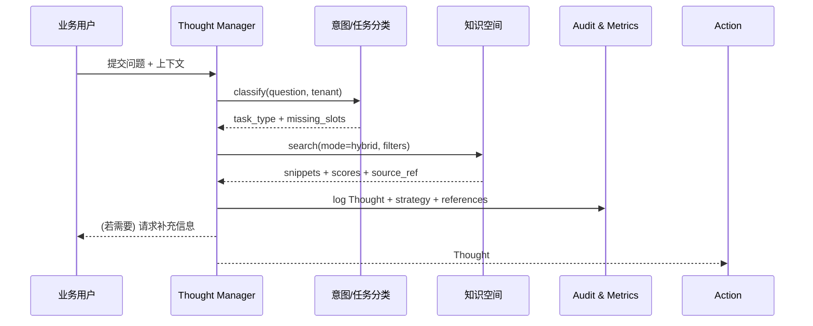

doc_id: UC-AGENT-REACT-THOUGHT-001
scn_id: SCN-AGENT-REACT-ORCH-001
title: PowerX (service) - ReAct 思考链与多策略检索
status: Draft
version: v0.1.0
repo_key: powerx
scope: powerx
layer: service
domain: agent-orchestration
scenario_title: "ReAct 智能体编排"
owners:
  - name: Agent Platform Guild
    role: Thought Engine Steward
    contact: agent-platform@artisan-cloud.com
contributors:
  - name: Knowledge Intelligence Team
    role: Retrieval Partner
    contact: knowledge@artisan-cloud.com
  - name: Ops Reliability Center
    role: Audit & Telemetry Partner
    contact: ops-center@artisan-cloud.com
linked_requirements:
  - id: SCN-AGENT-REACT-ORCH-001
    description: 主场景 - ReAct 智能体编排
  - id: SCN-AGENT-REACT-THOUGHT-001
    description: 子场景 A - 思考链生成与知识检索启动
code_refs:
  - repo: powerx
    path: services/react/thought-manager.ts
    description: 思考链状态机、模板渲染、Trace 绑定
  - repo: powerx
    path: services/knowledge/search.ts
    description: 多策略（向量/关键词/图谱）检索路由
  - repo: powerx
    path: services/observability/react_audit.ts
    description: Thought/片段引用审计与指标写入
feature_flags:
  - react-thought-engine
  - knowledge-hub-mix-search
  - react-trace-persist
last_reviewed_at: 2025-02-21

---

# Usecase Overview

- **业务目标**：在用户提交复杂问题后 1.5 秒内生成首个 Thought，识别缺失信息并自动挑选向量 / 关键词 / 图谱等检索策略，把高置信度片段写入上下文与审计。
- **成功度量**：`react.thought.latency_ms_p95` < 1500ms；首轮检索命中率 ≥80%；低置信度（<0.6）提示率 ≤20%；审计写入成功率 100%。
- **场景关联**：支撑 `SCN-AGENT-REACT-ORCH-001` 主循环、为 Action/Memory 子用例提供上下文，并向知识/推理主线回传策略结果。

> 摘要：本用例定义 ReAct 思考链入口的“意图理解 → 缺口识别 → 混合检索 → 引用打标”能力，保证推理链条可解释、可追踪、可治理。

# Context & Assumptions

- **前置条件**
  - Feature Flags `react-thought-engine`, `knowledge-hub-mix-search`, `react-trace-persist` 已开启。
  - LLM Gateway、Knowledge Hub（向量/关键词/图谱索引）、Audit Service 在线。
  - 租户策略与数据域标签已同步至 Thought Engine，可在请求中获取。
  - `docs/scenarios/agent-orchestration/SCN-AGENT-REACT-THOUGHT-001.md` 已定义流程、指标与风控。
- **输入/输出**
  - 输入：`question`, `tenant_id`, `risk_profile`, `conversation_context`, 可选 `follow_up_hint`。
  - 输出：`thought_id`, `task_type`, `hypothesis`, `missing_slots`, `retrieval_plan`, `snippets[]`（含 score、source_ref、safety_tag）、审计 Trace。
- **边界**
  - 不负责插件调用、参数组装或行动审批（由 Action 用例覆盖）。
  - 不处理知识库构建、索引更新（由知识空间场景负责）。
  - 不直接写入长期记忆，仅标记高价值片段供 Memory 用例消费。

# Solution Blueprint

## 体系分解

| 层 | 主要组件/模块 | 责任 | 代码入口 |
|----|---------------|------|---------|
| service | `services/react/thought-manager.ts` | 会话 ID/Trace 生成、意图分类、Thought 模板渲染、缺口检测 | `services/react/thought-manager.ts` |
| service | `services/knowledge/search.ts` | 根据任务/数据域路由向量、关键词、图谱或混合检索并汇总评分 | `services/knowledge/search.ts` |
| service | `services/observability/react_audit.ts` | 记录 Thought/片段引用、策略原因、低置信度告警 | `services/observability/react_audit.ts` |
| integration | `config/react/thought_templates.yaml` | 定义任务类型与模板、槽位、指标阈值 | `config/react/thought_templates.yaml` |
| ops | `workflow-metrics.mjs` | 采集 `react.thought.*` 指标并写入报告 | `scripts/qa/workflow-metrics.mjs` |

## 流程与时序

1. **Step 1 – Session Seeding**：主 Agent 接收问题，生成 `conversation_id` + `trace_id`，调用意图分类模型得到任务类型、风险标签、缺口描述。
2. **Step 2 – Strategy Planning**：Thought Manager 结合任务类型、租户策略、历史成功率，从 `config/knowledge/routing.yaml` 选取单一或组合检索模式并写入计划。
3. **Step 3 – Retrieval Execution**：并发请求向量、关键词、图谱服务，聚合片段并按 `score + policy_weight` 重新排名，低置信度片段打 `needs_clarification` 标签。
4. **Step 4 – Logging & Handoff**：把 Thought、片段引用、策略原因写入 Audit；向 Action 用例发送 enriched context；若置信度不足则提示用户补充信息或切换策略。

# Contracts & Interfaces

- **Inbound APIs / Events**
  - `POST /internal/react/thought` — Body: `question`, `tenant_id`, `context`, `trace_id?`, `risk_profile?`; Headers: `x-tenant`, `x-trace`; 返回 `thought_id`, `task_type`, `retrieval_plan`, `missing_slots`, `snippets`.
- **Outbound 调用**
  - `POST /internal/intent/classify` — 传入问题、租户、历史上下文，返回任务类型、置信度、缺口列表。
  - `POST /internal/knowledge/search` — 参数 `mode`, `filters`, `max_tokens`; 返回片段与相似度；需 2s 超时、重试 1 次。
  - `POST /internal/audit/react_thought` — 写入 Thought、策略、引用及低置信度指标。
- **配置与脚本**
  - `config/react/thought_templates.yaml` — 模板/槽位定义。
  - `config/knowledge/routing.yaml` — 检索策略、阈值、fallback。
  - `scripts/qa/react-thought-lab.mjs` — Sandboxing & regression。

# Implementation Checklist

| 项目 | 描述 | 完成状态 | 负责人 |
|------|------|----------|--------|
| Thought 模板治理 | 设计任务类型、槽位、缺口描述与本地化文案 | [ ] | Agent Platform Guild |
| 意图分类升级 | 扩充行业/多语言样本，产出 v2 模型 | [ ] | Agent Platform Guild |
| 检索策略编排 | 支持混合检索、权重配置、Fallback 与低置信度钩子 | [ ] | Knowledge Intelligence Team |
| 审计/指标扩展 | `audit.react_thought` Schema、`react.thought.*` 指标、Grafana 面板 | [ ] | Ops Reliability Center |
| SDK/CLI | `scripts/qa/react-thought-lab.mjs` 用于回归与性能测试 | [ ] | Agent Platform Guild |

# Testing Strategy

- **单元测试**：Thought 模板渲染、缺口检测、策略选择、片段排名、低置信度标记。
- **集成测试**：对接 Intent Service、Knowledge Search、Audit；模拟 200/400/500 响应与超时，确认重试 + 降级策略。
- **端到端**：运行 `scripts/qa/react-thought-lab.mjs --tenant tenant-react-lab --question "<>"`，核对 Thought/片段/指标写入。
- **非功能**：压测 `POST /internal/react/thought`（100 RPS）、Chaos（Intent Service 停机、向量检索超时）及自动降级。

# Observability & Ops

- **指标**：`react.thought.latency_ms`, `react.knowledge.hit_rate`, `react.knowledge.low_confidence_total`, `react.gap.prompt_rate`, `react.thought.audit_failure_total`。
- **日志**：`audit.react_thought` 记录 `thought_id`, `trace_id`, `task_type`, `strategy`, `missing_slots`, `snippets[#]`, `scores`; INFO 日志输出裁剪后的上下文与耗时。
- **告警**：Latency >1.5s（p95）、命中率 <70%、低置信度占比 >30%、Audit 写入失败、Tracer 丢失；通知 PagerDuty + Teams #agent-react。
- **Dashboards**：Grafana「ReAct Thought」，含延迟、策略成功率、失败原因分布；Datadog `react.thought.*`；`reports/usecases/usecases_SCN-AGENT-REACT-ORCH-001.json`。

# Rollback & Failure Handling

- **回滚步骤**：版本回退 Thought Manager（蓝绿部署）、还原模板/策略配置、恢复旧模型。
- **补救措施**：若检索故障，降级到缓存摘要或请求用户澄清；意图分类异常时切换到规则模板；Audit 失败走本地缓冲并定时重放。
- **数据修复**：使用 `scripts/ops/react-thought-replay.mjs --trace <id>` 重新写入缺失审计；必要时在 Audit DB 中标记补写事件。

# Follow-ups & Risks

| 风险/事项 | 影响 | 缓解方案 | 负责人 | ETA |
|-----------|------|----------|--------|-----|
| 意图模型行业样本不足 | Thought 模板命中率下降、需要人工澄清 | 扩充训练集、上线在线学习/反馈回路 | Agent Platform Guild | 2025-03-10 |
| 图谱检索缺少置信度解释 | 审计与调试困难 | 在 Graph API 中返回 `explanations[]` 字段 | Knowledge Intelligence Team | 2025-03-12 |
| Audit 流水量猛增 | 存储与查询成本上升 | 引入数据分层、TTL、采样策略 | Ops Reliability Center | 2025-03-20 |

# References & Links

- 场景文档：`docs/scenarios/agent-orchestration/SCN-AGENT-REACT-THOUGHT-001.md`
- 主场景：`docs/scenarios/agent-orchestration/SCN-AGENT-REACT-ORCH-001.md`
- 标准：`docs/standards/powerx/backend/integration/09_agent/Agent_Manager_and_Lifecycle_Spec.md`
- QA：`scripts/qa/react-thought-lab.mjs`
- Docmap：`docs/_data/docmap.yaml`
