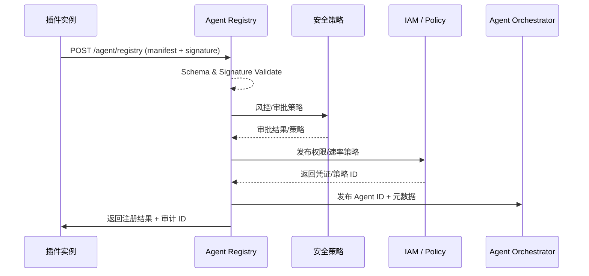

# Executive Summary

插件在启动或升级时应携带 Agent 描述文件，并通过 Registry API 自动完成注册。平台需要在 5 秒内完成签名/字段校验、生成 Agent ID、写入元数据与审计，同时根据策略触发安全审核或直接授权沙箱运行。本子场景确保 Vendor 交付的 Agent 能被即时纳入资产台账并可被主编排平台引用，避免僵尸或重复实例。

# Scope & Guardrails

- **In Scope**：Agent 描述生成、Registry API、签名与兼容性校验、Agent ID 生成、审批策略、沙箱验证、审计与指标。
- **Out of Scope**：插件业务逻辑、Agent 任务执行、Tenant 自定义配置、Marketplace 审核。
- **Environment & Flags**：`agent-registry-v1`、`plugin-autoreg-webhook`、`vendor-sandbox`；依赖 Secret Manager、Plugin Manifest Builder、Audit Service。

# Participants & Responsibilities

| Scope | Repository | Layer | 责任与交付物 | Owners |
|-------|------------|-------|--------------|--------|
| registry-api | powerx | service | Registry API、签名与 Schema 校验、Agent ID 分配、审计写入 | Agent Platform Guild |
| plugin-manifest | powerx-plugin | integration | 构建 Agent 描述、携带版本/权限、沙箱回归脚本 | Plugin Guild |
| security-hooks | powerx | service | 插件 Allowlist、风险策略、自动审批/复核逻辑 | Agent Platform Guild |

# End-to-End Flow

1. **Stage 1 – Manifest Build & Dispatch**：插件编译期或启动时生成 `agent.manifest.json`，包含能力、接口、权限、版本、依赖工具与签名，并通过启动钩子调用 Registry API。
2. **Stage 2 – Validation & Correlation**：Registry 校验签名、Schema、插件版本对齐情况，阻断缺失字段或重复 Agent，并把记录关联到插件版本台账及 Vendor 版本史。
3. **Stage 3 – ID Issuance & Policy Hooks**：通过雪花或 UUID 生成 Agent ID，写入元数据仓库并触发 IAM Policy Publisher 生成权限/速率策略。
4. **Stage 4 – Sandbox & Security Checks**：根据风险策略自动触发沙箱验证、自动审核或人工复核，沉淀沙箱报告与 Audit Trail。
5. **Stage 5 – Activation, Broadcast & Telemetry**：将 Agent 信息同步到编排平台、Catalog、监控指标，发布 `agent.registry.state.changed` 事件，并向 Vendor 返回可追踪的审计 ID。

# Architecture Diagram

# Key Interactions & Contracts

- **APIs / Events**：`POST /internal/agent/registry`、`GET /internal/agent/{id}`、`POST /internal/agent/registry/{id}/validate`、`EVENT agent.registry.registered`、`EVENT agent.registry.failed`。
- **Configs / Schemas**：`config/agent/registry/schema.yaml`、`docs/standards/powerx/backend/integration/09_agent/Agent_Manager_and_Lifecycle_Spec.md`、`plugins/<name>/agent.manifest.json` 模板。
- **Security / Compliance**：插件签名与证书校验、Manifest 版本兼容策略、同名 Agent 冲突保护、审计留痕与风控事件。

# Usecase Links

- `UC-AGENT-REG-AUTO-001` — 插件自动注册链路（integration 层，`docs/use_cases/_from_hub/SCN-AGENT-REG-MGMT-001/UC-AGENT-REG-AUTO-001.md`）。

# Implementation Checklist

| 项目 | 描述 | 负责人 | 状态 |
|------|------|--------|------|
| Manifest Schema & CLI | 维护 `config/agent/registry/schema.yaml` 及 lint/CLI 工具，覆盖能力、权限、依赖、租户标签 | Plugin Guild | [ ] |
| Registry API Gateway | `services/agent/registry/http.ts`：鉴权、限流、回调、重放保护 | Agent Platform Guild | [ ] |
| Signature & Security Hooks | `services/security/signature_verifier.ts`、Allowlist、风险策略、审计扩展 | Agent Platform Guild | [ ] |
| IAM Policy Binding | `services/iam/policy/publisher.ts`：权限/速率策略生成、冲突回滚 | Agent Platform Guild | [ ] |
| Sandbox & Telemetry | `scripts/ops/agent-sandbox-validate.mjs`、`services/observability/audit_pipeline.ts`：验证、指标、事件、告警 | Ops Reliability Center | [ ] |

# Acceptance Criteria

1. Manifest 提交至成功注册平均耗时 <5 秒，失败会返回可调试错误码。
2. 描述文件签名与必填字段校验覆盖率 100%，重复或缺失字段必须阻断。
3. 注册成功后 1 秒内在 Agent 台账、编排平台与插件版本记录中可查询。

# Testing Strategy

- **单元**：Manifest Schema 校验器、签名验证器、重复阻断逻辑、IAM 发布器幂等性均需 90%+ 覆盖。
- **集成**：使用沙箱插件调用 `POST /internal/agent/registry` 覆盖成功/失败路径；模拟签名失效、字段缺失、IAM 失败、沙箱报错。
- **端到端**：运行 `scripts/ops/agent-sandbox-validate.mjs --agent <id>`、`scripts/qa/plugin-autoreg.mjs --plugin insight-bot@1.2.0`，观察 Audit/指标/事件。
- **非功能**：对 Registry API 进行并发压测（100 RPS）与 Chaos（Secret Manager / Audit 不可用）验证降级与回滚。

# Observability & Ops

- **指标**：`agent.registry.latency_p95`、`agent.registry.success_rate`、`agent.registry.signature_failure_total`、`agent.registry.duplicate_block_total`、`agent.registry.sandbox_failure_total`。
- **日志/审计**：每次注册记录插件 ID、Agent ID、manifest 哈希、签名指纹、策略 ID、沙箱结果；INFO/ERROR 级别写入 Elastic + Audit Log。
- **告警**：签名失败率 >2%、注册错误率 >5%、沙箱 Pending >10 分钟、Audit 写入失败；推送至 PagerDuty + Teams #agent-registry。
- **Dashboards**：Grafana「Agent Registry」、Datadog `agent.registry.*`、Vendor 自助报表（由 `scripts/qa/plugin-autoreg.mjs` 输出）。

# Rollback & Failure Handling

- 注册失败：撤销新建 Agent 记录、清理策略/凭证与审计；返回 `4xx`/`5xx` 错误及 traceId。
- 签名/Schema 兼容性问题：由 CLI/lint 在 CI 阶段阻断，同时 Registry 提供 `dry_run=true` 诊断模式。
- Sandbox 失败：标记 Agent 为 `pending_fix`，阻止编排平台引用，通知 Vendor 并允许 `POST /internal/agent/registry/{id}/validate` 重跑。
- Audit/Telemetry 不可用：暂存事件到本地队列，恢复后批量回放；若超时则触发人工 runbook。

# Validation Workflow

1. 在 CI 中运行 `node scripts/qa/manifest-lint.mjs --plugin <name>` 校验 manifest。
2. 使用沙箱插件执行 `scripts/qa/plugin-autoreg.mjs --plugin <name>@<version>` 并验证 `agent.registry.*` 指标。
3. 运行 `npm run publish:scenarios -- --scn-id SCN-AGENT-REG-AUTO-001 --validate-only` 确保结构通过。
4. 如需发布，执行 `npm run publish:usecases -- --scn-id SCN-AGENT-REG-MGMT-001 --validate-only`，确保 Usecase Seeds 与 docmap 对齐。

# Follow-ups & Risks

| 风险/事项 | 影响范围 | 缓解方案 | 负责人 | ETA |
|-----------|----------|----------|--------|-----|
| Manifest Schema 与 Vendor 旧版不兼容 | 大量注册失败 | 维护 `schema_version` 策略 + 兼容层，并提供升级指南与 CLI 校验 | Plugin Guild | 2025-03-01 |
| 签名证书轮换不及时 | 安全风险/拒绝注册 | 构建证书到期告警，强制 Vendor 在 T-7 天前上传 | Agent Platform Guild | 2025-02-28 |
| Sandbox 资源瓶颈 | 注册排队 | 扩容资源池，引入优先级队列与离线批量模式 | Ops Reliability Center | 2025-03-05 |

# Related Links

- `docs/scenarios/agent-orchestration/SCN-AGENT-REG-MGMT-001.md`
- `docs/usecases-seeds/SCN-AGENT-REG-MGMT-001/UC-AGENT-REG-AUTO-001.md`
- `docs/standards/powerx/backend/integration/09_agent/Agent_Manager_and_Lifecycle_Spec.md`
- `config/agent/registry/schema.yaml`
