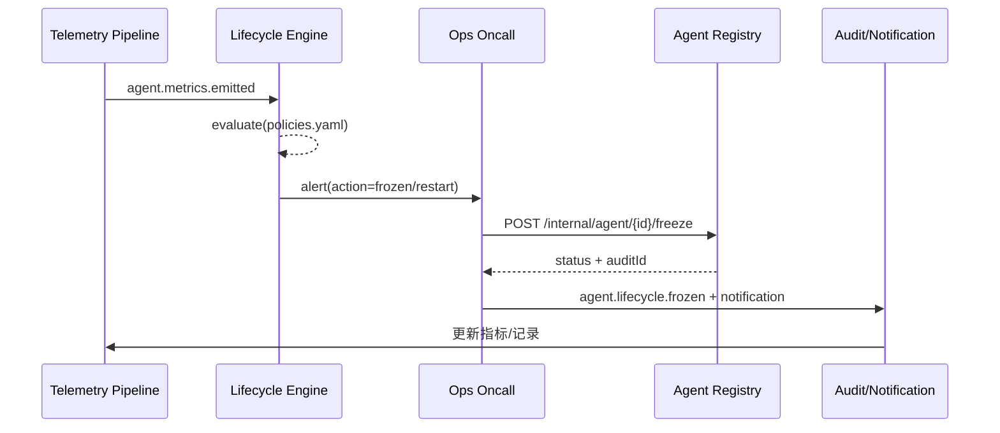

# Executive Summary

平台需要持续监测 Agent 的调用量、成功率、延迟与错误类型，并基于策略识别僵尸或异常 Agent，执行自愈、冻结、下线或资源回收动作。本子场景保障“监控 → 判定 → 处置 → 审计”闭环，目标是监控覆盖率 100%、异常响应 <10 分钟、资源回收成功率 100%，并将所有操作记录在案。

# Scope & Guardrails

- **In Scope**：指标采集、僵尸判定策略、异常告警、自愈动作（重启/限流/降级）、冻结/下线 API、资源回收、审计。
- **Out of Scope**：模型层观测、业务 SLA 细节、COPILOT 工单协作策略（由任务执行场景覆盖）。
- **Environment & Flags**：`agent-lifecycle-ops`、`agent-telemetry-bus`、`agent-recovery-framework`；依赖 Grafana/Datadog、Ops 告警、Notification、Audit 服务。

# Participants & Responsibilities

| Scope | Repository | Layer | 责任与交付物 | Owners |
|-------|------------|-------|--------------|--------|
| telemetry-pipeline | powerx | service | 调用/延迟/错误指标采集、状态事件总线 | Agent Platform Guild |
| lifecycle-engine | powerx | ops | 僵尸/异常判定策略、告警路由、自愈编排 | Ops Reliability Center |
| remediation-runs | powerx | ops | 冻结/下线/回收 API、Runbook、审计输出 | Ops Reliability Center |

# End-to-End Flow

1. **Stage 1 – Metrics & Signals**：收集 Agent 调用量、成功率、延迟、错误、资源占用等信号，写入 `agent.lifecycle.state` Topic。
2. **Stage 2 – Policy Evaluation**：Lifecycle Engine 根据 `policies.yaml`（僵尸规则、异常阈值、优先级）执行判定并输出动作建议。
3. **Stage 3 – Remediation & Recovery**：执行自愈（重启、限流、降级）或人工 Runbook；必要时调用冻结/回收 API 释放资源。
4. **Stage 4 – Audit & Notification**：记录操作日志、审计事件、指标，并通知责任人、租户管理员。
5. **Stage 5 – Review & Continuous Improvement**：定期复盘策略效果、指标趋势、告警准确率，调整阈值并同步到 Policy Engine。

# Architecture Diagram

# Key Interactions & Contracts

- **Events**
  - `agent.metrics.emitted` — Payload: `agent_id`, `tenant_id`, `calls`, `errors`, `latency_ms`, `idle_days`, `resource_usage`, `timestamp`.
  - `agent.lifecycle.zombie_detected` — 包含策略 ID、命中原因、建议动作、优先级、触发人。
  - `agent.lifecycle.frozen` / `agent.lifecycle.recovered` — 记录冻结/恢复状态、initiator、audit_id。
- **APIs**
  - `POST /internal/agent/{id}/freeze` — Body: `reason`, `initiator`, `force`, `ticket_id`; 需要双人 token。
  - `POST /internal/agent/{id}/recover`、`/retire`、`/resource/reclaim` — 控制回收与恢复。
- **Configs / Schemas**：`config/agent/lifecycle/policies.yaml`（僵尸/异常规则、优先级、灰度）、`docs/standards/powerx/backend/integration/09_agent/Agent_Metrics_and_Observability.md`、`runbooks/agent-freeze.yaml` / `agent-recover.yaml`。
- **Security / Compliance**：冻结/下线双人确认、操作签名、≥180 天审计、资源回收记录、租户通知。

# Usecase Links

- `UC-AGENT-REG-LIFECYCLE-001` — Agent 运行监控与僵尸治理（ops 层，`docs/use_cases/_from_hub/SCN-AGENT-REG-MGMT-001/UC-AGENT-REG-LIFECYCLE-001.md`）。

# Implementation Checklist

| 项目 | 描述 | 负责人 | 状态 |
|------|------|--------|------|
| Telemetry Pipeline | `services/telemetry/agent-lifecycle-pipeline.ts`：指标接入、租户/责任人标签、落地 Kafka/Datadog | Agent Platform Guild | [ ] |
| Lifecycle Policy Engine | `services/agent/lifecycle/policy_engine.ts`：策略 DSL、优先级、动作编排 | Ops Reliability Center | [ ] |
| Remediation APIs & Runbooks | `services/ops/runbooks/agent_freeze.ts`、`scripts/ops/agent-retire-zombie.mjs` | Ops Reliability Center | [ ] |
| Audit & Notification | `services/observability/audit_pipeline.ts`、Notification Center、PagerDuty 集成 | Ops Reliability Center | [ ] |
| Drill & Reporting | `scripts/ops/agent-lifecycle-drill.mjs`、Grafana「Agent Lifecycle」看板、每周复盘报表 | Ops Reliability Center | [ ] |

# Acceptance Criteria

1. 监控数据覆盖率 100%，指标延迟 <60 秒。
2. 僵尸或高错误 Agent 在 10 分钟内触发自愈或人工响应，冻结/回收成功率 100%。
3. 所有生命周期动作写入审计并通知责任人，资源释放时间 <5 分钟。

# Testing Strategy

- **单元**：策略引擎（各类规则/阈值/优先级）、僵尸计时器、冻结 API 逻辑、指标解析器。
- **集成**：模拟指标流和事件，验证策略触发、告警路由、Runbook 执行、审计写入；覆盖成功/失败路径。
- **端到端**：运行 `scripts/ops/agent-lifecycle-drill.mjs --profile zombie --tenant tenant-lab`，演练僵尸识别、冻结、回收；执行 `agent-retire-zombie.mjs --dry-run`。
- **非功能**：Policy Engine 每分钟处理 10k Agent 事件的性能测试；Chaos（Telemetry、Audit、Notification 中断）验证降级策略。

# Observability & Ops

- **指标**：`agent.lifecycle.coverage_rate`、`agent.lifecycle.zombie_detected_total`、`agent.lifecycle.alert_backlog`、`agent.lifecycle.freeze_duration_minutes`、`agent.lifecycle.mttd_minutes`、`agent.lifecycle.mttre_minutes`、`agent.lifecycle.resource_release_success_rate`。
- **日志/审计**：记录指标摘要、策略命中详情、执行动作、initiator、ticket_id；敏感字段脱敏；写入 Elastic + Audit Service。
- **告警**：Coverage <100%、MTTR >10 分钟、冻结失败、审计/通知失败、未监控 Agent >0。
- **Dashboards**：Grafana「Agent Lifecycle」、Datadog `agent.lifecycle.*`、Audit Explorer、Ops Pager 报表。

# Rollback & Failure Handling

- 策略误报：使用 `POST /internal/agent/{id}/recover` 恢复状态，记录 `reverted` 审计；在 Policy Engine 中回滚策略版本。
- Telemetry 中断：启用降级模式（本地缓存、定时巡检脚本），并向值班发送高优先告警。
- 冻结/回收失败：自动重试并触发 P1 工单，调用 `agent-registry-cleanup.mjs` 清理半成品状态。
- 指标延迟：Kafka/Datadog 延迟 >60 秒时进入降级，暂停自动动作，仅保留告警。

# Validation Workflow

1. 运行 `scripts/ops/agent-lifecycle-drill.mjs --profile zombie` 验证僵尸判定、冻结、通知链路。
2. 执行 `npm run publish:scenarios -- --scn-id SCN-AGENT-REG-LIFECYCLE-001 --validate-only`，确保结构通过。
3. 在 staging 环境模拟 Telemetry 中断/延迟，确认降级策略与告警。
4. 对 `scripts/ops/agent-retire-zombie.mjs --dry-run` 的输出进行审计，确保资源回收日志完整。

# Follow-ups & Risks

| 风险/事项 | 影响范围 | 缓解方案 | 负责人 | ETA |
|-----------|----------|----------|--------|-----|
| 僵尸策略阈值与业务 SLA 不一致 | 误报/漏报 | 引入租户/场景级阈值与灰度，策略变更需跑 `agent-lifecycle-drill.mjs --what-if` | Ops Reliability Center | 2025-02-28 |
| Telemetry 延迟或缺失 | 无法及时响应 | Kafka 延迟监控 + 自动降级 + 人工巡检脚本 | Agent Platform Guild | 2025-03-05 |
| Audit/Notification 不可用 | 合规缺口 | 缓存到 S3，恢复后补写；通知失败时生成工单并追踪 | Ops Reliability Center | 2025-02-28 |

# Related Links

- `docs/scenarios/agent-orchestration/SCN-AGENT-REG-MGMT-001.md`
- `docs/usecases-seeds/SCN-AGENT-REG-MGMT-001/UC-AGENT-REG-LIFECYCLE-001.md`
- `docs/standards/powerx/backend/integration/09_agent/Agent_Metrics_and_Observability.md`
- `config/agent/lifecycle/policies.yaml`

# Appendix

- `docs/meta/scenarios/powerx/agent-and-automation/agent-orchestration/agent-registration-and-management/primary.md`
- `docs/scenarios/agent-orchestration/SCN-AGENT-REG-MGMT-001.md`
