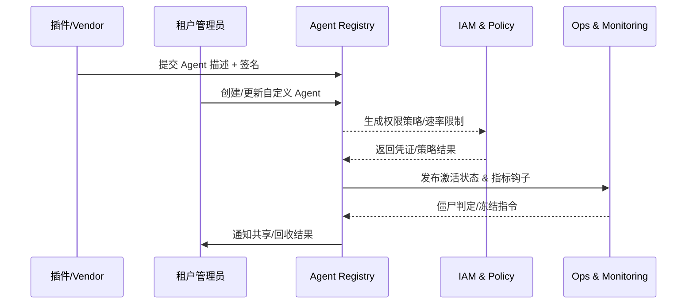

# Executive Summary

PowerX 插件生态、租户管理员与平台运维需要统一的智能体（Agent）注册与资产治理体系，以保证来源可信、权限受控、运行可观测并可随时回收。本场景覆盖“插件/租户提交 → 审核与策略绑定 → 激活与监控 → 跨租户共享/回收”的全生命周期，目标是在 5 秒内完成自动注册、2 个工作日内完成自定义 Agent 审批、监控覆盖率 100% 并在 30 分钟内回收僵尸 Agent，确保平台拥有透明的 Agent 台账与风控能力。

# Positioning & Goals

- 将 Agent Registry 打造成插件、租户与运维共用的统一入口，所有 Agent 均需持有同一套元数据、权限、审计字段。
- 让插件商与租户团队可自助创建/变更 Agent，同时嵌入安全审批、速率限制与租户策略校验，降低误配与越权。
- 让运维具备运行期指标、告警、僵尸判定与一键回收工具，杜绝“长尾无主 Agent”。
- 提供跨租户共享与目录能力，保证共享时的上下文隔离、配额独立与及时撤销。

# Core Capabilities

| 能力域 | 说明 | 关键系统/材料 |
|--------|------|---------------|
| Registry & Metadata Governance | 统一 Agent 描述、版本、插件映射、签名/审批状态并写入审计台账 | `services/agent-registry`, Agent Metadata DB, Audit Log |
| Tenant Self-Service & Approval | 控制台表单、权限/速率策略绑定、审批编排、API Key/Webhook 生成 | `console/agent-center`, IAM Policy Service, Workflow Engine |
| Lifecycle Monitoring & Recovery | 指标采集、僵尸判定、异常告警、冻结/回收执行与 Runbook | Telemetry Pipeline, `scripts/ops/agent-lifecycle.mjs`, Ops Console |
| Multi-tenant Catalog & Sharing | Agent 标签/目录、共享白名单、配额复制、撤销通知 | `services/agent-catalog`, Tenant Label Service, Notification Center |

# Scope & Guardrails

- **In Scope**：插件自动注册、租户自定义 Agent 审批、运行监控/僵尸治理、跨租户共享/撤销、审计与指标。
- **Out of Scope**：模型训练/推理、Agent 任务执行细节、Marketplace 计费策略、外部第三方平台注册流程。
- **Environment & Flags**：`agent-registry-v1`、`tenant-agent-center`、`agent-lifecycle-ops`、`agent-sharing-directory`；依赖 IAM、Secret Manager、Telemetry、Workflow、Notification 服务。

# Participants & Responsibilities

| Scope | Repository | Layer | 责任与交付物 | Owners |
|-------|------------|-------|--------------|--------|
| registry-core | powerx | service | Registry API、元数据 Schema、签名校验、审计/报告 | Agent Platform Guild |
| tenant-console | powerx | service | 自定义 Agent 表单、权限策略绑定、审批编排、密钥发放 | Agent Platform Guild |
| lifecycle-ops | powerx | ops | 指标采集、僵尸判定策略、冻结/回收 Runbook、告警处理 | Ops Reliability Center |
| plugin-vendors | powerx-plugin | integration | 插件 Agent 描述、版本兼容声明、共享策略、沙箱验证脚本 | Plugin Guild |

# End-to-End Flow

1. **Stage 1 – Manifest Intake & Cataloging**：插件或租户提交 Agent 描述文件，Registry 校验签名/字段并生成 Agent ID、关联插件与租户标签。
2. **Stage 2 – Policy Binding & Approval**：结合租户策略、数据域与速率限制生成权限配置，若为租户自建 Agent 则进入审批流或自动风控校验。
3. **Stage 3 – Activation & Observability**：审批通过后生成运行凭证、Webhook/调度策略并在沙箱验证，监控面收集调用量、延迟、错误率。
4. **Stage 4 – Lifecycle Governance & Sharing**：根据使用情况触发僵尸判定、冻结/回收；如需跨租户共享则设置共享白名单、复制配额并支持一键撤销。

# Architecture Diagram

# Key Interactions & Contracts

- **APIs / Events**：`POST /internal/agent/registry`、`POST /internal/agent/custom`、`POST /internal/agent/{id}/approve`、`POST /internal/agent/catalog/share`、`EVENT agent.registry.state.changed`、`EVENT agent.lifecycle.alert`。
- **Configs / Schemas**：`docs/standards/powerx/backend/integration/09_agent/Agent_Manager_and_Lifecycle_Spec.md`、`config/agent/registry/schema.yaml`、`config/agent/sharing/policies.yaml`。
- **Security / Compliance**：插件签名验证、租户隔离、审批留痕、调用凭证加密、操作审计、共享白名单与撤销通知。

# Usecase Links

- `UC-AGENT-REG-AUTO-001` — 插件内置 Agent 自动注册（integration 层，`docs/use_cases/_from_hub/SCN-AGENT-REG-MGMT-001/UC-AGENT-REG-AUTO-001.md`）。
- `UC-AGENT-REG-TENANT-001` — 租户自定义 Agent 创建与审批（service 层，`docs/use_cases/_from_hub/SCN-AGENT-REG-MGMT-001/UC-AGENT-REG-TENANT-001.md`）。
- `UC-AGENT-REG-LIFECYCLE-001` — Agent 运行监控与僵尸治理（ops 层，`docs/use_cases/_from_hub/SCN-AGENT-REG-MGMT-001/UC-AGENT-REG-LIFECYCLE-001.md`）。
- `UC-AGENT-REG-SHARE-001` — 多租户 Agent 目录与共享策略（integration 层，`docs/use_cases/_from_hub/SCN-AGENT-REG-MGMT-001/UC-AGENT-REG-SHARE-001.md`）。

# Implementation Checklist

| 项目 | 描述 | 负责人 | 状态 |
|------|------|--------|------|
| Registry API & Manifest Schema | `services/agent-registry` + `config/agent/registry/schema.yaml`：支持插件/租户统一的注册入口、签名/字段校验、审计拓展字段 | Agent Platform Guild | [ ] |
| Tenant Agent Center & Approval Flow | `services/tenant-agent-center` & `services/workflow/agent_approval_flow.ts`：表单、模板、多级审批、冲突提示、自动化凭证下发 | Agent Platform Guild / Ops Reliability Center | [ ] |
| Lifecycle Telemetry & Policy Engine | `services/telemetry/agent-lifecycle-pipeline.ts` + `services/agent/lifecycle/policy_engine.ts`：指标采集、僵尸/异常判定、Runbook 触发 | Ops Reliability Center | [ ] |
| Catalog Sharing & Revoke | `services/agent/catalog/share_service.ts` + `services/iam/quota/share_provisioner.ts`：白名单、配额复制、撤销脚本化 | Agent Platform Guild | [ ] |
| Audit / Notification / Reporting | `services/observability/audit_pipeline.ts`、通知中心、`scripts/qa/workflow-metrics.mjs`：统一指标、日志、报表、告警升级 | Ops Reliability Center | [ ] |

# Testing Strategy

1. **Schema & API 单测**：为 Registry、Tenant Console、Catalog 接口编写 Jest/Go 单测覆盖 90%+ 核心逻辑（字段校验、签名、冲突检测、白名单）。
2. **集成测试**：在 staging 环境使用沙箱插件与租户运行 `POST /internal/agent/registry`、`/agent/custom`、`/agent/catalog/share`，观察与 IAM、Workflow、Teleport 的交互日志。
3. **端到端演练**：运行 `npm run publish:scenarios -- --scn-id SCN-AGENT-REG-MGMT-001 --validate-only`、`npm run publish:usecases -- --scn-id ...`，并执行 `scripts/ops/agent-sandbox-validate.mjs`, `scripts/ops/agent-lifecycle-drill.mjs`, `scripts/ops/agent-share-drill.mjs` 模拟主链路。
4. **非功能/Chaos**：对 Registry API 压测（100 RPS）验证 95% 延迟；关闭 IAM/Telemetry/Notification 服务验证降级与回滚流程；执行僵尸批量回收与共享撤销回滚演练。

# Acceptance Criteria

1. 插件内置 Agent 自动注册在 5 秒内完成，签名/字段校验 100% 写入审计与告警。
2. 租户自定义 Agent 审批平均时长 <2 个工作日，权限/速率策略下发准确率 100%。
3. 运行监控覆盖率 100%，僵尸 Agent 判定后 30 分钟内自动冻结并通知责任人。
4. 跨租户共享/撤销操作均生成独立配额、凭证和日志，撤销后凭证即时失效。

# Observability & Ops

- **指标**：`agent.registry.latency_p95`、`agent.registry.success_rate`、`agent.custom.approval_duration_hours`、`agent.custom.policy_conflict_total`、`agent.lifecycle.zombie_detected_total`、`agent.share.active_total`、`agent.share.revocation_time_seconds`。
- **日志 & 审计**：Registry/Console/Catalog 所有写操作需记录 Agent ID、租户、版本、策略/凭证 ID、发起人、审批单、沙箱结果，敏感字段脱敏后写入 Elastic/S3 + `Audit Service`。
- **告警**：注册错误率 >5%、审批排队 >48h、沙箱失败率 >5%、僵尸回收超时 >30m、共享撤销失败率 >1%、未监控 Agent >0；通道覆盖 PagerDuty (P1)、Teams #agent-governance、Ops 邮件。
- **Dashboards**：Grafana「Agent Registry」「Tenant Agent Center」「Agent Lifecycle」「Agent Catalog Sharing」四套仪表；Datadog `agent.*` 命名空间；`scripts/qa/workflow-metrics.mjs` 生成日报。

# Rollback & Failure Handling

- 插件注册/审批失败：幂等删除新建 Agent 记录、撤销 IAM 策略、清理由本次写入的审计引用并返回明确错误码。
- 沙箱或共享验证失败：自动将 Agent 状态标记为 `pending_fix` 或 `share_failed`，阻断编排平台使用，并触发通知 + 工单。
- 僵尸回收/撤销失败：自动重试三次，仍失败时创建 P1 工单并锁定 Agent/租户，依赖 `scripts/ops/agent-registry-cleanup.mjs`、`agent-share-revoke.mjs` 强制清理。
- 核心依赖宕机（IAM、Telemetry、Notification）：进入降级模式（缓存 + 延迟发布），恢复后通过死信队列回放事件并补写审计。

# Validation Workflow

1. 更新 `docs/_data/docmap.yaml` 以登记 `SCN-AGENT-REG-MGMT-001` 及子场景（含 usecase seeds 与路径）。
2. 执行 `npm run publish:scenarios -- --scn-id SCN-AGENT-REG-MGMT-001 --dry-run` 验证结构、Mermaid 与 Frontmatter。
3. 运行 `npm run publish:usecases -- --scn-id SCN-AGENT-REG-MGMT-001 --validate-only`，确保未来 usecase 种子与 docmap 对齐。
4. 使用 `node scripts/qa/workflow-metrics.mjs --scenario SCN-AGENT-REG-MGMT-001` 收集注册/审批/回收链路指标。

# Follow-ups & Risks

| 风险/事项 | 影响范围 | 缓解方案 | 负责人 | ETA |
|-----------|----------|----------|--------|-----|
| docmap/usecase 元数据漂移 | 发布脚本失败、站点断链 | 将 `npm run publish:usecases -- --validate-only` 纳入 CI，变更后自动校验 | Agent Platform Guild | 2025-02-25 |
| 跨租户共享白名单与 IAM 标签不一致 | 越权或共享失败 | 建立 `agent-catalog-whitelist-sync.mjs` 定期同步，差异自动告警 | Plugin Guild & IAM Team | 2025-03-05 |
| Tenant Policy 模板未版本化 | 审批冲突、越权风险 | 为每个租户生成版本化策略文件，审批前执行 diff 校验 | IAM Platform Team | 2025-03-08 |
| Sandbox 资源不足导致注册/激活排队 | SLA 违约 | 扩容容器池、引入优先级队列与“沙箱后置”审批策略 | Ops Reliability Center | 2025-03-01 |

# Related Links

- `docs/meta/scenarios/powerx/agent-and-automation/agent-orchestration/agent-registration-and-management/primary.md`
- `docs/meta/scenarios/powerx/list.md`
- `docs/standards/powerx/backend/integration/09_agent/Agent_Manager_and_Lifecycle_Spec.md`
- `docs/usecases-seeds/SCN-AGENT-REG-MGMT-001/`
