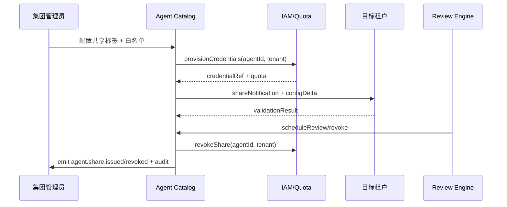

# Executive Summary

集团或平台管理员需要在多个租户之间共享已验证的 Agent，同时保持上下文隔离、配额独立与日志归属。本子场景定义“标记共享范围 → 复制配置与配额 → 目标租户验证 → 周期复核与撤销”流程，确保共享后的调用安全、审计透明，撤销时凭证立即失效。

# Scope & Guardrails

- **In Scope**：Agent 标签、共享白名单、租户映射、凭证与配额复制、目标租户验证、共享撤销、日志与通知。
- **Out of Scope**：Marketplace 对外售卖、跨组织数据同步、租户计费策略。
- **Environment & Flags**：`agent-sharing-directory`、`agent-multi-tenant`、`agent-share-review`；依赖 IAM、Quota Service、Notification、Audit。

# Participants & Responsibilities

| Scope | Repository | Layer | 责任与交付物 | Owners |
|-------|------------|-------|--------------|--------|
| catalog-service | powerx | integration | Agent 目录、共享白名单、租户映射、配额复制 API | Agent Platform Guild |
| tenant-verifier | powerx-plugin | integration | 目标租户沙箱验证、调用上下文隔离测试、日志归属检查 | Plugin Guild |
| compliance-review | powerx | ops | 周期复核、撤销策略、通知与审计 | Ops Reliability Center |

# End-to-End Flow

1. **Stage 1 – Catalog Tagging**：管理员为 Agent 配置共享标签、租户白名单、权限范围、配额模板与到期时间。
2. **Stage 2 – Sharing Execution**：Share Service 校验白名单后调用 IAM/Quota 复制凭证与速率限制，并向目标租户同步配置。
3. **Stage 3 – Validation & Monitoring**：Tenant Validation Worker 执行沙箱调用，检查上下文隔离、日志归属、速率限制，结果写入 `agent.share.validation` 指标。
4. **Stage 4 – Review & Compliance**：Compliance Review Engine 定期核查（到期、异常、审计稽核），必要时创建复核任务。
5. **Stage 5 – Revoke & Notify**：共享到期或违规触发 `POST /internal/agent/catalog/revoke`，释放配额、失效凭证、发送通知与审计记录。

# Architecture Diagram

# Key Interactions & Contracts

- **APIs**
  - `POST /internal/agent/catalog/share` — Body: `agent_id`, `tenants[]`, `permissions`, `quota`, `credential_profile`, `expires_at`, `reason`; 需 `agent.catalog.manage` + 审批 token。
  - `POST /internal/agent/catalog/revoke` — Body: `agent_id`, `tenants[]`, `reason`, `immediate`, `notify=true|false`。
  - `GET /internal/agent/catalog/{agent_id}` — 返回共享状态、白名单、凭证引用、历史记录。
- **Events**
  - `agent.share.issued` / `agent.share.revoked` — 包含租户、凭证引用、配额、触发人、审计 ID、是否自动撤销。
- **Configs / Schemas**：`config/agent/sharing/policies.yaml`（白名单来源、隔离策略、自动撤销条件）、`config/iam/quota/*.yaml`（配额模板）、`docs/standards/powerx/backend/integration/09_agent/Agent_Manager_and_Lifecycle_Spec.md`。
- **Security / Compliance**：独立凭证 + 速率、日志分区、撤销留痕、共享审批记录、敏感数据遮蔽、租户通知。

# Usecase Links

- `UC-AGENT-REG-SHARE-001` — 多租户共享/撤销流程（integration 层，`docs/use_cases/_from_hub/SCN-AGENT-REG-MGMT-001/UC-AGENT-REG-SHARE-001.md`）。

# Implementation Checklist

| 项目 | 描述 | 负责人 | 状态 |
|------|------|--------|------|
| Catalog Share Service | `services/agent/catalog/share_service.ts`：共享/撤销 API、白名单、标签同步 | Agent Platform Guild | [ ] |
| Quota & Credential Provisioner | `services/iam/quota/share_provisioner.ts`：复制速率、配额、凭证、回滚 | Agent Platform Guild | [ ] |
| Tenant Validation Worker | `services/agent/catalog/tenant_validator.ts`：沙箱验证、日志/上下文检查 | Plugin Guild | [ ] |
| Compliance Review Engine | `services/compliance/share_review.ts`：周期复核、到期撤销、报表 | Ops Reliability Center | [ ] |
| Automation Scripts | `scripts/ops/agent-share-drill.mjs`, `agent-share-revoke.mjs`：演练/批量操作 | Ops Reliability Center | [ ] |

# Acceptance Criteria

1. 共享配置写入 100% 审计，配额与凭证在 1 分钟内同步至目标租户。
2. 目标租户验证通过后方可转入生产，日志与调用上下文按租户隔离。
3. 撤销操作即时失效凭证，释放配额并通知涉及租户，撤销失败率 <1%。

# Testing Strategy

- **单元**：共享/撤销 API、白名单匹配、配额复制、回滚逻辑、事件发布。
- **集成**：在 staging 环境调用 `POST /internal/agent/catalog/share` 与 IAM/Quota/Notification/Audit 联调；模拟验证失败、撤销失败。
- **端到端**：运行 `scripts/ops/agent-share-drill.mjs --agent <id> --tenant tenant-b --dry-run`；执行 `agent-share-revoke.mjs` 验证批量撤销和通知。
- **非功能**：并发共享请求、长名单租户同步性能、Chaos（IAM/Notification/Audit 不可用）以验证回滚。

# Observability & Ops

- **指标**：`agent.share.active_total`、`agent.share.validation_failure_total`、`agent.share.revocation_time_seconds`、`agent.share.cross_tenant_success_rate`、`agent.share.unauthorized_attempt_total`。
- **日志/审计**：共享/撤销请求需记录 Agent、租户、权限、配额、凭证引用、审批单、审计 ID；敏感字段脱敏。
- **告警**：配额同步 >5 分钟、验证失败连续 3 次、撤销失败、未授权租户尝试 >0、Audit 写入失败。
- **Dashboards**：Grafana「Agent Catalog Sharing」、Datadog `agent.share.*`、审计报表、`scripts/ops/agent-share-drill.mjs` 生成的演练报告。

# Rollback & Failure Handling

- 共享失败：撤销已发凭证/配额、删除共享记录、通知申请人并生成工单。
- 验证失败：自动执行 `agent-share-revoke.mjs` 回滚，状态标记为 `validation_failed`，需通过 Catalog 界面重提。
- 撤销失败：重试三次后上报 P1，锁定凭证并阻断调用，人工执行 `agent-share-revoke.mjs --force`。
- 白名单误配置：使用 `agent-catalog-whitelist-sync.mjs --rollback` 恢复上一版本。

# Validation Workflow

1. 在 CI 中运行 `npm run publish:scenarios -- --scn-id SCN-AGENT-REG-SHARE-001 --validate-only`。
2. 使用 `scripts/ops/agent-share-drill.mjs --agent <id> --tenant tenant-b --dry-run` 验证申请→验证→撤销闭环。
3. 在 staging 中执行 `agent-share-revoke.mjs`，确保配额释放与通知落地。
4. 审核 `agent.share.*` 指标与 Audit 事件，确认共享/撤销记录完整。

# Follow-ups & Risks

| 风险/事项 | 影响范围 | 缓解方案 | 负责人 | ETA |
|-----------|----------|----------|--------|-----|
| 白名单数据源与 IAM 标签不同步 | 共享失败或越权 | 建立同步脚本与差异告警，策略变更需审批 | Agent Platform Guild & IAM Team | 2025-03-05 |
| 配额/凭证复制失败 | 共享不可用或数据泄露 | 在 Catalog 中启用事务日志 + 回滚脚本，失败即撤销 | Agent Platform Guild | 2025-03-02 |
| 撤销通知缺失 | 租户继续调用、产生错误 | `agent.share.revoked` 事件强制带通知结果并做二次校验 | Ops Reliability Center | 2025-02-28 |

# Related Links

- `docs/scenarios/agent-orchestration/SCN-AGENT-REG-MGMT-001.md`
- `docs/usecases-seeds/SCN-AGENT-REG-MGMT-001/UC-AGENT-REG-SHARE-001.md`
- `docs/standards/powerx/backend/integration/09_agent/Agent_Manager_and_Lifecycle_Spec.md`
- `config/agent/sharing/policies.yaml`

# Appendix

- `docs/meta/scenarios/powerx/agent-and-automation/agent-orchestration/agent-registration-and-management/primary.md`
- `docs/scenarios/agent-orchestration/SCN-AGENT-REG-MGMT-001.md`
