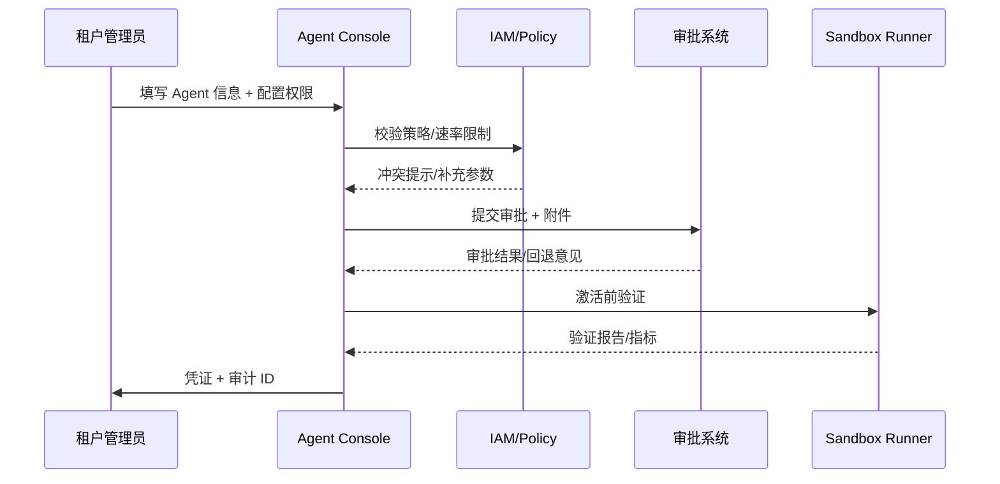

# Executive Summary

租户管理员需要在控制台自助创建 Agent，用于内部知识问答、自动化任务或插件编排。平台必须提供统一的表单、权限/速率策略选择器、审批流与激活步骤，并确保未经审批的 Agent 无法上线。本子场景聚焦“创建 → 审批 → 激活 → 沙箱验证”链路，目标是让审批平均时长低于 2 个工作日、权限冲突零容忍、激活后立即可观测。

# Scope & Guardrails

- **In Scope**：Agent 表单（名称、用途、Prompt、引用插件/工具）、权限/数据域配置、审批流转、凭证生成、沙箱验证、审计。
- **Out of Scope**：插件开发、知识库建设、业务流程逻辑、Marketplace 外部审批。
- **Environment & Flags**：`tenant-agent-center`、`agent-approval-flow`、`agent-sandbox`；依赖 IAM、Workflow、Notification、Template Scanner。

# Participants & Responsibilities

| Scope | Repository | Layer | 责任与交付物 | Owners |
|-------|------------|-------|--------------|--------|
| tenant-console | powerx | service | Agent 表单、提示词模板、插件/工具引用配置、数据域选择 | Agent Platform Guild |
| policy-engine | powerx | service | 权限策略、速率限制、租户/用户组绑定、冲突校验 | Agent Platform Guild |
| approval-workflow | powerx | ops | 审批规则、合规校验、通知、API Key/Webhook 生成 | Ops Reliability Center |

# End-to-End Flow

1. **Stage 1 – Definition & Inputs**：租户管理员填写 Agent 基础信息、Prompt 模板、引用插件/工具、知识库与运行目的，表单会自动加载租户模板、多语言提示、预设工具清单。
2. **Stage 2 – Policy Selection & Validation**：管理员选择可访问的数据域、租户/用户组、速率限制，Policy Engine 根据租户策略、敏感级别和 SLA 做冲突校验与补充参数。
3. **Stage 3 – Approval & Compliance**：提交后触发多级审批（安全、合规、业务），支持加签、回退与意见记录；Template Scanner 对 Prompt/知识库做敏感词扫描。
4. **Stage 4 – Activation & Sandbox**：审批通过后自动绑定 IAM 策略、生成 API Key/Webhook/调度策略，调用 `agent-sandbox-validate.mjs` 在沙箱中回归并输出报告。
5. **Stage 5 – Post-Activation Governance**：把 Agent 元数据同步给 Lifecycle、Catalog、Audit；若出现修改或撤销，将自动重新进入审批/验证。

# Architecture Diagram

# Key Interactions & Contracts

- **APIs / Events**
  - `POST /internal/agent/custom` — Body: `name`, `purpose`, `prompt_template`, `knowledge_sources[]`, `plugins[]`, `tools[]`, `data_domains[]`, `rate_limits`, `owners`；需要 `tenant.agent.manage` 权限。
  - `POST /internal/agent/approval` — Body: `agent_id`, `approvers[]`, `urgency`, `attachments`, `comments`; 支持 `dry_run`。
  - `PATCH /internal/agent/{id}/policy` — 用于审批回退后更新权限或速率策略。
  - `EVENT agent.approval.state.changed` — Payload: `agent_id`, `state`, `approver`, `reason`, `timestamp`, `audit_id`。
- **Configs / Schemas**：`config/agent/templates/prompt.yaml`（表单模板 + 多语言）、`config/iam/policies/*.yaml`（数据域/权限/速率）、`config/workflows/agent_approval.yaml`（状态机）、`docs/standards/powerx/backend/integration/09_agent/Agent_Manager_and_Lifecycle_Spec.md`。
- **Security / Compliance**：租户隔离、模板敏感词扫描、审批留痕、API Key/Webhook 加密存储、速率/配额隔离、双人审批 token。

# Usecase Links

- `UC-AGENT-REG-TENANT-001` — 租户自定义 Agent 审批链路（service 层，`docs/use_cases/_from_hub/SCN-AGENT-REG-MGMT-001/UC-AGENT-REG-TENANT-001.md`）。

# Implementation Checklist

| 项目 | 描述 | 负责人 | 状态 |
|------|------|--------|------|
| Tenant Agent Center 表单 | 组件化表单、模板加载、多语言、字段校验、草稿保存 | Agent Platform Guild | [ ] |
| Policy Conflict Engine | 权限/速率/数据域冲突检测、提示、自动修复 | Agent Platform Guild / IAM Team | [ ] |
| Approval Workflow & 通知 | `services/workflow/agent_approval_flow.ts`、`config/workflows/agent_approval.yaml` | Ops Reliability Center | [ ] |
| Template/Compliance Scanner | Prompt/知识库敏感词、数据域策略校验 | Security & Compliance | [ ] |
| Sandbox Activation | 凭证生成、`scripts/ops/agent-sandbox-validate.mjs`、审计写入 | Agent Platform Guild | [ ] |

# Acceptance Criteria

1. 审批平均时长 <2 个工作日，拒绝率/原因可在控制台查询。
2. 权限或速率策略冲突必须在提交前被阻断并提供可操作提示。
3. 审批通过后 30 秒内生成并下发 API Key/Webhook，且沙箱验证结果写入审计。

# Testing Strategy

- **单元**：表单校验、模板加载、多语言提示、Policy 冲突检测、审批状态机、通知路由。
- **集成**：在 staging 租户执行完整提交流程，验证与 IAM、Workflow、Notification、Audit 服务交互。模拟敏感词、权限冲突、审批驳回。
- **端到端**：运行 `scripts/ops/agent-sandbox-validate.mjs --agent <id> --profile tenant-lab`；执行“提交 → 审批 → 激活 → 撤销 → 再次提交”链路。
- **非功能/Chaos**：表单并发提交、高峰审批、Workflow/IAM 不可用时的降级（缓存+工单）。

# Observability & Ops

- **指标**：`agent.custom.requests_total`、`agent.custom.approval_duration_hours`、`agent.custom.policy_conflict_total`、`agent.custom.activation_success_rate`、`agent.custom.sandbox_failure_total`。
- **日志**：记录租户、Agent、输入摘要、审批人、评论、凭证引用（脱敏）；写入 Elastic + Audit；关键动作级别 INFO/ERROR。
- **告警**：审批排队 >48h、冲突率 >10%、沙箱失败率 >5%、Audit 写入失败；通知 PagerDuty + Teams #tenant-agent。
- **Dashboards**：Grafana「Tenant Agent Center」、Datadog `agent.custom.*`、Workflow 报表。

# Rollback & Failure Handling

- **审批驳回**：保留草稿，管理员调整后重提，记录审计。
- **凭证/策略回滚**：撤销已发凭证、恢复状态为 `pending`，修复后重新审批 + 沙箱。
- **Workflow 失败**：自动转人工工单并锁定状态，避免重复提交。
- **Sandbox 失败**：标记 `sandbox_failed`，阻止激活，通知 Ops & 租户；修复后可重跑。
- **表单版本回退**：`tenant-agent-center rollback --agent <id> --version <n>` 还原上一个版本配置。

# Validation Workflow

1. 本地运行 `npm run lint` + `npm run docs:build` 确保 Markdown 与站点通过。
2. 在 staging 租户执行“提交 → 审批 → 激活 → 沙箱”全链路，并记录 `agent.custom.*` 指标。
3. 执行 `scripts/ops/agent-sandbox-validate.mjs --agent <id> --profile tenant-lab`，确保沙箱回归成功。
4. 运行 `npm run publish:scenarios -- --scn-id SCN-AGENT-REG-TENANT-001 --validate-only` 及 `npm run publish:usecases -- --scn-id SCN-AGENT-REG-MGMT-001 --validate-only`，验证结构与 usecase 对齐。

# Follow-ups & Risks

| 风险/事项 | 影响范围 | 缓解方案 | 负责人 | ETA |
|-----------|----------|----------|--------|-----|
| 提示词模板敏感词策略与合规未对齐 | 审批质量、合规风险 | 与 Legal/Compliance 共建规则库，随版本发布更新 | Ops Reliability Center | 2025-03-03 |
| Feature Flag 未同步导致控制台缺功能 | 提交失败、体验不一致 | 发布前在 CI 校验 Flag，并提供回退路径 | Agent Platform Guild | 2025-03-01 |
| 权限策略与租户条款不一致 | 越权或误杀 | 引入租户级 policy 模板 diff，审批前强制校验 | IAM Platform Team | 2025-03-05 |
| 审批人缺席导致 SLA 超时 | Agent 激活阻塞 | 启用多级代理、审批超时自动升级 | Ops Reliability Center | 2025-02-28 |

# Related Links

- `docs/scenarios/agent-orchestration/SCN-AGENT-REG-MGMT-001.md`
- `docs/usecases-seeds/SCN-AGENT-REG-MGMT-001/UC-AGENT-REG-TENANT-001.md`
- `docs/standards/powerx/backend/integration/09_agent/Agent_Manager_and_Lifecycle_Spec.md`
- `config/workflows/agent_approval.yaml`
