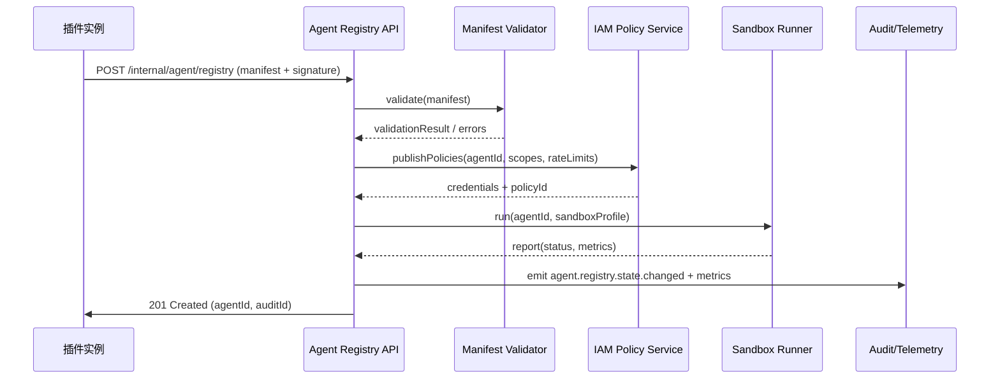

doc_id: UC-AGENT-REG-AUTO-001
scn_id: SCN-AGENT-REG-MGMT-001
title: PowerX (integration) - 插件内置 Agent 自动注册
status: Draft
version: v0.2.0
repo_key: powerx
scope: powerx
layer: integration
domain: agent-orchestration
scenario_title: "智能体注册与管理"
owners:
  - name: Agent Platform Guild
    role: Agent Registry Maintainer
    contact: agent-platform@artisan-cloud.com
contributors:
  - name: Plugin Guild
    role: Vendor Integration Partner
    contact: plugins@artisan-cloud.com
  - name: Ops Reliability Center
    role: Security & Observability Partner
    contact: ops-center@artisan-cloud.com
linked_requirements:
  - id: SCN-AGENT-REG-AUTO-001
    description: 插件自动注册 Stage：Manifest Intake → Validation → Activation
  - id: PXIP-452
    description: 统一 Agent Registry API 与编排平台同步
code_refs:
  - repo: powerx
    path: services/agent/registry
    description: Registry HTTP API、请求校验、Agent ID 生成
  - repo: powerx
    path: services/security/signature_verifier.ts
    description: 插件签名与证书校验组件
  - repo: powerx
    path: services/iam/policy/publisher.ts
    description: Agent 权限/速率策略绑定、下发到 IAM
  - repo: powerx
    path: backend/config/agent/registry/schema.yaml
    description: Manifest Schema、字段规范与版本兼容逻辑
  - repo: powerx
    path: scripts/ops/agent-sandbox-validate.mjs
    description: 自动沙箱验证脚本、回归与报告上传
feature_flags:
  - agent-registry-v1
  - plugin-autoreg-webhook
  - agent-sandbox
optional: false
last_reviewed_at: 2025-02-20

---

# Usecase Overview

- **业务目标**：让插件携带的 Agent 描述在 5 秒内完成注册、签名校验、Agent ID 生成与准入策略绑定，使平台实时掌控 Agent 台账并可立即在编排平台中引用。
- **成功度量**：注册成功率 ≥98%；签名/Schema 校验覆盖率 100%；`agent.registry.latency_p95` <5s；重复/冲突阻断率 100%；审计写入延迟 <1s。
- **场景关联**：对应 `SCN-AGENT-REG-MGMT-001` 子场景 A，向 `SCN-AGENT-REG-TENANT-001`、`SCN-AGENT-REG-LIFECYCLE-001` 提供元数据基础，亦为 `SCN-AGENT-TASK-EXEC-001` 的能力图谱同步提供输入。

> 摘要：该 Seed 聚焦 Registry API、签名校验、权限策略绑定与沙箱验证，以自动方式把插件内置 Agent 纳入受控目录并持续可观测。

# Context & Assumptions

- **前置条件**
  - 场景文档 `docs/scenarios/agent-orchestration/SCN-AGENT-REG-AUTO-001.md` 已定义流程、指标、参与者。
  - `docs/_data/docmap.yaml` 中的 `UC-AGENT-REG-AUTO-001` 节点与本 Seed frontmatter 完全一致。
  - Feature Flags `agent-registry-v1`、`plugin-autoreg-webhook`、`agent-sandbox` 已在配置中心登记。
  - 插件构建管线会生成 `agent.manifest.json` 并随启动调用 Registry API。
  - IAM、Secret Manager、Telemetry 管道在线，具备必要权限。
- **输入/输出**
  - 输入：插件 ID/版本、签名、Agent 能力描述、权限/速率声明、依赖工具列表、沙箱验证参数。
  - 输出：Agent ID、元数据记录、权限策略 ID、沙箱验证结果、审计事件、`agent.registry.*` 指标。
- **边界**
  - 不负责租户自定义 Agent（由 `UC-AGENT-REG-TENANT-001` 处理）。
  - 不处理运行期监控与共享策略（见生命周期/共享子用例）。
  - 不包含插件内部业务逻辑或模型推理链路。

# Solution Blueprint

## 体系分解

| 层 | 主要组件/模块 | 责任 | 代码入口 |
|----|---------------|------|---------|
| integration | Agent Registry API Gateway | 接收插件 manifest、鉴权、限流、Agent ID 生成 | `services/agent/registry/http.ts` |
| integration | Manifest Validator & Schema | 校验字段、签名、插件版本兼容，生成审计载荷 | `backend/config/agent/registry/schema.yaml` + `services/agent/registry/validator.ts` |
| integration | IAM Policy Publisher | 把权限/速率策略映射到 IAM、生成凭证引用 | `services/iam/policy/publisher.ts` |
| integration | Sandbox Validation Runner | 触发 `scripts/ops/agent-sandbox-validate.mjs`，上传运行报告 | `scripts/ops/agent-sandbox-validate.mjs` |
| integration | Audit & Telemetry Sink | 写入 `agent.registry.state.changed` 事件、指标、日志 | `services/observability/audit_pipeline.ts` |

## 流程与时序

1. **Step 1 – Manifest Intake**：插件启动钩子向 `POST /internal/agent/registry` 提交 manifest + 签名；网关进行 OAuth2 + 插件证书鉴权。
2. **Step 2 – Schema & Signature Validation**：Validator 校验字段、能力引用、版本兼容、签名证书；失败返回可调试错误码并写入告警。
3. **Step 3 – Agent ID Issuance**：生成 Agent ID、记录插件映射、写入元数据表与审计日志；并把 manifest 解析结果传递到 IAM 发布器。
4. **Step 4 – Policy Binding & Sandbox**：IAM 发布器生成权限/速率策略与凭证；触发 Sandbox Runner 执行回归用例，得到健康报告。
5. **Step 5 – Activation & Broadcast**：注册成功事件写入 `agent.registry.state.changed`，同步到 Agent 编排平台和监控面板；若 Sandbox 失败则将状态标记为 `pending_fix` 并通知 Vendor。

# Contracts & Interfaces

- **Inbound APIs / Events**
  - `POST /internal/agent/registry` — Body 包含 `agent_id?`, `plugin_id`, `version`, `capabilities[]`, `permissions`, `rate_limits`, `signature`; 需 `agent.registry.write` scope 与插件证书；支持 `dry_run`。
  - `POST /internal/agent/registry/{agent_id}/sandbox` — 手动重跑沙箱验证；可指定 `profile`, `timeout`, `telemetry_tags`。
  - `EVENT agent.registry.registered` / `agent.registry.failed` — 对接监控、告警与 Copilot。
- **Outbound 调用**
  - `IAM Policy Service /internal/policies` — 创建权限、速率策略与凭证；失败需回滚 Registry 状态。
  - `Agent Catalog Sync /internal/catalog/agents` — 发布元数据到编排平台。
  - `Telemetry Bus agent.registry.*`、`Audit Service /events` — 写入指标/日志。
- **配置与脚本**
  - `backend/config/agent/registry/schema.yaml` — 定义必填字段与兼容策略。
  - `config/feature_flags/agent-registry.yaml` — 控制自动审批/沙箱策略。
  - `scripts/ops/agent-sandbox-validate.mjs` — 运行回归、录入健康报告。

# Implementation Checklist

| 项目 | 描述 | 完成状态 | 负责人 |
|------|------|----------|--------|
| Manifest Schema & Lint | 支持能力、权限、依赖工具、租户标签字段，提供 CLI 校验 | [ ] | Agent Platform Guild |
| Signature Verification | 接入证书信任链、失效提醒、重放保护 | [ ] | Plugin Guild |
| Agent ID & Metadata Store | 新建/迁移表结构、索引、幂等写入 | [ ] | Agent Platform Guild |
| IAM Policy Binding | 自动生成权限/速率策略、凭证回传、冲突回滚 | [ ] | Agent Platform Guild |
| Sandbox Automation | 扩展脚本覆盖核心插件、上传指标与报告 | [ ] | Ops Reliability Center |
| Audit & Alerting | 事件/指标写入、Grafana 面板、PagerDuty 告警 | [ ] | Ops Reliability Center |

# Testing Strategy

- **单元测试**
  - Manifest Schema 校验器（必填/枚举/JSON schema）。
  - 签名验证、重放防护、重复 Agent 阻断逻辑。
  - IAM 发布器对速率/权限映射的序列化与幂等性。
- **集成测试**
  - 使用沙箱插件触发 `POST /internal/agent/registry`，验证与 IAM、Sandbox Runner 的交互。
  - 注入异常（签名错误、缺字段、IAM 失败）确保回滚与告警触发。
- **端到端验证**
  - 在 staging 中使用真实插件包执行自动注册，观察 Agent ID 生成、编排平台同步、沙箱报告。
  - 运行 `scripts/ops/agent-sandbox-validate.mjs --agent <id> --profile full` 验证回归链路。
- **非功能测试**
  - 压测 Registry API（并发 100 RPS）确保 <5s SLA。
  - Chaos：网络抖动、Secret Manager 失败，确认告警/回滚路径。

# Observability & Ops

- **指标**
  - `agent.registry.latency_p95`, `agent.registry.success_total`, `agent.registry.signature_failure_total`, `agent.registry.duplicate_block_total`, `agent.registry.sandbox_failure_total`.
- **日志**
  - 每次注册写入插件 ID、Agent ID、版本、签名指纹、策略 ID、沙箱结果；日志等级 INFO/ERROR；落地在 Elastic + S3。
- **告警**
  - 签名失败率 >2%（5 分钟窗口）、注册错误率 >5%、Sandbox Pending >10 分钟、IAM 发布失败。
  - 通知渠道：Ops Pager、Agent Platform Teams 频道、Vendor 邮件播报。
- **Dashboards**
  - Grafana「Agent Registry」面板、Datadog `agent.registry.*`、Elastic Dashboard（审计日志）、Sandbox 报告视图。

# Rollback & Failure Handling

- 失败后立即删除新建 Agent 记录、撤销 IAM 策略、清理审计引用，返回可调试错误码。
- 提供 `scripts/ops/agent-registry-cleanup.mjs --agent <id>` 清理残留元数据与凭证。
- Sandbox 失败：标记 Agent 状态 `pending_fix`，阻止编排平台引用，并自动开启 `agent-registry-sandbox-failure` Pager。
- 当 IAM 或 Audit 不可用时，在内存队列重试，超时 5 分钟后进入隔离队列并提醒值班。

# Follow-ups & Risks

| 风险/事项 | 影响 | 缓解方案 | 负责人 | ETA |
|-----------|------|----------|--------|-----|
| 老版本插件未升级 manifest Schema，导致批量注册失败 | 影响 Vendor 上线节奏 | 提供 CLI 校验器、在发布脚本加入 schema lint；允许 `schema_version` 灰度策略 | Plugin Guild | 2025-03-05 |
| Sandbox 资源不足导致排队 >10 分钟 | 注册链路延迟、SLA 违约 | 扩容沙箱池、引入优先级队列，必要时允许“沙箱后置”但需 Ops 审批 | Ops Reliability Center | 2025-03-01 |

# References & Links

- 场景文档：`docs/scenarios/agent-orchestration/SCN-AGENT-REG-MGMT-001.md`
- 子场景：`docs/scenarios/agent-orchestration/SCN-AGENT-REG-AUTO-001.md`
- Docmap：`docs/_data/docmap.yaml`（SCN-AGENT-REG-MGMT-001 → UC-AGENT-REG-AUTO-001）
- Repo 元数据：`docs/_data/repos.yaml` (`key: powerx`)
- 契约与标准：`docs/standards/powerx/backend/integration/09_agent/Agent_Manager_and_Lifecycle_Spec.md`
- 相关脚本：`scripts/ops/agent-sandbox-validate.mjs`, `scripts/ops/agent-registry-cleanup.mjs`
