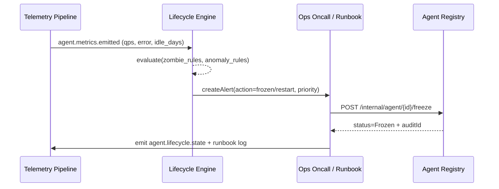

doc_id: UC-AGENT-REG-LIFECYCLE-001
scn_id: SCN-AGENT-REG-MGMT-001
title: PowerX (ops) - Agent 运行状态监控与生命周期治理
status: Draft
version: v0.2.0
repo_key: powerx
scope: powerx
layer: ops
domain: agent-orchestration
scenario_title: "智能体注册与管理"
owners:
  - name: Ops Reliability Center
    role: Lifecycle Steward
    contact: ops-center@artisan-cloud.com
contributors:
  - name: Agent Platform Guild
    role: Telemetry & Service Partner
    contact: agent-platform@artisan-cloud.com
  - name: Security & Compliance Office
    role: Audit Partner
    contact: security@artisan-cloud.com
linked_requirements:
  - id: SCN-AGENT-REG-LIFECYCLE-001
    description: 生命周期监控与僵尸治理阶段（Metrics → Policy → Recovery → Audit）
  - id: PXIP-478
    description: 统一 Agent Telemetry & Lifecycle 自动化能力
code_refs:
  - repo: powerx
    path: services/telemetry/agent-lifecycle-pipeline.ts
    description: 指标采集、事件聚合与状态总线
  - repo: powerx
    path: services/agent/lifecycle/policy_engine.ts
    description: 僵尸/异常判定策略与动作路由
  - repo: powerx
    path: services/ops/runbooks/agent_freeze.ts
    description: 冻结/下线 API 编排与审计输出
  - repo: powerx
    path: scripts/ops/agent-lifecycle-drill.mjs
    description: 指标/告警演练、回收演练脚本
  - repo: powerx
    path: scripts/ops/agent-retire-zombie.mjs
    description: 僵尸 Agent 批量回收与通知脚本
feature_flags:
  - agent-lifecycle-ops
  - agent-telemetry-bus
  - agent-recovery-framework
optional: false
last_reviewed_at: 2025-02-20

---

# Usecase Overview

- **业务目标**：为所有注册 Agent 建立统一的运行监控、僵尸判定与回收闭环，保证异常在 10 分钟内响应、资源回收成功率 100%、并在审计中可追溯。
- **成功度量**：`agent.lifecycle.coverage_rate`=100%；`agent.lifecycle.mttd_minutes`≤5；`agent.lifecycle.mttre_minutes`≤10；僵尸回收成功率=100%；审计写入延迟 <60s。
- **场景关联**：支撑 `SCN-AGENT-REG-LIFECYCLE-001` 的 Stage 1-4，依赖 `UC-AGENT-REG-AUTO-001` / `UC-AGENT-REG-TENANT-001` 提供元数据，向 `UC-AGENT-REG-SHARE-001` 输出 Agent 状态以允许共享策略复用。

> 摘要：通过 Telemetry Pipeline、Lifecycle Policy Engine 与 Runbook 自动化，持续收集 Agent 信号、判断异常、执行冻结/回收并输出审计，使平台可视、可控、可回滚。

# Context & Assumptions

- **前置条件**
  - 场景文档 `docs/scenarios/agent-orchestration/SCN-AGENT-REG-LIFECYCLE-001.md` 已定义流程与指标。
  - `agent-lifecycle-ops`、`agent-telemetry-bus`、`agent-recovery-framework` Feature Flags 在配置中心启用。
  - Agent Registry 已输出完整元数据（状态、责任人、租户标签）。
  - Grafana/Datadog、Audit、Notification、IAM 等基础服务在线。
- **输入/输出**
  - 输入：`agent.metrics.emitted`、`agent.lifecycle.zombie_detected`、Agent 元数据、Ops Runbook 状态。
  - 输出：冻结/回收 API 响应、`agent.lifecycle.state` 指标、审计日志、通知（邮件/IM/工单）。
- **边界**
  - 不负责具体任务执行或 Copilot 工单细节（另由任务执行场景覆盖）。
  - 不覆盖模型层监控、成本治理。
  - 依赖外部日志/指标管线的可用性，若外部宕机需进入降级模式。

# Solution Blueprint

## 体系分解

| 层 | 主要组件/模块 | 责任 | 代码入口 |
|----|---------------|------|---------|
| service | Telemetry Pipeline | 聚合 Agent 指标、日志、事件并写入状态总线 | `services/telemetry/agent-lifecycle-pipeline.ts` |
| ops | Lifecycle Policy Engine | 执行僵尸/异常判定、动作决策、告警路由 | `services/agent/lifecycle/policy_engine.ts` |
| ops | Remediation Orchestrator | 调用冻结/回收 API、Runbook、自愈脚本、审计输出 | `services/ops/runbooks/agent_freeze.ts` |
| ops | Drill & Automation Scripts | 演练、批量回收、指标校验 | `scripts/ops/agent-lifecycle-drill.mjs`, `scripts/ops/agent-retire-zombie.mjs` |

## 流程与时序

1. **Step 1 – Metrics & Signal Intake**：Telemetry Pipeline 每 30 秒写入调用量、成功率、错误类型、CPU/内存等指标，并推送到 `agent.lifecycle.state` 总线。
2. **Step 2 – Policy Evaluation**：Lifecycle Policy Engine 根据策略（30 天无调用、错误率 >50%、延迟 >5s、成本异常）执行僵尸/异常识别，打出优先级并决定自动/人工动作。
3. **Step 3 – Remediation**：对低风险异常执行自动重启/限流；僵尸 Agent 触发 `agent-retire-zombie.mjs` 回收，或通过 API `POST /internal/agent/{id}/freeze` 进入冻结状态；高风险异常自动升级值班。
4. **Step 4 – Audit & Notification**：所有动作写入 `agent.lifecycle.frozen`、`agent.lifecycle.recovered` 事件和审计日志，通知责任人、租户管理员并同步回 Agent Registry。

# Contracts & Interfaces

- **Inbound APIs / Events**
  - `EVENT agent.metrics.emitted` — 指标 payload 包含 `agent_id`, `tenant_id`, `calls`, `errors`, `latency_ms`, `last_invoked_at`, `resource_usage`.
  - `EVENT agent.lifecycle.zombie_detected` — Policy Engine 输出，携带策略命中详情与推荐动作。
  - `POST /internal/agent/{agent_id}/freeze` — 请求体包含 `reason`, `initiator`, `force=true|false`；需要 Ops 双人 token。
  - `POST /internal/agent/{agent_id}/recover` — 解除冻结并触发沙箱验证。
- **Outbound 调用**
  - `Notification Center /v1/notify` — 推送责任人、租户管理员。
  - `Ops Pager /v1/incidents` — 高风险异常升级。
  - `Audit Service /internal/events` — 写入 `agent.lifecycle.*` 审计记录。
  - `Resource Manager /internal/resources/reclaim` — 释放算力/凭证。
- **配置与脚本**
  - `config/agent/lifecycle/policies.yaml` — 指标阈值、僵尸规则、优先级。
  - `runbooks/agent-freeze.yaml`, `runbooks/agent-recover.yaml` — 手/自动化步骤。
  - `scripts/ops/agent-lifecycle-drill.mjs` — 周期演练。
  - `scripts/ops/agent-retire-zombie.mjs` — 批量回收。

# Implementation Checklist

| 项目 | 描述 | 完成状态 | 负责人 |
|------|------|----------|--------|
| Telemetry 覆盖度 | 将所有 Agent 指标接入 `agent.lifecycle.state` Topic，补齐租户/责任人标签 | [ ] | Agent Platform Guild |
| 策略引擎与阈值 | 落地 `policies.yaml`、支持动态阈值与 A/B 验证 | [ ] | Ops Reliability Center |
| 冻结/回收 API | 实现 `freeze/recover` 接口幂等、审计、双人确认 | [ ] | Ops Reliability Center |
| 自愈脚本与 Runbook | 完成 `agent-retire-zombie.mjs`、`agent-lifecycle-drill.mjs`，并文档化 | [ ] | Ops Reliability Center |
| 审计 & 通知 | 将动作写入 Audit、Pager、Notification；添加 Grafana 面板 | [ ] | Security & Compliance Office |

# Testing Strategy

- **单元测试**
  - 策略引擎：各类僵尸/异常规则、阈值、优先级决策。
  - 冻结/回收 API：幂等、权限、输入校验。
  - Telemetry Parser：指标有效性、租户标签完整性。
- **集成测试**
  - 模拟指标流（空闲 30 天、错误率 60%）验证策略触发与动作。
  - 调用 `POST /internal/agent/{id}/freeze` 与 Registry + Audit 的交互。
  - 执行 `scripts/ops/agent-retire-zombie.mjs --dry-run` 验证资源回收。
- **端到端验证**
  - 演练脚本：`scripts/ops/agent-lifecycle-drill.mjs --profile zombie --tenant tenant-lab`。
  - Chaos：下线 Telemetry 或 Notification，确认降级路径（本地缓存、延迟告警）。
- **非功能测试**
  - 性能：Policy Engine 每分钟可处理 10k Agent 信号。
  - 容错：Audit 写入失败重试 + 死信队列，防止数据丢失。

# Observability & Ops

- **指标**
  - `agent.lifecycle.coverage_rate`, `agent.lifecycle.zombie_detected_total`, `agent.lifecycle.freeze_duration_minutes`, `agent.lifecycle.reclaim_success_total`, `agent.lifecycle.alert_backlog`.
- **日志**
  - Runbook 结果（包含 agent_id, action, initiator, duration, audit_id）、策略命中详情；INFO for success, WARN/ERROR for失败。
- **告警**
  - Coverage <100%；MTTR >10 分钟；冻结/回收失败；未监控 Agent >0；审计写入失败。
  - 通知渠道：PagerDuty（P1）、Teams #agent-lifecycle（P2）、Email（每日汇总）。
- **Dashboards**
  - Grafana「Agent Lifecycle」：僵尸趋势、MTTD/MTTR、冻结执行时间。
  - Datadog `agent.lifecycle.*`：指标明细。
  - Audit Explorer：动作日志查询。

# Rollback & Failure Handling

- 若策略误触发：使用 `POST /internal/agent/{id}/recover` 并回滚资源释放脚本；审计记录需标记为 `reverted`.
- Telemetry 中断：切换到降级模式，启用 `agent-lifecycle-drill.mjs --fallback` 对关键 Agent 手动巡检，并通知值班。
- 冻结 API 失败：自动重试 3 次，仍失败则创建 P1 工单并锁定 Agent，防止重复操作。
- 批量回收失败：执行 `scripts/ops/agent-registry-cleanup.mjs` 清理半成品状态，再重新触发回收脚本。

# Follow-ups & Risks

| 风险/事项 | 影响 | 缓解方案 | 负责人 | ETA |
|-----------|------|----------|--------|-----|
| 僵尸策略阈值与业务 SLA 不一致，易误杀 | 业务中断、投诉 | 引入租户/场景级阈值与灰度，策略修改前跑 `agent-lifecycle-drill.mjs --what-if` | Ops Reliability Center | 2025-03-10 |
| Telemetry 延迟导致 MTTD >5 分钟 | 无法及时响应故障 | 在 Kafka topic 启用延迟监控、超 60s 自动转入人工巡检 | Agent Platform Guild | 2025-03-05 |
| 审计与通知系统暂不可用 | 合规风险、信息缺失 | 缓存动作日志到 S3，恢复后补写 Audit；通知失败时生成工单 | Security & Compliance Office | 2025-02-28 |

# References & Links

- 场景：`docs/scenarios/agent-orchestration/SCN-AGENT-REG-MGMT-001.md`
- 子场景：`docs/scenarios/agent-orchestration/SCN-AGENT-REG-LIFECYCLE-001.md`
- Docmap：`docs/_data/docmap.yaml` (SCN-AGENT-REG-MGMT-001 → UC-AGENT-REG-LIFECYCLE-001)
- Repo metadata：`docs/_data/repos.yaml` (`key: powerx`)
- 标准：`docs/standards/powerx/backend/integration/09_agent/Agent_Metrics_and_Observability.md`
- Runbooks & Scripts：`scripts/ops/agent-lifecycle-drill.mjs`, `scripts/ops/agent-retire-zombie.mjs`, `services/ops/runbooks/agent_freeze.ts`
