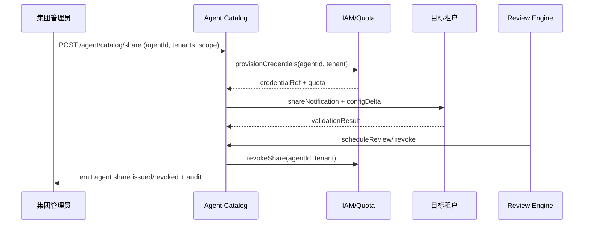

doc_id: UC-AGENT-REG-SHARE-001
scn_id: SCN-AGENT-REG-MGMT-001
title: PowerX (integration) - 多租户 Agent 目录与共享策略
status: Draft
version: v0.2.0
repo_key: powerx
scope: powerx
layer: integration
domain: agent-orchestration
scenario_title: "智能体注册与管理"
owners:
  - name: Agent Platform Guild
    role: Agent Catalog Maintainer
    contact: agent-platform@artisan-cloud.com
contributors:
  - name: Plugin Guild
    role: Tenant Validation Partner
    contact: plugins@artisan-cloud.com
  - name: Ops Reliability Center
    role: Compliance & Revoke Partner
    contact: ops-center@artisan-cloud.com
linked_requirements:
  - id: SCN-AGENT-REG-SHARE-001
    description: 多租户 Agent 目录与共享策略阶段（Tag → Share → Validate → Revoke）
  - id: PXIP-463
    description: Agent Catalog Sharing & Revocation Automation
code_refs:
  - repo: powerx
    path: services/agent/catalog/share_service.ts
    description: Agent 目录共享 API、白名单/标签管理
  - repo: powerx
    path: services/iam/quota/share_provisioner.ts
    description: 配额与凭证复制、独立速率限制
  - repo: powerx
    path: services/compliance/share_review.ts
    description: 周期复核、撤销策略、审计输出
  - repo: powerx
    path: scripts/ops/agent-share-drill.mjs
    description: 共享/撤销演练脚本、指标校验
  - repo: powerx
    path: scripts/ops/agent-share-revoke.mjs
    description: 批量撤销、配额释放与通知
feature_flags:
  - agent-sharing-directory
  - agent-multi-tenant
  - agent-share-review
optional: false
last_reviewed_at: 2025-02-20

---

# Usecase Overview

- **业务目标**：让集团/平台管理员在多租户间安全共享 Agent，自动生成独立凭证和配额，确保日志、上下文、速率均按租户隔离，并提供可追溯的撤销与复核能力。
- **成功度量**：共享请求平均 1 分钟内完成；`agent.share.validation_failure_total` <2%；撤销失败率 <1%；共享/撤销事件 100% 写入审计；`agent.share.cross_tenant_success_rate` ≥99%。
- **场景关联**：实现 `SCN-AGENT-REG-SHARE-001` 全流程，依赖 `UC-AGENT-REG-AUTO-001`/`UC-AGENT-REG-TENANT-001` 的元数据与权限信息，并向 `UC-AGENT-REG-LIFECYCLE-001` 输出共享状态供生命周期治理参考。

> 摘要：通过 Agent Catalog、Quota Provisioner 与合规撤销脚本，实现跨租户共享的配置化、审计化与可回滚，保证共享 Agent 的隔离、可见与可控。

# Context & Assumptions

- **前置条件**
  - 场景文档 `docs/scenarios/agent-orchestration/SCN-AGENT-REG-SHARE-001.md` 已定义流程与指标。
  - Feature Flags `agent-sharing-directory`、`agent-multi-tenant`、`agent-share-review` 启用。
  - Agent Registry 内含 Agent 标签、责任人、租户白名单字段。
  - IAM、Quota Service、Notification、Audit 服务可用；共享目标租户已完成基础表结构/权限初始化。
- **输入/输出**
  - 输入：共享请求（Agent ID、租户列表、权限范围、配额策略、到期时间）、审批记录、租户验证结果。
  - 输出：共享凭证/配额、租户配置 delta、`agent.share.issued` / `agent.share.revoked` 事件、审计日志、通知。
- **边界**
  - 不负责 Marketplace 对外售卖与计费。
  - 目标租户内部的工作流配置由租户自管。
  - 不覆盖租户本地化或语言包同步（由其他场景负责）。

# Solution Blueprint

## 体系分解

| 层 | 主要组件/模块 | 责任 | 代码入口 |
|----|---------------|------|---------|
| integration | Agent Catalog Share Service | 处理共享/撤销 API、白名单校验、标签同步 | `services/agent/catalog/share_service.ts` |
| integration | Quota & Credential Provisioner | 为目标租户复制速率、配额、凭证，写入 IAM/Quota | `services/iam/quota/share_provisioner.ts` |
| integration | Tenant Validation Worker | 调用沙箱验证、上下文隔离检查、日志归属确认 | `services/agent/catalog/tenant_validator.ts` |
| ops | Compliance Review Engine | 周期复核、过期/违规撤销、通知与审计 | `services/compliance/share_review.ts` |
| ops | Share Automation Scripts | 演练、批量撤销、指标校验 | `scripts/ops/agent-share-drill.mjs`, `scripts/ops/agent-share-revoke.mjs` |

## 流程与时序

1. **Stage 1 – Catalog Tagging & Request**：管理员在 Catalog 中为 Agent 设置共享标签、目标租户和权限范围，调用 `POST /internal/agent/catalog/share`。
2. **Stage 2 – Provision & Publish**：Share Service 校验白名单后调用 Quota Provisioner 复制凭证/配额，写入 IAM/Quota 并生成租户配置 delta。
3. **Stage 3 – Tenant Validation**：Tenant Validation Worker在目标租户沙箱运行首轮调用，校验上下文隔离、日志归属、速率限制，失败时自动回滚。
4. **Stage 4 – Review & Revoke**：Compliance Review Engine根据到期时间或违规信号触发 `agent.share.revoked`，调用撤销脚本释放配额并通知所有租户。

# Contracts & Interfaces

- **Inbound APIs / Events**
  - `POST /internal/agent/catalog/share` — Body: `agent_id`, `tenants[]`, `permissions`, `quota`, `expires_at`, `reason`; 需 `agent.catalog.manage` 权限与双人审批 token。
  - `POST /internal/agent/catalog/revoke` — Body: `agent_id`, `tenants[]`, `reason`, `immediate=true|false`; 支持指定触发源（手动/自动）。
  - `EVENT agent.share.issued` / `agent.share.revoked` — 包含租户、凭证、配额、触发人、审计 ID。
  - `GET /internal/agent/catalog/{agent_id}` — 返回共享状态、白名单、历史记录。
- **Outbound 调用**
  - `IAM/Quota Service /internal/quota/share` — 复制速率、配额、凭证；失败需回滚 Catalog。
  - `Notification Center /v1/notify` — 通知责任人、目标租户管理员。
  - `Tenant Validation Runner /internal/tenant/{id}/agent-validation` — 执行沙箱调用并回传结果。
  - `Audit Service /internal/events` — 写入共享/撤销审计。
- **配置与脚本**
  - `config/agent/sharing/policies.yaml` — 白名单来源、租户隔离策略、自动撤销阈值。
  - `config/iam/quota/*.yaml` — 每租户配额模板与速率限制。
  - `scripts/ops/agent-share-drill.mjs` / `agent-share-revoke.mjs` — 演练与批量操作脚本。

# Implementation Checklist

| 项目 | 描述 | 完成状态 | 负责人 |
|------|------|----------|--------|
| Catalog API & Schema | 支持共享/撤销 API、标签、白名单、审计字段 | [ ] | Agent Platform Guild |
| Quota & Credential Provisioner | 复制配额、凭证、速率限制，确保隔离 | [ ] | Agent Platform Guild |
| Tenant Validation Flow | 自动化沙箱验证、日志归属检查、失败回滚 | [ ] | Plugin Guild |
| Compliance Review Engine | 定时复核、到期撤销、通知与报表 | [ ] | Ops Reliability Center |
| Scripts & Dashboards | 完成 `agent-share-drill.mjs`、`agent-share-revoke.mjs`、Grafana 面板 | [ ] | Ops Reliability Center |

# Testing Strategy

- **单元测试**
  - Share API 权限校验、输入 Schema、白名单匹配。
  - Quota Provisioner：配额复制、速率限制同步、回滚。
  - Validation Worker：上下文隔离、日志归属、速率限制模拟。
- **集成测试**
  - 使用沙箱租户调用 `POST /internal/agent/catalog/share`，验证与 IAM、Notification、Audit 交互。
  - 模拟验证失败/撤销场景，确保凭证回收与审计记录。
- **端到端验证**
  - `scripts/ops/agent-share-drill.mjs --agent <id> --tenant tenant-b --dry-run` 跑通“申请→验证→撤销”链路。
  - 生产前灰度：在 staging 共享至两个租户，观察指标 `agent.share.cross_tenant_success_rate`。
- **非功能测试**
  - 并发共享请求（10 RPS）下的 Catalog 性能。
  - Chaos：IAM 或 Notification 失败，确认自动回滚与告警。

# Observability & Ops

- **指标**
  - `agent.share.active_total`, `agent.share.validation_failure_total`, `agent.share.revocation_time_seconds`, `agent.share.cross_tenant_success_rate`, `agent.share.unauthorized_attempt_total`.
- **日志**
  - 记录共享/撤销请求、租户、权限范围、凭证引用、审批人、审计 ID；敏感字段脱敏；日志落地 Elastic + S3。
- **告警**
  - 配额同步 >5 分钟、验证失败连续 3 次、撤销失败、未授权租户尝试。
  - 通道：PagerDuty (P1)、Teams #agent-catalog (P2)、Email 日报。
- **Dashboards**
  - Grafana「Agent Catalog Sharing」：活跃共享数、验证失败率、撤销耗时。
  - Datadog `agent.share.*` 指标面板。
  - 审计 Explorer：共享/撤销历史。

# Rollback & Failure Handling

- 共享失败：撤销已生成的配额/凭证、删除共享记录并通知申请人。
- 验证失败：自动执行 `agent-share-revoke.mjs --agent <id> --tenant <id>`，并在 Catalog 中标记状态 `validation_failed`。
- 撤销失败：重试 3 次仍失败则创建 P1 工单、锁定凭证，防止继续调用。
- 白名单误配置：提供 `scripts/ops/agent-catalog-whitelist-sync.mjs` 回滚到上次快照，并重新推送。

# Follow-ups & Risks

| 风险/事项 | 影响 | 缓解方案 | 负责人 | ETA |
|-----------|------|----------|--------|-----|
| 白名单来源与 IAM 不一致导致共享失败 | 共享被阻断或越权 | 构建同步脚本与差异告警，发布前运行 `agent-catalog-whitelist-sync.mjs --dry-run` | Agent Platform Guild | 2025-03-05 |
| 共享租户日志未正确分区 | 合规风险 | 在 Validation 阶段强制检查日志 Index，未通过即回滚 | Plugin Guild | 2025-03-01 |
| 撤销流程缺少租户通知 | 租户继续调用、错误率上升 | 在 `agent.share.revoked` 事件中附带通知信息并追踪发送结果 | Ops Reliability Center | 2025-02-28 |

# References & Links

- 场景：`docs/scenarios/agent-orchestration/SCN-AGENT-REG-MGMT-001.md`
- 子场景：`docs/scenarios/agent-orchestration/SCN-AGENT-REG-SHARE-001.md`
- Docmap：`docs/_data/docmap.yaml` (SCN-AGENT-REG-MGMT-001 → UC-AGENT-REG-SHARE-001)
- Repo metadata：`docs/_data/repos.yaml` (`key: powerx`)
- 契约/标准：`docs/standards/powerx/backend/integration/09_agent/Agent_Manager_and_Lifecycle_Spec.md`
- 脚本：`scripts/ops/agent-share-drill.mjs`, `scripts/ops/agent-share-revoke.mjs`, `config/agent/sharing/policies.yaml`
