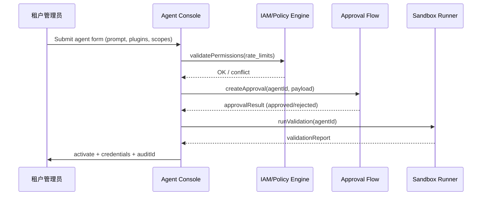

doc_id: UC-AGENT-REG-TENANT-001
scn_id: SCN-AGENT-REG-MGMT-001
title: PowerX (service) - 租户自定义 Agent 创建与审批
status: Draft
version: v0.2.0
repo_key: powerx
scope: powerx
layer: service
domain: agent-orchestration
scenario_title: "智能体注册与管理"
owners:
  - name: Agent Platform Guild
    role: Tenant Agent Center Maintainer
    contact: agent-platform@artisan-cloud.com
contributors:
  - name: Ops Reliability Center
    role: Security & Compliance Partner
    contact: ops-center@artisan-cloud.com
  - name: IAM Platform Team
    role: Policy & Credential Partner
    contact: iam@artisan-cloud.com
linked_requirements:
  - id: SCN-AGENT-REG-TENANT-001
    description: 租户自定义 Agent 创建与审批阶段（Definition → Policy → Approval → Activation）
  - id: PXIP-447
    description: Tenant Agent Console & Approval Automation
code_refs:
  - repo: powerx
    path: services/tenant-agent-center/forms
    description: Agent 表单、模板、工具引用配置
  - repo: powerx
    path: services/iam/policy/publisher.ts
    description: 权限/速率策略绑定、冲突校验
  - repo: powerx
    path: services/workflow/agent_approval_flow.ts
    description: 审批编排、通知、状态机
  - repo: powerx
    path: services/security/template_scanner.ts
    description: Prompt/知识库敏感词扫描与合规检查
  - repo: powerx
    path: scripts/ops/agent-sandbox-validate.mjs
    description: 激活前沙箱验证脚本
feature_flags:
  - tenant-agent-center
  - agent-approval-flow
  - agent-sandbox
optional: false
last_reviewed_at: 2025-02-20

---

# Usecase Overview

- **业务目标**：支持租户管理员自助创建、配置与激活自定义 Agent，以统一表单与审批流确保权限/速率策略正确绑定，未经批准不得上线。
- **成功度量**：审批平均时长 <2 个工作日；权限冲突阻断率 100%；激活后 30 秒内生成凭证并完成沙箱验证；`agent.custom.approval_duration_hours` 可追踪。
- **场景关联**：实现 `SCN-AGENT-REG-TENANT-001` 的全流程，并向 `UC-AGENT-REG-LIFECYCLE-001` 与 `UC-AGENT-REG-SHARE-001` 输出完整元数据和策略信息。

> 摘要：该 Seed 定义 Tenant Agent Center 的表单、策略校验、审批编排与激活动作，确保租户自建 Agent 具备可审、可控、可回滚的上线体验。

# Context & Assumptions

- **前置条件**
  - 场景文档 `docs/scenarios/agent-orchestration/SCN-AGENT-REG-TENANT-001.md` 已确定流程。
  - Feature Flags `tenant-agent-center`, `agent-approval-flow`, `agent-sandbox` 已开启。
  - IAM、Workflow、Notification、Audit、Sandbox 验证等依赖服务可用。
  - 租户管理员具备必要权限并已完成组织/数据域配置。
- **输入/输出**
  - 输入：Agent 基础信息、用途、Prompt/知识库、引用插件/工具、权限范围、速率限制、审批人、附件。
  - 输出：Agent ID、策略绑定结果、审批记录、调用凭证、Webhook/API Key、沙箱验证报告、审计日志。
- **边界**
  - 不处理插件开发、知识库建设（由其他场景承担）。
  - Marketplace 对外发布不在本用例范围内。
  - 人工 Copilot 协作细节在生命周期/执行场景另行描述。

# Solution Blueprint

## 体系分解

| 层 | 主要组件/模块 | 责任 | 代码入口 |
|----|---------------|------|---------|
| service | Tenant Agent Center Forms | 采集基础信息、模板、知识库、插件引用、权限选择 | `services/tenant-agent-center/forms` |
| service | Policy & Rate Publisher | 校验租户策略、生成 IAM 权限/速率配置、冲突回滚 | `services/iam/policy/publisher.ts` |
| service | Approval Workflow Orchestrator | 构建审批链路、通知、状态机、回退机制 | `services/workflow/agent_approval_flow.ts` |
| service | Template & Compliance Scanner | 检查 Prompt、知识库敏感词、数据域限制 | `services/security/template_scanner.ts` |
| ops | Sandbox Validation Runner | 激活前运行 `scripts/ops/agent-sandbox-validate.mjs` 验证 | `scripts/ops/agent-sandbox-validate.mjs` |

## 流程与时序

1. **Step 1 – Definition & Inputs**：租户管理员在控制台填写 Agent 信息、Prompt 模板、引用插件/工具，并选择数据域/用户组。
2. **Step 2 – Policy Merge & Validation**：系统调用 Policy Publisher 校验权限/速率冲突，Template Scanner 检查敏感词、审批必填项。
3. **Step 3 – Approval Workflow**：提交表单后触发审批流，安全/合规人员在 Workflow 中审核、评论、回退或通过；状态写入审计。
4. **Step 4 – Activation & Sandbox**：审批通过后生成凭证、Webhook、调度策略，并触发沙箱验证脚本；成功后状态置为 `active` 并通知管理员。

# Contracts & Interfaces

- **Inbound APIs / Events**
  - `POST /internal/agent/custom` — 创建/更新 Agent，包含基础字段、Prompt、工具引用；需 `tenant.agent.manage` 权限。
  - `POST /internal/agent/approval` — 提交审批，字段包含审批人列表、紧急程度、附件；支持 `dry_run`.
  - `PATCH /internal/agent/{id}/policy` — 用于冲突调整或审批退回后的修改。
  - `EVENT agent.approval.state.changed` — 审批结果、审批人、原因、时间。
- **Outbound 调用**
  - `IAM Policy Service /internal/policies` — 生成权限/速率策略；冲突即回滚。
  - `Workflow Engine /internal/workflows` — 发起审批任务、回退、记录评论。
  - `Notification Center /v1/notify` — 通知审批人、租户管理员、Ops。
  - `Sandbox Validation Runner` — `scripts/ops/agent-sandbox-validate.mjs --agent <id>`.
  - `Audit Service /internal/events` — 记录提交、审批、激活、驳回。
- **配置与脚本**
  - `config/agent/templates/prompt.yaml` — Prompt/知识库模板与敏感词策略。
  - `config/iam/policies/*.yaml` — 权限、速率、数据域映射。
  - `config/workflows/agent_approval.yaml` — 审批链路定义。
  - `scripts/ops/agent-sandbox-validate.mjs` — 激活前验证脚本。

# Implementation Checklist

| 项目 | 描述 | 完成状态 | 负责人 |
|------|------|----------|--------|
| Tenant Form Builder | 表单组件、多语言、模板加载、校验规则 | [ ] | Agent Platform Guild |
| Policy Conflict Engine | 权限/速率冲突检测、提示、回滚 | [ ] | IAM Platform Team |
| Approval Workflow | Workflow 定义、通知、回退、审计 | [ ] | Ops Reliability Center |
| Template Scanner | Prompt/知识库敏感词、数据域检查 | [ ] | Security Partner |
| Sandbox Activation | 自动生成凭证、调用 Sandbox 验证、状态同步 | [ ] | Agent Platform Guild |
| Audit & Telemetry | `agent.custom.*` 指标、日志、告警、面板 | [ ] | Ops Reliability Center |

# Testing Strategy

- **单元测试**
  - 表单校验（必填、数据域白名单、插件引用合法性）。
  - Policy Engine 的冲突检测与回滚。
  - 审批状态机（提交、驳回、通过、撤回）。
- **集成测试**
  - 在 staging 租户提交 Agent 表单，验证与 IAM、Workflow、Notification、Audit 的交互。
  - 故意触发权限冲突、敏感词、审批驳回，确认提示与回滚。
- **端到端验证**
  - `scripts/ops/agent-sandbox-validate.mjs --agent <id> --profile tenant-lab` 验证激活流程。
  - QA 用例：提交→审批→激活→撤销→再次提交，观测 `agent.custom.approval_duration_hours`.
- **非功能测试**
  - 表单并发提交 (50 RPS) 与 Workflow 队列压力。
  - Chaos：Workflow / IAM 服务不可用时的降级策略（缓存 + 重试 + 工单）。

# Observability & Ops

- **指标**
  - `agent.custom.requests_total`, `agent.custom.approval_duration_hours`, `agent.custom.policy_conflict_total`, `agent.custom.activation_success_rate`, `agent.custom.sandbox_failure_total`.
- **日志**
  - 记录提交人、租户、权限范围、审批人、评论、凭证引用（脱敏）；INFO/ERROR 等级，输出至 Elastic。
- **告警**
  - 审批排队 >48h、权限冲突率 >10%、沙箱失败率 >5%、Audit 写入失败。
  - 通知渠道：PagerDuty、Teams #tenant-agent、Email。
- **Dashboards**
  - Grafana「Tenant Agent Center」：审批 SLA、激活成功率、冲突 TopN。
  - Datadog `agent.custom.*` 指标。

# Rollback & Failure Handling

- **审批驳回**：保留草稿，允许管理员修改后重提；生成审计记录。
- **凭证/策略回滚**：撤销已下发凭证与策略，重置状态为 `pending`，修复后重新触发审批与沙箱。
- **Workflow 失败**：自动转人工工单并锁定状态，防止重复提交。
- **Sandbox 失败**：标记 `sandbox_failed`，阻止激活并通知 Ops；修复后可重跑。
- **表单版本回退**：`tenant-agent-center rollback --agent <id> --version <n>` 恢复上一版本配置与表单字段。

# Follow-ups & Risks

| 风险/事项 | 影响 | 缓解方案 | 负责人 | ETA |
|-----------|------|----------|--------|-----|
| Feature Flag 未同步导致租户控制台缺功能 | 提交失败、体验不一致 | 在发布脚本中校验 `tenant-agent-center` flag，必要时 fallback 至旧版流程 | Agent Platform Guild | 2025-03-01 |
| 权限策略与租户合规条款未同步 | 越权或误杀 | 引入租户级 Policy 模板与版本控制，审批前自动比较差异 | IAM Platform Team | 2025-03-05 |
| 审批人缺席导致 SLA 超时 | Agent 激活阻塞 | 设置多级代理审批 & 审批超时自动升级 | Ops Reliability Center | 2025-02-28 |

# References & Links

- 场景：`docs/scenarios/agent-orchestration/SCN-AGENT-REG-MGMT-001.md`
- 子场景：`docs/scenarios/agent-orchestration/SCN-AGENT-REG-TENANT-001.md`
- Docmap：`docs/_data/docmap.yaml` (SCN-AGENT-REG-MGMT-001 → UC-AGENT-REG-TENANT-001)
- Repo metadata：`docs/_data/repos.yaml` (`key: powerx`)
- 契约：`docs/standards/powerx/backend/integration/09_agent/Agent_Manager_and_Lifecycle_Spec.md`
- 相关脚本：`scripts/ops/agent-sandbox-validate.mjs`, `config/workflows/agent_approval.yaml`, `config/agent/templates/prompt.yaml`
