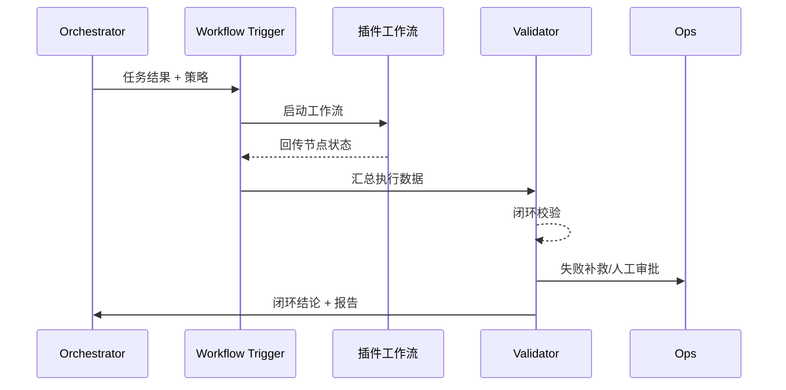

scn_id: SCN-AGENT-EXEC-CLOSURE-001
title: 插件工作流闭环验证
status: Draft
version: v0.1.0
owners:
  - name: Agent Platform Guild
    role: Scenario Steward
    contact: agent-platform@artisan-cloud.com
  - name: Ops Reliability Center
    role: Automation Co-owner
    contact: ops-center@artisan-cloud.com
domains: [agent-orchestration]
layers: [ops]
repos:
  - key: powerx
    scope: core-platform
    responsibility: Workflow Trigger、闭环校验、补救编排、报告/指标
related_usecases:
  - doc_id: UC-AGENT-EXEC-CLOSURE-001
    layer: ops
    domain: agent-orchestration
last_reviewed_at: 2025-02-15

---

# Executive Summary

本子场景确保主 Agent 在任务完成后能触发插件工作流、校验通知与对账结果，并在失败时立即补救或升级告警。目标指标：闭环通过率 ≥98%，补救流程 <2 分钟拉起，交付报告与审计记录覆盖 100%。

# Scope & Guardrails

- **In Scope**：工作流触发、回调/轮询、闭环规则、对账验证、通知、补救、报告生成、指标与告警。
- **Out of Scope**：插件内部节点实现、财务结算系统的深度逻辑。
- **Environment & Flags**：`workflow-trigger-kit`、`closure-verification`、`telemetry-unified-sink`；依赖插件工作流回调、通知渠道、审计仓库。

# Participants & Responsibilities

| Scope | Repository | Layer | 责任与交付物 | Owners |
|-------|------------|-------|--------------|--------|
| workflow-trigger | powerx | ops | 调用插件工作流、参数映射、幂等键 | Agent Platform Guild |
| closure-validator | powerx | ops | 校验通知、对账、回执与必达节点 | Ops Reliability Center |
| remediation-orchestrator | powerx | ops | 补救脚本、人工审批、升级告警 | Ops Reliability Center |
| reporting | powerx | ops | 交付报告、审计与用户通知 | Agent Platform Guild |

# End-to-End Flow

1. **Stage 1 – Workflow Trigger**：主 Agent 根据策略触发插件或外部工作流，带入交付参数与回调配置。
2. **Stage 2 – Status Collection**：插件节点执行审批/写库/通知并通过回调或轮询返回状态。
3. **Stage 3 – Closure Validation**：校验必达节点、通知回执与对账一致性，判断成功或失败等级。
4. **Stage 4 – Remediation & Reporting**：失败触发补救或人工审批，成功则生成交付报告并更新监控。

# Key Interactions & Contracts

- **APIs / Events**：`POST /internal/agent/workflow/trigger`、`POST /plugins/{pluginId}/workflow`、`EVENT plugin.workflow.completed`、`EVENT agent.workflow.closure.failed`、`POST /notifications/agent-delivery`、`POST /audit/agent-closure-report`。
- **Configs / Schemas**：`config/agent/workflow_templates/*.yaml`、`config/agent/closure_rules.yaml`、`docs/standards/powerx-plugin/contract/agent_contract.md`。
- **Security / Compliance**：签名回调、通知审计、对账数据脱敏、补救审批留痕。

# Usecase Links

- `UC-AGENT-EXEC-CLOSURE-001` — 插件工作流闭环验证。

# Acceptance Criteria

1. 闭环通过率 ≥98%，所有通知/对账节点提供回执。
2. 失败 2 分钟内触发补救或人工审批，并在 Ops 面板产生高优先级告警。
3. 交付报告与审计日志涵盖执行结果、补救动作、用户通知记录。

# Telemetry & Ops

- 指标：`plugin.workflow.closure_rate`、`agent.workflow.remediation_total`、`agent.workflow.callback_latency`、`agent.workflow.audit_delay`。
- 告警阈值：闭环失败连续 3 次、补救耗时 >5 分钟、审计写入失败。
- 观测：Grafana「Agent Closure」、Ops 闭环看板、`scripts/ops/closure-validation.mjs`。

# Open Issues & Follow-ups

| 风险/事项 | 影响范围 | 负责人 | ETA |
|-----------|----------|--------|-----|
| 插件回调协议不统一，造成校验困难 | 多插件闭环可靠性 | Plugin Guild | 2025-03-12 |
| 对账逻辑未与财务系统对齐 | 误报/漏报 | Ops Reliability Center | 2025-03-20 |

# Appendix

- `docs/scenarios/agent-orchestration/SCN-AGENT-TASK-EXEC-001.md`
- `docs/meta/scenarios/powerx/agent-and-automation/agent-orchestration/agent-task-execution/primary.md`
- `docs/standards/powerx-plugin/contract/agent_contract.md`
