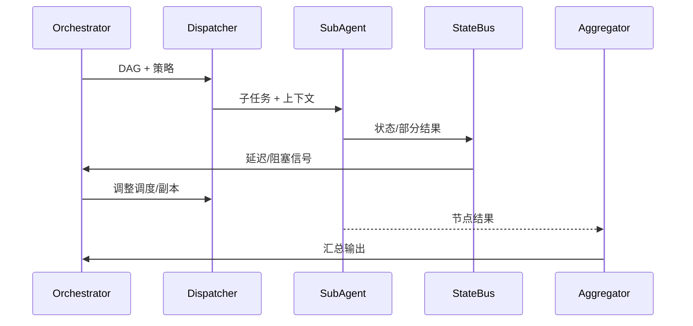

scn_id: SCN-AGENT-EXEC-COORD-001
title: 多 Agent 并行执行与状态协调
status: Draft
version: v0.1.0
owners:
  - name: Agent Platform Guild
    role: Scenario Steward
    contact: agent-platform@artisan-cloud.com
  - name: Ops Reliability Center
    role: Automation Co-owner
    contact: ops-center@artisan-cloud.com
domains: [agent-orchestration]
layers: [integration]
repos:
  - key: powerx
    scope: core-platform
    responsibility: DAG Runtime、子 Agent 调度、状态总线、结果汇总
related_usecases:
  - doc_id: UC-AGENT-EXEC-COORD-001
    layer: integration
    domain: agent-orchestration
last_reviewed_at: 2025-02-15

---

# Executive Summary

本子场景关注 Planner 输出后的任务在多个子 Agent 间的并行执行、状态上报与调度调优。目标是确保复杂任务的吞吐与可观测性：并行子任务成功率 ≥95%，状态总线延迟 <1 秒，阻塞可被自动识别和缓解。

# Scope & Guardrails

- **In Scope**：DAG 解析、子 Agent 分发、上下文注入、状态总线、调度调优、结果汇总。
- **Out of Scope**：失败重试/人工协同（参见恢复子场景）、插件内部执行逻辑。
- **Environment & Flags**：`agent-orchestrator-v2`、`statebus-stream`、`scheduler-autoscale`；依赖子 Agent 注册表、Kafka 状态总线、调度策略库。

# Participants & Responsibilities

| Scope | Repository | Layer | 责任与交付物 | Owners |
|-------|------------|-------|--------------|--------|
| orchestrator-runtime | powerx | integration | DAG Runtime、依赖管理、资源推导 | Agent Platform Guild |
| sub-agent-pool | powerx | integration | 子 Agent 注册与任务领取、上下文注入 | Agent Platform Guild |
| statebus | powerx | integration | 状态事件推送、阻塞检测、调度调优 | Ops Reliability Center |

# End-to-End Flow

1. **Stage 1 – DAG 装载**：载入 Planner 生成的 DAG，计算拓扑顺序与资源需求。
2. **Stage 2 – 子任务分发**：根据租户、权限与插件可用性将任务推送到子 Agent。
3. **Stage 3 – 状态同步**：子 Agent 将进度、部分结果写入状态总线，供调度与监控消费。
4. **Stage 4 – 调度调优与汇总**：调度器根据状态调整并行度、限流或重排，所有节点完成后汇总输出。

# Key Interactions & Contracts

- **APIs / Events**：`POST /internal/agent/dag/{id}/execute`、`EVENT agent.task.status.updated`、`EVENT agent.task.blocked`、`POST /internal/plugins/{pluginId}/invoke`。
- **Configs / Schemas**：`config/agent/subagents.yaml`、`config/agent/scheduler_policies.yaml`、`docs/standards/powerx/backend/integration/09_agent/Agent_Metrics_and_Observability.md`。
- **Security / Compliance**：租户隔离、幂等任务领取、子 Agent 凭证轮换、状态事件脱敏。

# Usecase Links

- `UC-AGENT-EXEC-COORD-001` — 多 Agent 并行执行与状态协调。

# Acceptance Criteria

1. 子任务成功率 ≥95%，状态同步延迟 <1 秒。
2. 阻塞任务在 SLA（可配置，如 30 秒）内被检测，自动触发重排或扩容。
3. 汇总结果写入审计与任务看板，避免重复执行率 >0.5%。

# Telemetry & Ops

- 指标：`agent.statebus.lag_ms`、`agent.task.parallelism`、`agent.task.blocked_total`、`agent.result.generation_latency`。
- 告警阈值：状态延迟 >1s、阻塞任务 >20、重复执行率 >0.5%。
- 观测：Grafana「Agent Execution」、Datadog `agent.statebus.*`、Ops 任务看板。

# Open Issues & Follow-ups

| 风险/事项 | 影响范围 | 负责人 | ETA |
|-----------|----------|--------|-----|
| 子 Agent 注册表未同步插件新版本 | 任务领取失败/回退 | Plugin Guild | 2025-03-08 |
| 状态事件 schema 变更未通知下游 | 指标面板异常 | Agent Platform Guild | 2025-03-01 |

# Appendix

- `docs/scenarios/agent-orchestration/SCN-AGENT-TASK-EXEC-001.md`
- `docs/meta/scenarios/powerx/agent-and-automation/agent-orchestration/agent-task-execution/primary.md`
- `scripts/qa/dag-simulator.mjs`
