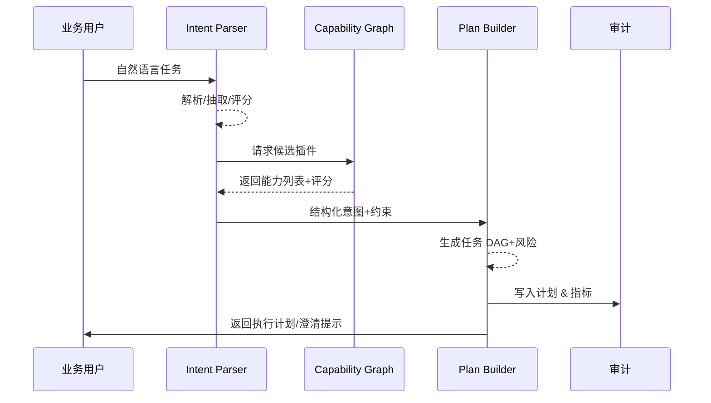

scn_id: SCN-AGENT-EXEC-PLAN-001
title: 自然语言任务解析与插件匹配
status: Draft
version: v0.1.0
owners:
  - name: Agent Platform Guild
    role: Scenario Steward
    contact: agent-platform@artisan-cloud.com
  - name: Ops Reliability Center
    role: Automation Co-owner
    contact: ops-center@artisan-cloud.com
domains: [agent-orchestration]
layers: [service]
repos:
  - key: powerx
    scope: core-platform
    responsibility: Intent Parser、Capability Graph、Plan Builder、审计/指标接口
related_usecases:
  - doc_id: UC-AGENT-EXEC-PLAN-001
    layer: service
    domain: agent-orchestration
last_reviewed_at: 2025-02-15

---

# Executive Summary

该子场景确保业务用户的自然语言任务在 2 秒内转化为可执行的任务 DAG，并自动匹配合规的插件组合。Planner 需要结合能力图谱、租户策略与风险标签输出结构化计划，为后续并行执行、风控与闭环奠定基础。成功标准：匹配准确率 ≥90%，计划、风险与插件列表全部写入审计。

# Scope & Guardrails

- **In Scope**：意图解析、多语言支持、实体抽取、约束合并、插件能力检索、计划生成、风险提示、审计写入。
- **Out of Scope**：插件实现/测试、ReAct Prompt 策略、执行期重试、人工协同。
- **Environment & Flags**：`agent-orchestrator-v2`、`capability-graph-service`、`telemetry-unified-sink`；依赖向量检索、能力元数据、审计流。

# Participants & Responsibilities

| Scope | Repository | Layer | 责任与交付物 | Owners |
|-------|------------|-------|--------------|--------|
| nlu-core | powerx | service | Intent Parser、实体抽取、置信度评估 | Agent Platform Guild |
| capability-graph | powerx | service | 插件能力检索、评分、租户可用性校验 | Plugin Guild |
| planner | powerx | service | 任务 DAG 构建、约束合并、风险标注、审计输出 | Agent Platform Guild |

# End-to-End Flow

1. **Stage 1 – Input Parsing**：解析自然语言与上下文，输出结构化意图与置信度。
2. **Stage 2 – Constraint Merge**：整合租户策略、SLA、敏感等级，补齐缺失参数。
3. **Stage 3 – Capability Search**：在能力图谱中筛选候选插件，结合健康信号评分。
4. **Stage 4 – Plan Build & Audit**：生成任务 DAG、节点依赖、风险与审批信息，并写入审计/指标。

# Key Interactions & Contracts

- **APIs / Events**：`POST /internal/agent/intents:parse`、`POST /internal/capabilities/search`、`POST /audit/agent-plan`、`EVENT agent.plan.created`。
- **Configs / Schemas**：`config/agent/intent_rules.yaml`、`config/agent/capability_weights.yaml`、`docs/standards/powerx/backend/integration/09_agent/Agent_Adaptor_and_Transport_Spec.md`。
- **Security / Compliance**：租户隔离、敏感任务审批提示、PII 脱敏日志、审计不可篡改。

# Usecase Links

- `UC-AGENT-EXEC-PLAN-001` — Planner 生成可执行任务计划与插件匹配。

# Acceptance Criteria

1. 平均 2 秒内返回计划，置信度低时必须提供澄清问题。
2. 插件匹配准确率 ≥90%，不可用插件需自动排除并提示人工流程。
3. 每份计划写入审计与指标，包含意图、插件列表、风险标签。

# Telemetry & Ops

- 指标：`agent.plan.latency_p95`、`agent.plan.success_rate`、`agent.plan.low_confidence_total`、`agent.plan.audit_write_total`。
- 告警阈值：计划耗时 >5s（连续 3 次）、匹配失败率 >5%、审计写入失败。
- 观测：Grafana「Agent Planner」、Datadog `planner.*`、`scripts/qa/intent-regression.mjs`.

# Open Issues & Follow-ups

| 风险/事项 | 影响范围 | 负责人 | ETA |
|-----------|----------|--------|-----|
| 插件健康信号尚未全部接入导致评分波动 | 插件选择正确性 | Plugin Guild | 2025-03-10 |
| 多语言语料不足，部分租户解析准确率低 | 国际化体验 | Agent Platform Guild | 2025-03-05 |

# Appendix

- `docs/meta/scenarios/powerx/agent-and-automation/agent-orchestration/agent-task-execution/primary.md`
- `docs/scenarios/agent-orchestration/SCN-AGENT-TASK-EXEC-001.md`
- `docs/standards/powerx/backend/integration/09_agent/Agent_Metrics_and_Observability.md`
