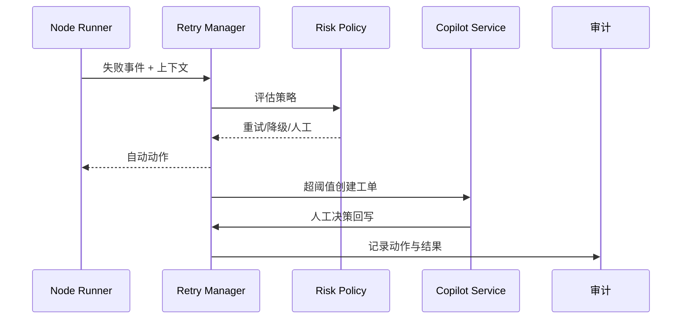

scn_id: SCN-AGENT-EXEC-RECOVERY-001
title: 失败恢复与 Copilot 协同
status: Draft
version: v0.1.0
owners:
  - name: Agent Platform Guild
    role: Scenario Steward
    contact: agent-platform@artisan-cloud.com
  - name: Ops Reliability Center
    role: Automation Co-owner
    contact: ops-center@artisan-cloud.com
domains: [agent-orchestration]
layers: [ops]
repos:
  - key: powerx
    scope: core-platform
    responsibility: Retry Manager、降级/回滚协调、Copilot 接口、审计
related_usecases:
  - doc_id: UC-AGENT-EXEC-RECOVERY-001
    layer: ops
    domain: agent-orchestration
last_reviewed_at: 2025-02-15

---

# Executive Summary

该子场景覆盖任务节点失败后的自动重试、降级、补偿与人工协同流程。系统需要在 5 分钟内交付可恢复的结果或触发 Copilot 工单，自动重试成功率 ≥80%，所有动作具备审计闭环，防止无限重试或风险外溢。

# Scope & Guardrails

- **In Scope**：失败检测、策略分级、重试/降级/回滚、Copilot 工单、人工决策回写、审计与指标。
- **Out of Scope**：人工工单处理细节、跨租户数据修复、外部系统权限审批。
- **Environment & Flags**：`retry-manager-v2`、`copilot-handoff`、`audit-streaming`；依赖补偿脚本库、Ops 工单系统、通知通道。

# Participants & Responsibilities

| Scope | Repository | Layer | 责任与交付物 | Owners |
|-------|------------|-------|--------------|--------|
| retry-engine | powerx | ops | 重试/退避/熔断、失败统计 | Agent Platform Guild |
| recovery-coordinator | powerx | ops | 回滚、降级脚本、补偿编排 | Ops Reliability Center |
| copilot-service | powerx | ops | 工单创建、上下文打包、审批与通知 | Ops Reliability Center |

# End-to-End Flow

1. **Stage 1 – Failure Capture**：子 Agent 报告失败，携带上下文、错误码、重试计数。
2. **Stage 2 – Policy Evaluation**：风险引擎判定是自动重试、降级还是直接人工。
3. **Stage 3 – Automated Actions**：按策略执行重试、回滚、降级，并记录结果。
4. **Stage 4 – Copilot Handoff**：超过阈值或敏感任务触发工单，由人工决策并回写结果。

# Key Interactions & Contracts

- **APIs / Events**：`EVENT agent.task.failed`、`POST /internal/agent/tasks/{id}/recover`、`POST /internal/plugins/{pluginId}/rollback`、`POST /ops/copilot/handoffs`。
- **Configs / Schemas**：`config/agent/retry_policies.yaml`、`config/agent/degrade_routes.yaml`、`docs/standards/powerx/backend/integration/09_agent/Agent_Metrics_and_Observability.md`。
- **Security / Compliance**：工单脱敏、权限校验、失败动作审计、最大重试阈值、幂等补偿。

# Usecase Links

- `UC-AGENT-EXEC-RECOVERY-001` — 失败恢复与 Copilot 协同。

# Acceptance Criteria

1. 自动重试成功率 ≥80%，退避策略避免无限重试。
2. 高风险/敏感任务在 5 分钟内转交 Copilot，人工决策记录原因与权限。
3. 所有恢复动作写入 `agent.failure.*` 审计流，提供回放能力。

# Telemetry & Ops

- 指标：`agent.retry.total`、`agent.retry.success_rate`、`agent.copilot.handoff_total`、`agent.failure.mtt_recovery`。
- 告警阈值：重试成功率 <80%、Copilot 工单积压 >10、补偿脚本失败。
- 观测：Grafana「Agent Recovery」、Ops 工单面板、`scripts/runbooks/agent-retry-drills.mjs`。

# Open Issues & Follow-ups

| 风险/事项 | 影响范围 | 负责人 | ETA |
|-----------|----------|--------|-----|
| Copilot 模板未完全脱敏 | 数据合规 | Ops Reliability Center | 2025-02-28 |
| 补偿脚本分散在各团队 | 回滚不一致 | Plugin Guild | 2025-03-15 |

# Appendix

- `docs/scenarios/agent-orchestration/SCN-AGENT-TASK-EXEC-001.md`
- `docs/meta/scenarios/powerx/agent-and-automation/agent-orchestration/agent-task-execution/primary.md`
- `scripts/qa/workflow-metrics.mjs`
