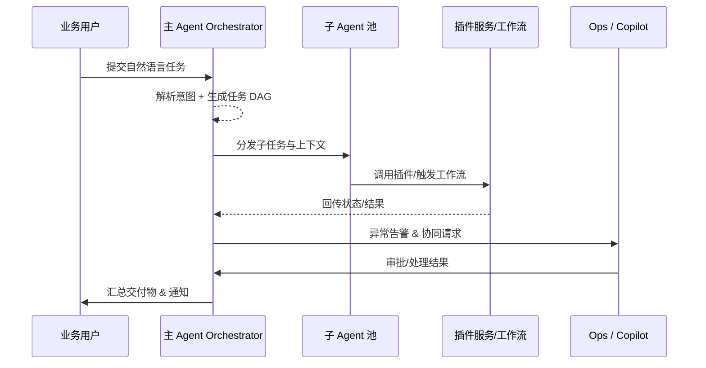

# Positioning & Goals

PowerX 企业客户依赖主 Agent 将自然语言目标拆解为可执行的任务 DAG，并在插件生态与 Copilot 协同下完成执行、校验与汇报。该场景确保“接到指令 → 规划 → 并行执行 → 失败恢复 → 闭环验证”具备统一规范、可观测与审计能力。成功标准：2 秒内产出可执行计划、任务成功率 ≥95%、异常 5 分钟内自动闭环或被人工感知。

# Core Capabilities

- **Planner & Capability Graph**：多语言意图解析、插件能力检索、风险标注与 DAG 构建，保障入口响应在 2 秒内完成并写入审计。
- **Parallel Execution Fabric**：子 Agent 池、状态总线、调度/重排策略与结果聚合，维持 95%+ 成功率与 <1 秒状态延迟。
- **Recovery & Copilot Collaboration**：重试/降级/回滚策略矩阵、Copilot 工单编排与脱敏模板，5 分钟内使高风险任务获得明确处理。
- **Workflow Closure & Reporting**：插件工作流触发、闭环校验、对账/通知补救与交付报告生成，闭环通过率 ≥98%。
- **Observability & Compliance**：统一指标、日志与审计流水，满足租户隔离、幂等令牌、防重放与敏感字段脱敏要求。

# Scope & Guardrails

- **In Scope**：自然语言任务解析、插件能力检索、任务 DAG 生成、多 Agent 并行调度、状态总线、失败恢复、人工协同、插件工作流闭环校验与指标采集。
- **Out of Scope**：插件开发与测试、知识空间构建、Prompt/ReAct 策略设计、纯人工流程、Marketplace 商业计费。
- **Environment & Flags**：`agent-orchestrator-v2`、`capability-graph-service`、`workflow-trigger-kit`、`copilot-handoff`、`telemetry-unified-sink`；依赖 Kafka/SQS 状态流、向量检索、任务编排服务、审计与监控总线。

# Participants & Responsibilities

| Scope | Repository | Layer | 责任与交付物 | Owners |
|-------|------------|-------|--------------|--------|
| core-platform | powerx | service | Planner、任务 DAG、状态协调、审计 & Telemetry 接口 | Agent Platform Guild |
| plugin-ecosystem | powerx-plugin | integration | 插件能力目录、工具契约、工作流触发器、健康信号上报 | Plugin Guild |
| automation-ops | powerx | ops | 重试/降级策略、Copilot 工单、Runbook、告警与指标面板 | Ops Reliability Center |

# End-to-End Flow

1. **Stage 1 – Intent Parsing & Capability Planning**：主 Agent 将自然语言转为结构化目标、约束与实体，在能力图谱中筛选插件，生成带风险标注的任务 DAG 并记录审计条目。
2. **Stage 2 – Parallel Execution & State Coordination**：子 Agent 依据 DAG 并行领取任务，携带租户/用户上下文调用插件，运行状态实时写入协调总线，主 Agent 可重排、扩缩或限流。
3. **Stage 3 – Failure Recovery & Human Handoff**：错误、超时或策略命中时执行自动重试、回滚、降级；仍失败则触发 Copilot 工单，附带上下文与建议动作。
4. **Stage 4 – Workflow Closure & Reporting**：插件返回执行状态或触发工作流节点，主 Agent 完成闭环（通知回执、余额对账），输出交付物并更新指标/审计。

# Architecture Diagram

# Key Interactions & Contracts

- **APIs / Events**：`POST /internal/agent/plans`、`POST /internal/agent/tasks/{task_id}/dispatch`、`EVENT agent.task.status.updated`、`EVENT plugin.workflow.completed`、`POST /ops/copilot/handoffs`、`EVENT agent.audit.appended`。
- **Configs / Schemas**：`docs/standards/powerx/backend/integration/09_agent/Agent_Adaptor_and_Transport_Spec.md`、`docs/standards/powerx/backend/integration/09_agent/Agent_Metrics_and_Observability.md`、`docs/standards/powerx-plugin/contract/agent_contract.md`。
- **Security / Compliance**：租户隔离、插件 Allowlist、幂等 Token、防重放签名、Copilot 操作审计、敏感字段脱敏。

# Usecase Links

- `UC-AGENT-EXEC-PLAN-001` — 自然语言解析与插件匹配（service 层，`docs/use_cases/_from_hub/SCN-AGENT-TASK-EXEC-001/UC-AGENT-EXEC-PLAN-001.md`）。
- `UC-AGENT-EXEC-COORD-001` — 多 Agent 并行与状态协调（integration 层）。
- `UC-AGENT-EXEC-RECOVERY-001` — 失败恢复与 Copilot 协同（ops 层）。
- `UC-AGENT-EXEC-CLOSURE-001` — 插件工作流闭环验证（ops 层）。

# Acceptance Criteria

1. 自然语言任务平均 2 秒内完成规划，插件匹配准确率 ≥90%，规划结果写入审计。
2. 子任务成功率 ≥95%，状态同步延迟 <1s，重复执行率 <0.5%，所有节点可追踪。
3. 自动重试成功率 ≥80%，人工接管响应 <5 分钟，闭环失败 2 分钟内触发补救并留痕。

# Validation Workflow

1. **配置一致性**：更新 `docs/_data/docmap.yaml` 与相关 Usecase Seed frontmatter，确保 `scope/layer/domain/repo/path` 对齐，并在场景交付矩阵中刷新链接。
2. **本地校验**：运行 `npm run lint` 与 `npm run docs:build`，确保 Markdown 语法、VitePress 构建与脚本依赖通过。
3. **场景验证**：执行 `npm run publish:scenarios -- --scn-id SCN-AGENT-TASK-EXEC-001 --validate-only` 或 `--dry-run`，检查结构化校验、生成的报告与站点内容。
4. **下游同步**：必要时运行 `npm run publish:usecases -- --scn-id SCN-AGENT-TASK-EXEC-001`，并通知 `powerx`/`powerx-plugin` 仓库对应 Stewards 完成审阅。
5. **运行监控**：借助 `scripts/qa/workflow-metrics.mjs` 与闭环演练脚本（如 `scripts/runbooks/agent-retry-drills.mjs`）复测关键链路后再发布。

# Telemetry & Ops

- 指标：`agent.plan.latency_p95`、`agent.task.success_rate`、`agent.statebus.lag_ms`、`agent.retry.success_total`、`agent.copilot.handoff_total`、`plugin.workflow.closure_rate`。
- 告警阈值：计划耗时 >5s 连续 3 次、状态总线延迟 >1s、任务失败率 >5%、闭环失败 3 次未恢复自动升级值班。
- 观测来源：Grafana「Agent Orchestration」仪表盘、Datadog Trace、`scripts/qa/workflow-metrics.mjs`、Ops 告警面板与工单系统。

# Open Issues & Follow-ups

| 风险/事项 | 影响范围 | 负责人 | ETA |
|-----------|----------|--------|-----|
| 插件健康信号尚未并入 Planner 评分 | 插件选择正确性 | Plugin Guild | 2025-03-10 |
| Copilot 工单模板缺少敏感字段脱敏策略 | 人工协同合规 | Ops Reliability Center | 2025-02-28 |

# Related Links

- `docs/meta/scenarios/powerx/list.md`
- `docs/standards/powerx/backend/integration/09_agent/Agent_Metrics_and_Observability.md`
- `docs/standards/powerx-plugin/contract/agent_contract.md`
- `scripts/qa/workflow-metrics.mjs`
