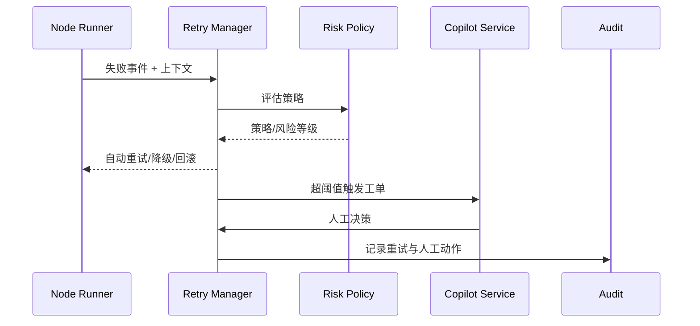

doc_id: UC-AGENT-EXEC-RECOVERY-001
scn_id: SCN-AGENT-TASK-EXEC-001
title: 失败恢复与 Copilot 协同
status: Draft
version: v0.1.0
repo_key: powerx
scope: powerx
layer: ops
domain: agent-orchestration
scenario_title: "智能体任务执行"
owners:
  - name: Agent Platform Guild
    role: Scenario Steward
    contact: agent-platform@artisan-cloud.com
  - name: Ops Reliability Center
    role: Automation Co-owner
    contact: ops-center@artisan-cloud.com
contributors: []
linked_requirements:
  - SCN-AGENT-TASK-EXEC-001-C
code_refs:
  - repo: powerx
    path: services/agent/runtime/retry_manager.ts
    description: 自动重试、退避与熔断策略
  - repo: powerx
    path: services/agent/runtime/rollback_coordinator.ts
    description: 回滚、补偿操作 orchestration
  - repo: powerx
    path: services/copilot/handoff_api.ts
    description: 工单创建、上下文打包与权限校验
  - repo: powerx
    path: services/audit/agent_failure_logger.ts
    description: 失败上下文与人工处理记录
feature_flags:
  - retry-manager-v2
  - copilot-handoff
  - audit-streaming
optional: false
last_reviewed_at: 2025-02-15

---

# Usecase Overview

- **业务目标**：当子任务失败或命中风险策略时，提供可治理的自动重试、回滚、降级与人工协同流程，缩短恢复时间并保留全链审计。
- **成功度量**：自动重试成功率 ≥80%；人工接管响应 <5 分钟；无限重试保护生效；所有动作在审计中可追踪。
- **场景关联**：支撑 Stage 3「Failure Recovery & Human Handoff」，保障任务执行的鲁棒性与客户体验。

> 通过标准化 Retry/Degrade 策略与 Copilot 流程，把复杂恢复操作沉淀为可配置、可审计的自动化链路。

# Context & Assumptions

- **前置条件**
  - `retry-manager-v2` 与 `copilot-handoff` Feature Flag 已开启。
  - 下游插件提供幂等接口与可调用的补偿操作。
  - Ops/Copilot 平台可接收自动创建的工单。
  - 审计流 `agent.failure.*` 已接入。
- **输入/输出**
  - 输入：失败的任务上下文（task_id, node_id, payload, error_code, retries）、风险等级、策略配置。
  - 输出：自动重试任务、降级/回滚动作、Copilot 工单、人工决定与审计记录。
- **边界**
  - 不涵盖人工工单处理流程细节。
  - 不负责跨租户的数据修复（由数据团队处理）。

# Solution Blueprint

## 体系分解

| 模块 | 责任 | 说明 |
|------|------|------|
| Retry Manager | 自动重试、退避、阈值管理 | 支持指数退避、优先级调度、最大次数限制。
| Degrade & Rollback Coordinator | 调用补偿脚本、切换备用流程 | 可执行兜底插件、回滚数据库、发起人工确认。
| Risk Policy Engine | 评估失败风险等级 | 根据错误码、插件敏感度、租户 SLA 输出处理策略。
| Copilot Handoff Service | 工单创建与协作 | 打包上下文、建议操作、权限校验与通知。
| Audit & Telemetry | 记录失败事件、重试、人工动作 | 写入 `agent.failure.log` 与指标。

## 流程与时序

1. **Step 1 – 失败捕获**：子 Agent 报告失败，Orchestrator 将上下文推送给 Retry Manager。
2. **Step 2 – 策略评估**：Risk Policy Engine 判断是否可自动重试或需直接人工介入。
3. **Step 3 – 自动动作**：Retry Manager 依策略执行重试/降级/回滚，并记录结果。
4. **Step 4 – Copilot 接管**：超过阈值或高风险时，Handoff Service 创建工单并通知负责角色。
5. **Step 5 – 审批与收敛**：人工选择继续执行、跳过或终止，结果写回 Orchestrator 并更新审计。



# Contracts & Interfaces

- **Inbound**：`EVENT agent.task.failed`；`POST /internal/agent/tasks/{task_id}/recover`（人工触发恢复）。
- **Outbound**：`POST /internal/plugins/{pluginId}/rollback`；`POST /ops/copilot/handoffs`；`EVENT agent.retry.executed`；`EVENT agent.task.degraded`。
- **配置/脚本**：`config/agent/retry_policies.yaml`、`config/agent/degrade_routes.yaml`、`scripts/runbooks/agent-retry-drills.mjs`。

# Implementation Checklist

| 项目 | 描述 | 状态 | Owner |
|------|------|------|-------|
| 策略矩阵 | 区分可重试/需人工/直接终止的错误码 | [ ] | Agent Platform Guild |
| 退避算法 | 实现指数退避 + 抖动 + 最大窗口 | [ ] | Agent Platform Guild |
| 回滚脚本库 | 关键插件补偿脚本入库 | [ ] | Plugin Guild |
| Copilot 模板 | 工单模板 + 脱敏字段清单 | [ ] | Ops Reliability Center |
| 审计事件 | `agent.retry.*`、`agent.degrade.*` 指标入仓 | [ ] | Ops Reliability Center |

# Testing Strategy

- **单元**：策略矩阵解析、退避计算、阈值计数。
- **集成**：模拟插件失败，验证重试/回滚/降级的调用链；模拟 Copilot 批准不同操作。
- **演练**：季度执行恢复演练脚本 `agent-retry-drills.mjs`，覆盖关键报表任务与通知任务。
- **Chaos**：强制触发连续失败，确认不会无限重试并能自动创建工单。

# Observability & Ops

- **指标**：`agent.retry.total`, `agent.retry.success_rate`, `agent.copilot.handoff_total`, `agent.failure.mtt_recovery`, `agent.degrade.trigger_total`。
- **日志**：记录 `failure_id`, `task_id`, `retry_count`, `action`, `copilot_decision`，敏感 payload 脱敏。
- **告警**：自动重试成功率 <80%、Copilot 工单积压 >10、回滚脚本失败 >1；通过 Ops 值班群通知。
- **Dashboard**：Grafana「Agent Recovery」、Ops 工单面板、Audit 回放工具。

# Rollback & Failure Handling

- Retry 服务异常时，可退回旧镜像或切换为保守策略（仅记录失败，不自动动作）。
- Copilot 服务不可用时，发出高优先级告警并自动降级为短信/邮件通知。
- 待处理工单过多时自动启用限流，暂停新任务进入恢复流程。

# Follow-ups & Risks

| 风险 | 影响 | 缓解 | ETA |
|------|------|------|-----|
| Copilot 模板未脱敏 | 数据泄露风险 | 在模板层引入字段白名单与审计 | 2025-02-28 |
| 补偿脚本分布在各团队 | 回滚不一致 | 建立统一回滚脚本仓库并自动化测试 | 2025-03-15 |

# References & Links

- 场景文档：`docs/scenarios/agent-orchestration/SCN-AGENT-TASK-EXEC-001.md`
- Runbook：`scripts/qa/workflow-metrics.mjs`, `scripts/runbooks/agent-retry-drills.mjs`
- 安全标准：`docs/standards/powerx/backend/integration/09_agent/Agent_Metrics_and_Observability.md`

---
scn_id: "SCN-AGENT-TASK-EXEC-001"
scenario_name: "智能体任务执行"
slug: "powerx-agent-task-execution"
primary_scope: "powerx"
primary_layer: "ops"
primary_domain: "agent-orchestration"
primary_repo: "powerx"
doc_owner: "Agent Platform Guild（Scenario Steward / agent-platform@artisan-cloud.com） & Ops Reliability Center（Automation Co-owner / ops-center@artisan-cloud.com）"
last_generated_at: "2025-11-09"
---

# 智能体任务执行 Usecase Seed 生成指南（Stage 3）

> 场景摘要：当任务节点失败或命中高风险策略时，PowerX 需要在 5 分钟内完成自动重试/降级/回滚或触发 Copilot 协同，自动动作成功率 ≥80%，并确保所有恢复路径可审计、可观测。

本文档面向场景负责人与仓库 Stewards，说明如何把 Stage 3 子用例（如 `UC-AGENT-EXEC-RECOVERY-001`）拆解成可交付的 Usecase Seed，为分发脚本与恢复演练提供权威信息。请根据实际情况补充或修订所有 `{{PLACEHOLDER}}` 字段。

## Seed 的定位

- 描述 `智能体任务执行` 场景中“失败恢复与 Copilot 协同”阶段的职责、策略、脚本与指标。
- 与 `docs/_data/docmap.yaml` 中 `scn_id: SCN-AGENT-TASK-EXEC-001` 的 `children` 配置保持 100% 对齐（`doc_id/scope/layer/domain/repo/path`）。
- 向 `npm run publish:usecases`、`npm run publish:collected` 提供唯一数据源，驱动下游仓库实施 Retry/Recovery。

## 前提条件

- 场景文档 `docs/scenarios/agent-orchestration/SCN-AGENT-TASK-EXEC-001.md` 已定义 Stage 3 的链路、指标与参与者。
- `docs/_data/docmap.yaml` 中存在 `UC-AGENT-EXEC-RECOVERY-001` 节点，字段如下所示，且 `repo` 指向 `powerx`：

  ```yaml
  - scn_id: SCN-AGENT-TASK-EXEC-001
    title: 智能体任务执行
    children:
      - doc_id: UC-AGENT-EXEC-PLAN-001
        scope: powerx
        layer: service
        domain: agent-orchestration
        optional: false
        repo: powerx
        path: docs/use_cases/_from_hub/SCN-AGENT-TASK-EXEC-001/UC-AGENT-EXEC-PLAN-001.md
      - doc_id: UC-AGENT-EXEC-COORD-001
        scope: powerx
        layer: integration
        domain: agent-orchestration
        optional: false
        repo: powerx
        path: docs/use_cases/_from_hub/SCN-AGENT-TASK-EXEC-001/UC-AGENT-EXEC-COORD-001.md
      - doc_id: UC-AGENT-EXEC-RECOVERY-001
        scope: powerx
        layer: ops
        domain: agent-orchestration
        optional: false
        repo: powerx
        path: docs/use_cases/_from_hub/SCN-AGENT-TASK-EXEC-001/UC-AGENT-EXEC-RECOVERY-001.md
      - doc_id: UC-AGENT-EXEC-CLOSURE-001
        scope: powerx
        layer: ops
        domain: agent-orchestration
        optional: false
        repo: powerx
        path: docs/use_cases/_from_hub/SCN-AGENT-TASK-EXEC-001/UC-AGENT-EXEC-CLOSURE-001.md
  ```

- `docs/_data/repos.yaml` 的 `powerx` 项配置了 `usecase_seed_root: docs/use_cases/_from_hub`、默认分支 `dev/docs`、维护者列表，供发布脚本引用。
- Feature Flag `retry-manager-v2`、`copilot-handoff`、`workflow-trigger-kit`、`telemetry-unified-sink`、`audit-streaming` 已在目标环境启用；自动重试所需的补偿脚本、Copilot Handoff API、审计与指标通道均可用。
- 恢复演练脚本（如 `scripts/runbooks/agent-retry-drills.mjs`、`scripts/qa/workflow-metrics.mjs`）已同步至最新版，以支持 Seed 中的自检与演练。

> **TODO**：如需额外依赖（临时凭据、租户限流策略、新的告警渠道），请在前提条件中列出并在 Follow-ups 中跟踪。

## 生成流程

1. **登记/更新 docmap 子节点**
   - 确认 `doc_id`、`scope`、`layer`、`domain`、`repo`、`path` 与 Seed frontmatter 完全一致。
   - 若恢复能力涉及 `powerx-plugin` 或其他仓库，请新增 docmap 子节点并复制 Seed 模板，避免多个仓共用同一路径。

2. **复制模板并放置到目录**

   ```bash
   mkdir -p docs/usecases-seeds/SCN-AGENT-TASK-EXEC-001
   cp docs/usecases-seeds/_template.md \
     docs/usecases-seeds/SCN-AGENT-TASK-EXEC-001/UC-AGENT-EXEC-RECOVERY-001.md
   ```

   - 文件名建议包含 `doc_id`，便于脚本按路径定位。
   - 从 `_template.md` 复制后，请立即更新 frontmatter 以免发布脚本读取到示例值。

3. **填充 Frontmatter 区域**

   - `repo_key` 使用 `powerx`，`scenario_title` 建议保持「智能体任务执行」。
   - `owners` 默认为 Agent Platform Guild + Ops Reliability Center；如引入 Copilot 团队或插件团队，请追加到 `contributors`。
   - `feature_flags` 至少列 `retry-manager-v2`、`copilot-handoff`、`workflow-trigger-kit`、`audit-streaming`，并说明是否依赖租户级策略。
   - `code_refs` 覆盖 `services/agent/runtime/retry_manager.ts`、`services/agent/runtime/rollback_coordinator.ts`、`services/copilot/handoff_api.ts`、`services/audit/agent_failure_logger.ts` 等核心模块。

4. **完善正文章节**

   - `Usecase Overview`：强调自动重试成功率、人工接管 SLA、审计覆盖率等指标，说明 Stage 3 在全链路中的作用。
   - `Context & Assumptions`：列出输入（失败上下文、风险等级）、输出（重试/降级/工单）、非目标（人工工单细节、跨租户修复）。
   - `Solution Blueprint`：拆分 Retry Manager、Risk Engine、Rollback Coordinator、Copilot Handoff 等子系统，并用 Mermaid 描述流程。
   - `Contracts & Interfaces`：明确 `EVENT agent.task.failed`、`POST /internal/agent/tasks/{task_id}/recover`、`POST /ops/copilot/handoffs`、`EVENT agent.retry.executed` 等接口与配置。
   - `Testing/Observability/Rollback`：覆盖策略矩阵单测、演练脚本、Chaos 测试、指标/告警、降级策略（如 `retry-safe-mode`、Copilot 故障切换）。

5. **与场景文档互相链接**

   - 在 `docs/scenarios/agent-orchestration/SCN-AGENT-TASK-EXEC-001.md` 的 Stage 3 章节加入 Seed 链接，交付矩阵中注明 `UC-AGENT-EXEC-RECOVERY-001`。
   - 若新增标准（如工单模板、回滚脚本规范），同步更新 `docs/standards/powerx/backend/integration/09_agent/**` 或新建标准文档。

## 自检清单

- `docmap.yaml`、Seed frontmatter、下游仓库路径完全一致，`scope/layer/domain/repo` 无大小写错误。
- Seed 覆盖策略矩阵、退避算法、降级/回滚脚本、Copilot Handoff、审计指标、Runbook/演练脚本等要素。
- `scripts/runbooks/agent-retry-drills.mjs`、`scripts/qa/workflow-metrics.mjs` 在最新代码下可运行，并能验证 Seed 描述的指标。
- Feature Flag、外部依赖（Copilot、插件补偿接口、审计流）在前提条件中列明，并给出监控/告警。
- 已运行 `npm run lint`、`npm run docs:build` 保证站点可构建。
- 通过 `npm run publish:scenarios -- --scn-id SCN-AGENT-TASK-EXEC-001 --validate-only` 校验配置后，再执行正式发布。

## 常见问题

| 问题 | 处理方式 |
|------|----------|
| 重试策略误触导致无限重试？ | 在 Seed 中写明退避与最大次数配置、`retry-safe-mode` Flag 及告警阈值，引用 `config/agent/retry_policies.yaml` 中的示例。 |
| Copilot 工单缺少脱敏导致无法发布？ | 在前提条件与 Follow-ups 中要求引用统一模板、字段白名单，必要时新增脱敏脚本，并将模板路径写入 `Contracts`。 |

完成上述步骤后，即可进入分发与发布流程，参考《发布 Usecase Seeds 指南》执行下游同步与演练安排。
