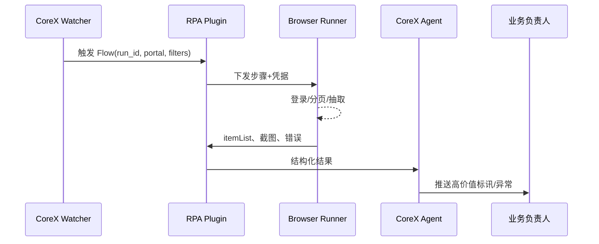

# Executive Summary

该子场景覆盖政府采购与招投标网站的自动化抓取：CoreX 智能体以 RPA Flow 对接登录、分页、数据抽取，再将结构化结果写回知识库或推送给业务负责人。目标是 30 分钟内可部署一个可复用的 Flow，每日定时运行采集不少于 3 个门户来源，并确保敏感凭据与 Cookie 安全可控。

# Scope & Guardrails

- **In Scope**：门户登录/登出流程、Captcha/OTP 回调、分页与过滤操作、DOM XPath 适配、抽取 JSON 化、推送 CoreX 审核与通知、失败重跑。
- **Out of Scope**：实际投标文件撰写、第三方 OCR/CV 训练、Marketplace 行业版定制、手工审核流程。
- **Environment & Flags**：`rpa-plugin-enabled`、`browser-runner-headful`、`telemetry-bid-feed`; 需配置政府网白名单 IP 与代理。

# Participants & Responsibilities

| Scope | Repository | Layer | 责任与交付物 | Owners |
|-------|------------|-------|--------------|--------|
| procurement-agent | powerx | service | 订阅关键词、触发定时任务、聚合结果推送 | Michael Hu |
| browser-runner | powerx-plugin-rpa | plugin | DOM 识别、分页、数据抽取、截图归档 | Michael Hu |
| notify-center | powerx | service | 推送负责人、生成任务摘要、审批确认 | Michael Hu |

# End-to-End Flow

1. **Stage 1 – Watcher Setup**：智能体维护招标关键词、门户账号与调度策略，绑定 Flow ID 与凭据保险箱。
2. **Stage 2 – Portal Login**：Browser Runner 进入政府采购网、加载登录页面、填写凭据、处理验证码/二次认证。
3. **Stage 3 – Data Harvesting**：RPA 轮询列表、执行翻页、提取公告内容/附件链接，写入变量 `itemList`。
4. **Stage 4 – Summary & Push**：结果同步到 CoreX Agent，由 Agent 筛选/总结并发出负责人通知或创建后续任务。

# Key Interactions & Contracts

- **APIs / Events**：`POST /rpa/flow/run` with `run_type=scheduled`、`GET /rpa/flow/{id}/artifacts`、`EVENT rpa.bidfeed.created`、`POST /agent/notifications`。
- **Configs / Schemas**：Flow JSON 中 `browser.extract.list`、`browser.wait.dom` 节点、`config/rpa/portal_accounts.yaml`、`TODO_RPA_BID_SCHEMA`。
- **Security / Compliance**：凭据 Vault、Cookie 加密、敏感公告需遵守政府网站抓取条款、操作日志保留 180 天。

# Usecase Links

- `PX-RPA-BID-001` — RPA 投标信息抓取的服务侧用例，包含调度与推送流程。

# Acceptance Criteria

1. 每个门户 Flow 成功率 ≥ 97%，失败需自动重试一次并通知 Agent。
2. 单次抓取延迟 ≤ 5 分钟（含登录），每日 2 次以上更新。
3. 推送内容包含原文链接、提取字段、智能体总结，且留存截图供稽核。

# Telemetry & Ops

- 指标：`rpa.bid.run_total`、`rpa.bid.success_rate`、`rpa.bid.latency_p95`、`rpa.bid.notify_latency`。
- 告警阈值：连续 2 次登录失败、抽取结果为空、推送延迟 >10 分钟、验证码识别失败率 >20%。
- 观测来源：RPA Dashboard、`scripts/qa/workflow-metrics.mjs --target rpa-bid`、审计系统截图归档。

# Open Issues & Follow-ups

| 风险/事项 | 影响范围 | 负责人 | ETA |
|-----------|----------|--------|-----|
| 部分门户使用极验/短信验证码，需人工确认 Step | 执行连贯性 | Michael Hu | 2025-03-01 |
| DOM 变更频繁，需要 Selector 健康监控脚本 | Flow 维护成本 | Michael Hu | 2025-02-28 |
| docmap.yaml 尚未登记该子场景 | 文档可发现性 | Michael Hu | TODO_DATE |

# Appendix

- docs/meta/scenarios/powerx/core-platform/rpa/primary.md
- TODO_RPA_BID_FLOW_LINK
