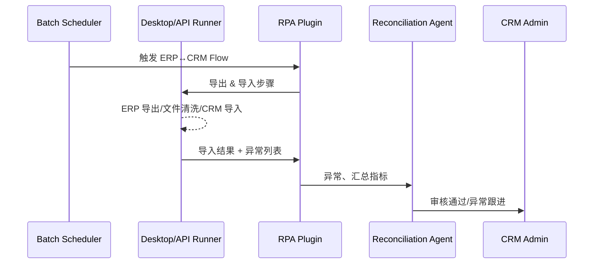

# Executive Summary

该子场景描述如何借助 RPA 在 ERP 与 CRM 之间自动同步月度对账单：Runner 负责导出 ERP 报表、执行 Excel/CSV 清洗、登录 CRM 批量导入，CoreX Agent 则审核异常并生成对账报告。目标是消除人工下载/上传环节，并确保任务可在凌晨定时完成，结果同步到智能体知识库供业务复查。

# Scope & Guardrails

- **In Scope**：ERP 桌面/浏览器导出流程、文件命名与校验、`data.*` 节点处理 Excel/CSV、CRM 管理端导入与校验、异常订单识别与推送、对账报告生成。
- **Out of Scope**：ERP/CRM 接口改造、票据生成、财务审批策略、BI 可视化。
- **Environment & Flags**：`desktop-runner-enabled`、`api-runner-enabled`、`rpa-file-vault`、`workflow-batch-window=00:00-06:00`；需 VPN/专线访问 ERP。

# Participants & Responsibilities

| Scope | Repository | Layer | 责任与交付物 | Owners |
|-------|------------|-------|--------------|--------|
| erp-export | powerx-plugin-rpa | plugin | 模拟 ERP 导出、桌面控件识别、文件落地 | Michael Hu |
| file-pipeline | powerx-plugin-rpa | plugin | Excel/CSV 清洗、字段映射、错误行分支 | Michael Hu |
| crm-import | powerx-plugin-rpa | plugin | 浏览器/API 导入、进度监控、异常日志 | Michael Hu |
| reconciliation-agent | powerx | service | 智能体核对差异、生成摘要、推送报告、记录审计 | Michael Hu |

# End-to-End Flow

1. **Stage 1 – ERP Export**：Desktop Runner 登录 ERP、打开对账模块、触发导出、监控文件生成并上传到临时存储。
2. **Stage 2 – Data Shaping**：`data.*` 节点清洗文件、转换字段、拆分异常订单列表，生成导入 CSV。
3. **Stage 3 – CRM Import**：Browser/API Runner 登录 CRM、导入文件、处理批量校验、记录失败记录。
4. **Stage 4 – Agent Review**：CoreX Agent 读取导入结果与异常列表，执行自动审核或推送人工确认，并回写最终状态。

# Key Interactions & Contracts

- **APIs / Events**：`POST /rpa/flow/run`、`GET /rpa/artifacts/{run_id}`、`EVENT rpa.reconciliation.completed`、`POST /agent/reports/reconciliation`。
- **Configs / Schemas**：Flow JSON `data.transform`/`data.split` 节点、`config/rpa/file_mapping.yaml`、`TODO_RPA_CRM_ERP_SCHEMA`。
- **Security / Compliance**：对账文件需加密存储、VPN 通道、操作日志可追溯、异常需自动触发人工审批。

# Usecase Links

- `PX-RPA-RECON-001` — ERP↔CRM 对账 Flow 的服务层用例，覆盖导出/导入/异常审计。

# Acceptance Criteria

1. 对账 Flow 必须在 60 分钟内完成，失败自动重试且保留快照。
2. 文件清洗后的导入成功率 ≥ 98%，异常订单需分类输出。
3. 智能体在 5 分钟内生成对账报告并推送相关人员。

# Telemetry & Ops

- 指标：`rpa.reconciliation.run_total`、`rpa.reconciliation.latency_p95`、`rpa.reconciliation.error_ratio`、`agent.reconciliation.alert_total`。
- 告警阈值：导出耗时 > 15 分钟、导入失败率 > 5%、文件校验失败 3 次、异常未确认 > 30 分钟。
- 观测来源：`scripts/qa/workflow-metrics.mjs --target reconciliation`、Datadog `rpa.reconciliation.*`、对账报告审计面板。

# Open Issues & Follow-ups

| 风险/事项 | 影响范围 | 负责人 | ETA |
|-----------|----------|--------|-----|
| ERP 桌面控件定位依赖模板，需补充视觉定位兜底 | Desktop Runner 稳定性 | Michael Hu | 2025-03-05 |
| 文件映射规则需要文档化并纳入版本控制 | 数据一致性 | Michael Hu | 2025-02-27 |
| docmap.yaml 未包含该子场景，需补登记 | 场景索引 | Michael Hu | TODO_DATE |

# Appendix

- docs/meta/scenarios/powerx/core-platform/rpa/primary.md
- TODO_RPA_CRM_ERP_FLOW_LINK
