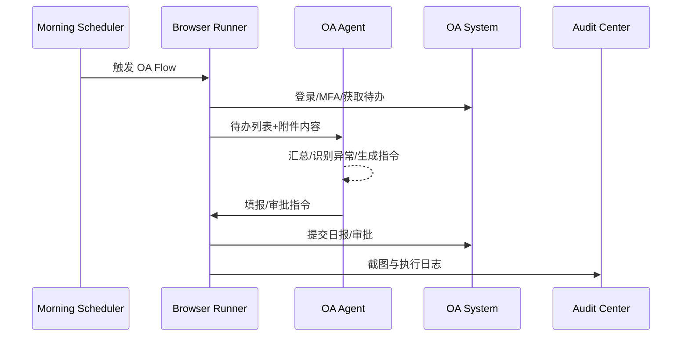

# Executive Summary

本子场景面向企业 OA 系统的日常巡检：RPA 自动登录 OA、抓取待办事项、下载附件并解析、生成日报，必要时回填审批或记录执行结果。智能体负责确认异常与补充说明，使办公自动化落地到可审计的执行链路。成功标准：晨间巡检 5 分钟内完成，下载/解析正确率 ≥ 98%，人工干预率 < 10%。

# Scope & Guardrails

- **In Scope**：OA 登录/多因子校验、待办列表抓取、附件下载与 OCR/PDF 解析、自动填写日报或审批字段、失败重试与人工确认、审计日志同步。
- **Out of Scope**：OA 系统改造、复杂审批策略、企业邮箱通知、移动端客户端脚本。
- **Environment & Flags**：`browser-runner-headless`、`file-runner-enabled`、`workflow-morning-check`、`telemetry-oa`；需企业内网访问。

# Participants & Responsibilities

| Scope | Repository | Layer | 责任与交付物 | Owners |
|-------|------------|-------|--------------|--------|
| oa-login | powerx-plugin-rpa | plugin | 登录脚本、MFA 处理、Session 续期 | Michael Hu |
| todo-harvest | powerx-plugin-rpa | plugin | 待办抓取、附件下载、OCR 解析 | Michael Hu |
| report-agent | powerx | service | 智能体生成日报、识别异常、推送审批人 | Michael Hu |
| audit-center | powerx | service | 日志归档、截图/附件审计、异常提醒 | Michael Hu |

# End-to-End Flow

1. **Stage 1 – Login & Session Prep**：RPA 使用凭据 Vault 登录 OA，处理短信/令牌验证并刷新 Session。
2. **Stage 2 – Inbox Harvest**：抓取今日待办、下载附件、解析 PDF/Excel，提取关键字段。
3. **Stage 3 – Agent Summary**：CoreX Agent 汇总任务、提炼异常、生成日报或审批建议。
4. **Stage 4 – Auto Fill & Confirm**：RPA 根据 Agent 指令自动填报日报或审批动作，并写入审计记录/通知责任人。

# Key Interactions & Contracts

- **APIs / Events**：`POST /rpa/flow/run?trigger=morning`、`GET /rpa/attachments/{run}`、`EVENT rpa.oa.todo.synced`、`POST /agent/reports/daily`。
- **Configs / Schemas**：Flow JSON `browser.extract.table`、`data.parse.pdf`、`config/rpa/oa_accounts.yaml`、`TODO_RPA_OA_SCHEMA`。
- **Security / Compliance**：凭据双层加密、MFA 处理需要人工兜底、附件解析需入库留痕、审批操作需 ACL 与审计共享。

# Usecase Links

- `PX-RPA-OA-001` — OA 待办巡检与自动填报的服务层用例。

# Acceptance Criteria

1. 登录成功率 ≥ 98%，MFA 失败需在 2 分钟内通知人工。
2. 待办抓取覆盖率 100%，解析准确率 ≥ 98%，异常任务需高亮。
3. 日报填报或审批流完成后 1 分钟内推送结果与截图。

# Telemetry & Ops

- 指标：`rpa.oa.run_total`、`rpa.oa.login_success_rate`、`rpa.oa.attachment_parse_errors`、`agent.oa.daily_report_latency`。
- 告警阈值：登录失败连续 2 次、附件解析失败率 >5%、自动填报失败 3 次、审计写入延迟 >5 分钟。
- 观测来源：OA Flow Dashboard、`scripts/qa/workflow-metrics.mjs --target oa`、审计中心回放。

# Open Issues & Follow-ups

| 风险/事项 | 影响范围 | 负责人 | ETA |
|-----------|----------|--------|-----|
| MFA 机制常变，需设计人工确认 Step 与超时策略 | 执行稳定性 | Michael Hu | 2025-03-02 |
| 附件 OCR 类库未确定，需选型与性能评估 | 文件处理能力 | Michael Hu | 2025-03-08 |
| docmap.yaml 未登记该子场景 | 场景导航 | Michael Hu | TODO_DATE |

# Appendix

- docs/meta/scenarios/powerx/core-platform/rpa/primary.md
- TODO_RPA_OA_FLOW_LINK
