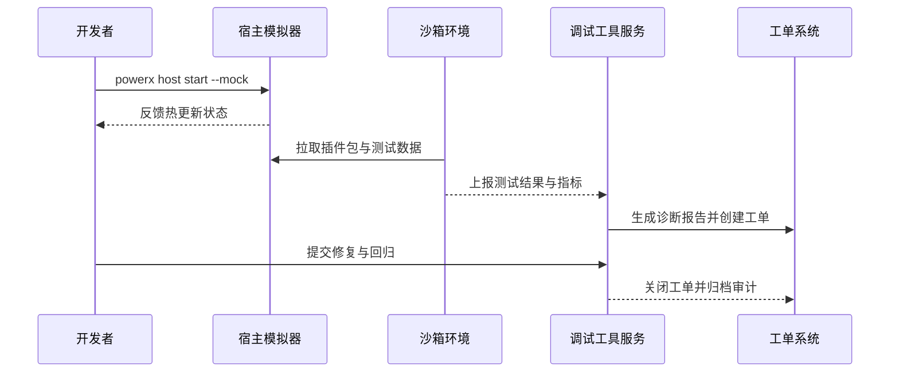

# Positioning & Goals

本主场景聚焦插件开发团队在上线前进行本地调试、沙箱验证与错误诊断的全链路，确保在多语言运行时与复杂依赖下仍能复现问题、定位根因并形成可追溯报告。平台需提供标准化的宿主模拟器、热更新工具与沙箱数据资产，使研发与测试团队能够在 1 分钟内复现错误、10 分钟内完成端到端验证，并把调试成果沉淀到工单与自动化回归中。

# Scope & Guardrails

- **In Scope**：宿主模拟环境启动、热更新调试、沙箱数据集加载、自动化测试与调试报告生成、敏感信息脱敏、工单闭环。
- **Out of Scope**：插件初始化与模板生成、生产环境运行监控、Marketplace 发布审核、运行态运维（升级/停用）。
- **Environment & Flags**：`PX_PLUGIN_HOST_SIMULATOR`、`plugin-sandbox-suite`、`debug-observability-v2`；依赖宿主模拟器镜像仓库、沙箱租户资源池、监控与工单系统。

# Core Capabilities

1. **Developer CLI & Host Simulator**：提供 `powerx host start --mock`、`powerx debug attach`、`px-plugin dev --watch` 等能力，支持多语言插件的秒级热更新、断点同步、日志聚合。
2. **Sandbox Validation Service**：PowerX 核心平台维护沙箱租户、脱敏数据集、最小权限模板与安装 API，保障调试过程中签名校验、权限对齐与资源隔离。
3. **Observability & Workflow Hooks**：调试工具服务负责日志脱敏、指标采集、工单/告警联动以及审计归档，使调试产物可以直接交付给测试、合规与审批团队。

# Participants & Responsibilities

| Scope | Repository | Layer | 责任与交付物 | Owners |
|-------|------------|-------|--------------|--------|
| plugin-ecosystem | powerx-plugin | proto | 宿主模拟器、热更新 SDK、断点与日志适配 | Michael Hu（Plugin Tech Lead / tech@artisan-cloud.com） |
| core-platform | powerx | service | 沙箱部署、数据集管理、调试工具后台、工单集成 | Michael Hu（Plugin Tech Lead / tech@artisan-cloud.com） |
| security | powerx | security | 调试日志脱敏、敏感数据审计、沙箱访问策略 | Grace Lin（Security & Compliance Lead / compliance@artisan-cloud.com） |

# Validation Workflow

1. **Stage 1 – 本地模拟与热更新**：开发者启动宿主模拟器、挂载插件代码仓，并通过 CLI 实现秒级热更新与断点调试。
2. **Stage 2 – 沙箱自动化验证**：测试工程师在沙箱租户执行测试方案，自动加载脱敏数据集、运行脚本并收集性能指标。
3. **Stage 3 – 错误诊断与报告**：调试工具聚合日志、调用链与上下文，生成结构化报告并同步工单系统。
4. **Stage 4 – 回归闭环**：修复后自动触发回归测试与告警关闭，沉淀指标与审计记录。

# Architecture Diagram

# Key Interactions & Contracts

- **APIs / Events**：`powerx host start --mock`、`powerx debug attach`、`POST /internal/sandbox/deploy`、`POST /internal/debug/report`、`EVENT plugin.debug.alert`.
- **Configs / Schemas**：`config/plugins/debug/host_simulator.yaml`、`config/plugins/debug/data_suite.yaml`、`docs/standards/powerx-plugin/integration/08_dev_console_and_ui/Common_Tasks_and_Troubleshooting.md`.
- **Security / Compliance**：日志与数据集需脱敏、调试访问遵循最小权限，工单与审计保留 ≥180 天。

# Related Links

- `UC-DEV-PLUGIN-HOT-RELOAD-001` — 本地宿主模拟热更新调试。
- `UC-DEV-PLUGIN-SANDBOX-VALIDATION-001` — 沙箱加载数据集完成功能验证。
- `UC-DEV-PLUGIN-ERROR-DIAGNOSTICS-001` — 调试工具生成错误报告并闭环工单。
- 设计稿：`docs/meta/scenarios/powerx/plugin-ecosystem/plugin-lifecycle/plugin-dev-and-debug/primary.md`
- 故障排查：`docs/standards/powerx-plugin/integration/08_dev_console_and_ui/Common_Tasks_and_Troubleshooting.md`
- 安全清单：`docs/standards/powerx-plugin/integration/04_security_and_compliance/Plugin_Security_Checklist.md`

# Acceptance Criteria

1. 宿主模拟器支持热更新延迟 ≤2 秒、断点自动同步、版本兼容校验，并阻止访问生产资源。
2. 沙箱部署流程 ≤5 分钟完成，关键用例覆盖率 ≥95%，性能指标与数据版本可追溯。
3. 错误报告在 1 分钟内生成、敏感信息脱敏合规率 100%，工单闭环率 ≥95%，回归自动触发。

# Telemetry & Ops

- 指标：`debug.hot_reload.duration_ms`、`sandbox.test.success_rate`、`debug.report.generate_ms`、`debug.sensitive.masked_total`.
- 告警阈值：热更新失败率 >5% 或报告生成超时 >60 秒告警；沙箱部署失败连续 3 次通知 `plugin-dev-oncall`。
- 观测来源：`workflow-metrics.mjs`、调试工具遥测、监控仪表盘、工单系统 Webhook。

# Open Issues & Follow-ups

| 风险/事项 | 影响范围 | 负责人 | ETA |
|-----------|----------|--------|-----|
| 宿主模拟器对新协议支持滞后需加速版本同步 | 本地调试体验 | Michael Hu | 2025-12-08 |
| 调试日志脱敏策略需覆盖 AI 生成字段 | 合规风险 | Grace Lin | 2025-12-18 |
