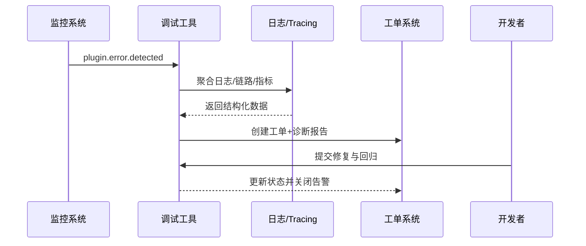

scn_id: SCN-DEV-PLUGIN-ERROR-DIAGNOSTICS-001
title: 调试工具错误捕获与日志报告
status: Draft
version: v0.1.0
owners:
  - name: Grace Lin
    role: Security & Compliance Lead
    contact: compliance@artisan-cloud.com
  - name: Michael Hu
    role: Plugin Tech Lead
    contact: tech@artisan-cloud.com
domains: [dev]
layers: [ops, security]
repos:
  - key: powerx
    scope: core-platform
    responsibility: 调试工具后台、日志采集、诊断报告生成、工单集成
  - key: powerx-plugin
    scope: plugin-ecosystem
    responsibility: 本地诊断插件、CLI 触发器、回归验证脚本
related_usecases:
  - doc_id: UC-DEV-PLUGIN-ERROR-DIAGNOSTICS-001
    layer: ops
    domain: dev
last_reviewed_at: 2025-11-20

---

# Executive Summary

该子场景确保在插件运行出现异常时，调试工具能够在 1 分钟内收集跨环境日志、调用链与上下文，生成结构化报告并自动关联工单。系统需实现敏感字段脱敏、备用日志下载通道以及回归验证流程，保证诊断效率与合规性。

# Scope & Guardrails

- **In Scope**：错误事件捕获、日志与链路聚合、报告生成、工单同步、回归验证、脱敏与审计。
- **Out of Scope**：本地热更新、沙箱数据加载、生产级监控策略配置。
- **Environment & Flags**：`debug-observability-v2`、`debug-ticket-bridge`；依赖日志平台、Tracing、Metrics、工单系统、审计数据库。

# Participants & Responsibilities

| Scope | Repository | Layer | 责任与交付物 | Owners |
|-------|------------|-------|--------------|--------|
| core-platform | powerx | ops | 调试工具服务、日志采集、报告生成、工单同步 | Michael Hu（Plugin Tech Lead / tech@artisan-cloud.com） |
| security | powerx | security | 敏感信息识别与脱敏、访问控制、审计日志 | Grace Lin（Security & Compliance Lead / compliance@artisan-cloud.com） |
| plugin-ecosystem | powerx-plugin | proto | 本地诊断脚本、回归触发器、CLI 集成 | Michael Hu（Plugin Tech Lead / tech@artisan-cloud.com） |

# End-to-End Flow

1. **Stage 1 – 异常检测与触发**：监控或开发者触发诊断任务，调试工具定位目标实例与时间窗口。
2. **Stage 2 – 数据聚合与脱敏**：聚合日志、Tracing、Metrics，并执行敏感字段脱敏、权限校验。
3. **Stage 3 – 报告生成与工单同步**：生成结构化报告、附件与链接，自动创建或更新工单。
4. **Stage 4 – 回归验证与告警关闭**：开发者提交修复，调试工具触发回归脚本并在成功后关闭告警。

# Key Interactions & Contracts

- **APIs / Events**：`POST /internal/debug/report`、`POST /internal/debug/logs/export`、`EVENT plugin.debug.alert`、`POST /internal/ticket/create`.
- **Configs / Schemas**：`config/plugins/debug/report_template.yaml`、`config/security/data_masking_rules.yaml`.
- **Security / Compliance**：敏感字段脱敏、报告访问控制、审计保留 ≥180 天、备用日志下载审计。

# Usecase Links

- `UC-DEV-PLUGIN-ERROR-DIAGNOSTICS-001` — 调试工具错误捕获与日志报告。

# Acceptance Criteria

1. 诊断任务触发后 1 分钟内生成报告，包含堆栈、请求参数、环境上下文。
2. 敏感信息遮蔽率 100%，日志采集失败时切换备用通道并提示有效期。
3. 工单自动关联插件、租户与负责人，回归验证成功后自动关闭。

# Telemetry & Ops

- 指标：`debug.report.generate_ms`、`debug.report.failure_total`、`debug.masking.violation_total`、`debug.ticket.autoclose_rate`.
- 告警阈值：报告生成超时 >60 秒或脱敏失败触发 P1；备用通道使用率激增告警至安全团队。
- 观测来源：调试工具遥测、审计日志、工单系统 Webhook、`workflow-metrics.mjs`。

# Open Issues & Follow-ups

| 风险/事项 | 影响范围 | 负责人 | ETA |
|-----------|----------|--------|-----|
| Tracing 与日志时间对齐偏差导致上下文缺失 | 诊断准确性 | Michael Hu | 2025-12-10 |
| 脱敏规则需覆盖 AI 生成内容 | 合规风险 | Grace Lin | 2025-12-18 |

# Appendix

- `docs/meta/scenarios/powerx/plugin-ecosystem/plugin-lifecycle/plugin-dev-and-debug/primary.md#子场景-c`
- `docs/standards/powerx-plugin/integration/04_security_and_compliance/Plugin_Security_Checklist.md`
