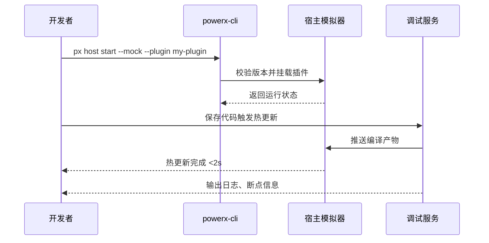

scn_id: SCN-DEV-PLUGIN-HOT-RELOAD-001
title: 本地宿主模拟热更新调试
status: Draft
version: v0.1.0
owners:
  - name: Michael Hu
    role: Plugin Tech Lead
    contact: tech@artisan-cloud.com
domains: [dev]
layers: [proto, service]
repos:
  - key: powerx-plugin
    scope: plugin-ecosystem
    responsibility: 宿主模拟器、热更新 SDK、断点调试适配
  - key: powerx
    scope: core-platform
    responsibility: 调试工具服务、权限校验、遥测上报
related_usecases:
  - doc_id: UC-DEV-PLUGIN-HOT-RELOAD-001
    layer: proto
    domain: dev
last_reviewed_at: 2025-11-20

---

# Executive Summary

本子场景聚焦开发者在本地宿主模拟环境中进行热更新和断点调试的全流程，目标是在 2 秒内完成代码变更生效并及时捕获异常。通过统一的模拟宿主、CLI 命令与调试扩展，保证插件与宿主 API 版本对齐，同时阻止访问生产资源或泄露敏感数据。

# Scope & Guardrails

- **In Scope**：宿主模拟器启动、插件挂载、热更新回路、断点同步、实时日志与遥测。
- **Out of Scope**：沙箱部署、数据集管理、工单闭环、生产运行监控。
- **Environment & Flags**：`PX_PLUGIN_HOST_SIMULATOR`、`debug-observability-v2`；依赖宿主模拟器镜像仓库、本地日志代理、CLI 登录凭证。

# Participants & Responsibilities

| Scope | Repository | Layer | 责任与交付物 | Owners |
|-------|------------|-------|--------------|--------|
| plugin-ecosystem | powerx-plugin | proto | 模拟器镜像、热更新监听、断点同步适配、开发者 CLI | Michael Hu（Plugin Tech Lead / tech@artisan-cloud.com） |
| core-platform | powerx | service | 调试事件路由、权限校验、遥测与日志聚合 | Michael Hu（Plugin Tech Lead / tech@artisan-cloud.com） |

# End-to-End Flow

1. **Stage 1 – 模拟器启动与插件挂载**：开发者执行 `px host start --mock`，系统校验宿主版本与插件 manifest。
2. **Stage 2 – 热更新循环**：调试服务监听源码变更，触发编译与热更新推送，宿主模拟器加载新产物。
3. **Stage 3 – 调试与日志捕获**：开发者在浏览器/CLI 交互，调试工具同步断点、变量快照、调用链日志。
4. **Stage 4 – 安全防护与回滚**：检测到访问生产资源或版本不匹配时阻断并提示修复，支持回滚至上个稳定版本。

# Key Interactions & Contracts

- **APIs / Events**：`px host start --mock`、`px debug attach`、`EVENT plugin.debug.hot_reload`、`POST /internal/debug/telemetry`.
- **Configs / Schemas**：`config/plugins/debug/host_simulator.yaml`、`config/plugins/debug/hot_reload_limits.yaml`.
- **Security / Compliance**：阻止生产 API 调用、记录调试操作审计、敏感日志脱敏。

# Usecase Links

- `UC-DEV-PLUGIN-HOT-RELOAD-001` — 本地宿主模拟热更新调试。

# Acceptance Criteria

1. 热更新延迟 ≤2 秒且成功率 ≥98%，断点自动同步至 IDE。
2. 宿主与插件版本不匹配时自动终止加载并提示升级。
3. 日志与遥测在 5 秒内可视化，访问生产资源时立即阻断并告警。

# Telemetry & Ops

- 指标：`debug.hot_reload.duration_ms`、`debug.hot_reload.failure_total`、`debug.host.version_mismatch_total`.
- 告警阈值：热更新失败率 >5% 时通知 `plugin-dev-oncall`；版本不匹配连续出现触发升级提示。
- 观测来源：调试工具遥测、宿主模拟器日志、`workflow-metrics.mjs` 报告。

# Open Issues & Follow-ups

| 风险/事项 | 影响范围 | 负责人 | ETA |
|-----------|----------|--------|-----|
| Windows 本地环境文件监控不稳定影响热更新 | 跨平台支持 | Michael Hu | 2025-12-06 |
| 断点同步对多语言工程覆盖不足 | 调试体验 | Michael Hu | 2025-12-15 |

# Appendix

- `docs/meta/scenarios/powerx/plugin-ecosystem/plugin-lifecycle/plugin-dev-and-debug/primary.md#子场景-a`
- `docs/standards/powerx-plugin/integration/08_dev_console_and_ui/Common_Tasks_and_Troubleshooting.md`
