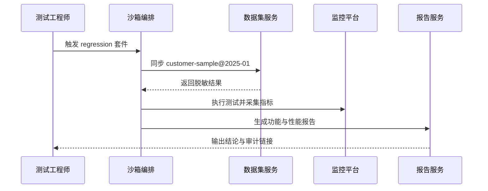

scn_id: SCN-DEV-PLUGIN-SANDBOX-VALIDATION-001
title: 沙箱数据集功能验证
status: Draft
version: v0.1.0
owners:
  - name: Michael Hu
    role: Plugin Tech Lead
    contact: tech@artisan-cloud.com
  - name: Matrix Ops
    role: Platform Ops Lead
    contact: ops@artisan-cloud.com
domains: [dev]
layers: [service, ops, security]
repos:
  - key: powerx
    scope: core-platform
    responsibility: 沙箱部署编排、数据集管理、性能采集、报告生成
  - key: powerx-plugin
    scope: plugin-ecosystem
    responsibility: 测试脚本、数据适配器、CLI 调试命令
related_usecases:
  - doc_id: UC-DEV-PLUGIN-SANDBOX-VALIDATION-001
    layer: service
    domain: dev
last_reviewed_at: 2025-11-20

---

# Executive Summary

该子场景描述插件在沙箱租户中加载脱敏数据集、运行回归脚本并产出性能与合规报告的流程。目标是在 5 分钟内完成部署与数据准备，保证关键用例覆盖率 ≥95%，并对敏感操作进行审计留痕，为上线前的系统级验证提供可重复的基线。

# Scope & Guardrails

- **In Scope**：沙箱租户资源配置、数据集同步与脱敏、自动化回归执行、性能指标采集、报告与审计。
- **Out of Scope**：本地热更新、生产环境压测、工单闭环、Marketplace 审核。
- **Environment & Flags**：`plugin-sandbox-suite`、`sandbox-dataset-v2`、`debug-observability-v2`；依赖沙箱资源池、数据脱敏服务、监控/日志平台。

# Participants & Responsibilities

| Scope | Repository | Layer | 责任与交付物 | Owners |
|-------|------------|-------|--------------|--------|
| core-platform | powerx | service | 沙箱部署编排、数据集加载、自动化脚本执行、性能监控 | Matrix Ops（Platform Ops Lead / ops@artisan-cloud.com） |
| plugin-ecosystem | powerx-plugin | proto | 测试脚本模板、数据适配器、CLI 操作指引 | Michael Hu（Plugin Tech Lead / tech@artisan-cloud.com） |
| security | powerx | security | 数据脱敏策略、访问控制、审计日志与合规报告 | Grace Lin（Security & Compliance Lead / compliance@artisan-cloud.com） |

# End-to-End Flow

1. **Stage 1 – 沙箱预检与资源配置**：系统校验租户配额与 Feature Flag，预热必要资源。
2. **Stage 2 – 数据集同步与脱敏**：加载指定版本的数据集，执行脱敏/校验并记录数据版本。
3. **Stage 3 – 自动化测试执行**：部署插件、运行预设脚本与性能基准，采集日志与指标。
4. **Stage 4 – 报告与审计**：生成结构化报告、写入审计日志，失败时支持回滚与重试。

# Key Interactions & Contracts

- **APIs / Events**：`POST /internal/sandbox/deploy`、`POST /internal/sandbox/dataset/load`、`POST /internal/sandbox/test/run`、`EVENT sandbox.test.completed`.
- **Configs / Schemas**：`config/plugins/debug/data_suite.yaml`、`config/sandbox/resource_policies.yaml`、`docs/standards/powerx-plugin/integration/04_security_and_compliance/Plugin_Security_Checklist.md`.
- **Security / Compliance**：数据脱敏失败自动阻断并回滚，审计日志保留 ≥180 天，访问需最小权限。

# Usecase Links

- `UC-DEV-PLUGIN-SANDBOX-VALIDATION-001` — 沙箱数据集功能验证。

# Acceptance Criteria

1. 数据集加载与部署总耗时 ≤5 分钟，关键用例通过率 ≥95%。
2. 报告包含数据版本、性能指标、异常项，敏感字段脱敏率 100%。
3. 沙箱资源超限或脱敏失败时自动回滚并通知安全/运维团队。

# Telemetry & Ops

- 指标：`sandbox.deploy.duration_ms`、`sandbox.dataset.load_failure_total`、`sandbox.test.pass_rate`、`sandbox.audit.records_total`.
- 告警阈值：部署失败率 >5% 或数据脱敏失败触发 P1 告警；性能指标超阈值自动创建工单。
- 观测来源：沙箱调度日志、监控仪表盘、`workflow-metrics.mjs`、审计系统。

# Open Issues & Follow-ups

| 风险/事项 | 影响范围 | 负责人 | ETA |
|-----------|----------|--------|-----|
| 混合语言插件测试脚本维护成本高 | 测试效率 | Michael Hu | 2025-12-12 |
| 数据脱敏策略需覆盖新字段类别 | 合规风险 | Grace Lin | 2025-12-20 |

# Appendix

- `docs/meta/scenarios/powerx/plugin-ecosystem/plugin-lifecycle/plugin-dev-and-debug/primary.md#子场景-b`
- `docs/standards/powerx-plugin/integration/08_dev_console_and_ui/Common_Tasks_and_Troubleshooting.md`
