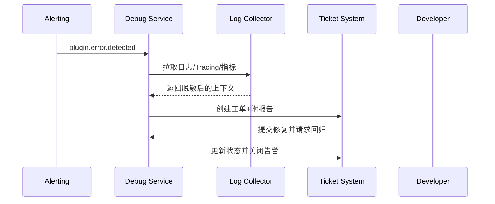

doc_id: UC-DEV-PLUGIN-ERROR-DIAGNOSTICS-001
scn_id: SCN-DEV-PLUGIN-DEBUG-001
title: 调试工具错误捕获与日志报告
status: Draft
version: v0.1.0
repo_key: powerx
scope: powerx
layer: ops
domain: dev
scenario_title: "插件开发与调试主场景"
owners:
  - name: Grace Lin
    role: Security & Compliance Lead
    contact: compliance@artisan-cloud.com
  - name: Michael Hu
    role: Plugin Tech Lead
    contact: tech@artisan-cloud.com
contributors: []
linked_requirements:
  - SCN-DEV-PLUGIN-ERROR-DIAGNOSTICS-001
code_refs:
  - repo: powerx
    path: internal/debug/report/generator.go
    description: 诊断任务 orchestrator、报告生成与脱敏处理
  - repo: powerx
    path: internal/debug/logcollect/collector.go
    description: 跨环境日志聚合、链路合并、备用通道切换
  - repo: powerx
    path: internal/debug/ticket/integrator.go
    description: 工单创建/更新、状态回写、负责人分派
  - repo: powerx
    path: internal/debug/telemetry/report_metrics.go
    description: 报告耗时、失败率、脱敏合规指标采集
feature_flags:
  - debug-observability-v2
  - debug-ticket-bridge
optional: false
last_reviewed_at: 2025-11-20

---

# Usecase Overview

- **业务目标**：在插件报错时自动收集跨环境日志、链路与上下文，1 分钟内生成结构化报告并与工单系统联动，为开发者提供可复现的诊断依据。
- **成功度量**：报告生成耗时 ≤ 60 秒；报告生成成功率 ≥ 98%；敏感信息遮蔽率 100%；工单自动闭环率 ≥ 95%。
- **场景关联**：支撑主场景 Stage 3/4，确保错误诊断、合规脱敏与回归验证形成闭环。

> 通过自动化诊断与工单联动，显著缩短插件问题定位时间，并确保调试数据符合安全合规要求。

# Context & Assumptions

- **前置条件**
  - Feature Flag `debug-observability-v2`、`debug-ticket-bridge` 已开启。
  - 日志、Tracing、Metrics 平台可用，具备历史保留能力。
  - 工单系统提供 API，并配置告警路由与负责人。
  - 调试任务执行账号具备读取沙箱/本地日志的权限。
- **输入/输出**
  - 输入：错误事件 ID、插件/租户信息、诊断时间范围、回归策略。
  - 输出：结构化诊断报告、脱敏日志包、工单状态、回归结果。
- **边界**
  - 不处理本地热更新与沙箱部署。
  - 不负责生产级监控策略配置（由 Ops 场景承担）。

# Solution Blueprint

## 体系分解

| 层 | 主要组件/模块 | 责任 | 代码入口 |
|----|---------------|------|---------|
| 触发调度层 | `internal/debug/report/generator.go` | 接收事件、创建诊断任务、编排步骤 | `services/debug/report` |
| 日志采集层 | `internal/debug/logcollect/collector.go` | 聚合日志、Tracing、指标并执行脱敏 | `services/debug/logcollect` |
| 工单集成层 | `internal/debug/ticket/integrator.go` | 创建/更新工单、同步状态、通知负责人 | `services/debug/ticket` |
| 回归验证层 | `packages/cli/src/commands/plugin/debug.ts` | 触发回归脚本、验证修复结果 | `packages/cli` |
| 遥测与审计层 | `internal/debug/telemetry/report_metrics.go` | 记录耗时、成功率、脱敏合规指标 | `services/debug/telemetry` |

## 流程与时序

1. **Step 1 – 诊断任务触发**：监控或开发者调用 API，生成诊断任务并确认范围。
2. **Step 2 – 数据聚合与脱敏**：采集日志、Tracing、Metrics，执行敏感字段遮蔽、权限校验。
3. **Step 3 – 报告生成与工单同步**：生成结构化报告、附件与链接，创建/更新工单并通知责任人。
4. **Step 4 – 回归验证与关闭**：开发者提交修复，自动触发回归脚本，成功后关闭告警并归档审计。

# Contracts & Interfaces

- **Inbound APIs / Events**
  - `POST /internal/debug/report` — 创建诊断任务。
  - `EVENT plugin.debug.alert` — 告警触发诊断。
- **Outbound 调用**
  - `POST /internal/debug/logs/export` — 调用日志/Tracing 服务拉取数据。
  - `POST /internal/ticket/create`、`POST /internal/ticket/update` — 工单系统联动。
  - `POST /internal/debug/regression/run` — 触发回归脚本。
- **配置与脚本**
  - `config/plugins/debug/report_template.yaml` — 报告字段、脱敏策略。
  - `scripts/workflows/debug-report-smoke.mjs` — 自动化诊断与回归脚本。

# Implementation Checklist

| 项目 | 描述 | 完成状态 | 负责人 |
|------|------|----------|--------|
| 日志聚合 | 实现跨环境日志收集、链路合并、备用通道 | [ ] | Michael Hu |
| 报告模板 | 定义结构化报告字段、附加上下文、脱敏规则 | [ ] | Grace Lin |
| 工单桥接 | 自动创建/更新工单、同步状态、通知责任人 | [ ] | Michael Hu |
| 回归自动化 | 接入回归脚本、验证结果、更新告警状态 | [ ] | Michael Hu |
| 审计与合规 | 脱敏策略与审计日志、访问控制 | [ ] | Grace Lin |

# Testing Strategy

- **单元**：诊断任务状态机、日志合并、脱敏规则、工单 API 调用。
- **集成**：执行 `scripts/workflows/debug-report-smoke.mjs`，验证正常与备用通道路径。
- **端到端**：复现 meta 文档用例 C-1/C-2，确认报告内容、脱敏处理、工单闭环。
- **非功能**：压力测试并发诊断任务、日志平台降级、备用通道切换、长链路回放。

# Observability & Ops

- **指标**：`debug.report.generate_ms`、`debug.report.failure_total`、`debug.masking.violation_total`、`debug.ticket.autoclose_rate`.
- **日志**：记录任务 ID、插件、租户、数据来源、脱敏结果；敏感字段加密存储。
- **告警**：报告生成超时 >60 秒或脱敏失败触发 P1；备用通道使用率激增通知安全团队。
- **Dashboards**：Debug Diagnostics Dashboard、Ticket SLA 面板、审计查询界面。

# Rollback & Failure Handling

- **回滚步骤**：关闭 `debug-ticket-bridge` 回退到人工工单；启用备用日志通道；暂停自动回归。
- **补救措施**：提供报告重试、手动下载日志包、通知责任团队人工诊断。
- **数据修复**：运行 `scripts/workflows/debug-report-reconcile.mjs` 对账诊断任务与工单状态。

# Follow-ups & Risks

| 风险/事项 | 影响 | 缓解方案 | 负责人 | ETA |
|-----------|------|----------|--------|-----|
| 日志与 Tracing 时间戳偏移导致上下文缺失 | 诊断准确性 | 引入时钟同步与对齐算法 | Michael Hu | 2025-12-10 |
| AI 生成内容脱敏策略不完善 | 合规风险 | 更新脱敏模型、人工抽检 | Grace Lin | 2025-12-18 |

# References & Links

- 场景文档：`docs/scenarios/plugin-lifecycle/SCN-DEV-PLUGIN-ERROR-DIAGNOSTICS-001.md`
- 主场景：`docs/scenarios/plugin-lifecycle/SCN-DEV-PLUGIN-DEBUG-001.md`
- 背景材料：`docs/meta/scenarios/powerx/plugin-ecosystem/plugin-lifecycle/plugin-dev-and-debug/primary.md`
- 标准文档：`docs/standards/powerx-plugin/integration/04_security_and_compliance/Plugin_Security_Checklist.md`
