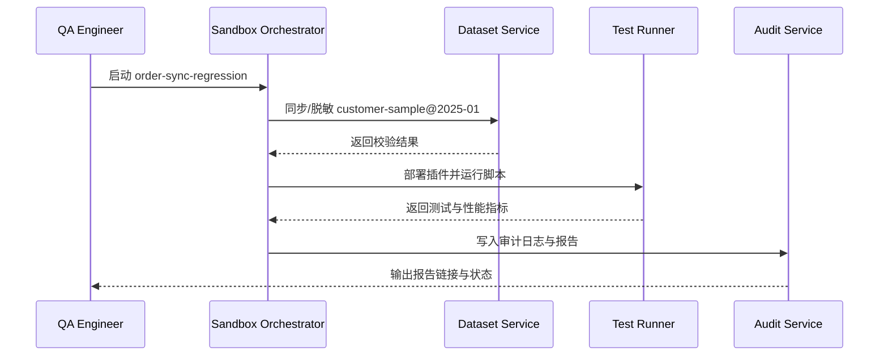

doc_id: UC-DEV-PLUGIN-SANDBOX-VALIDATION-001
scn_id: SCN-DEV-PLUGIN-DEBUG-001
title: 沙箱数据集功能验证
status: Draft
version: v0.1.0
repo_key: powerx
scope: powerx
layer: service
domain: dev
scenario_title: "插件开发与调试主场景"
owners:
  - name: Michael Hu
    role: Plugin Tech Lead
    contact: tech@artisan-cloud.com
  - name: Matrix Ops
    role: Platform Ops Lead
    contact: ops@artisan-cloud.com
contributors: []
linked_requirements:
  - SCN-DEV-PLUGIN-SANDBOX-VALIDATION-001
code_refs:
  - repo: powerx
    path: internal/sandbox/deployer/pipeline.go
    description: 沙箱部署编排、资源配额校验、回滚逻辑
  - repo: powerx
    path: internal/sandbox/dataset/loader.go
    description: 数据集同步、版本控制、脱敏处理
  - repo: powerx
    path: internal/sandbox/testsuite/runner.go
    description: 自动化脚本执行、结果收集、性能指标上报
  - repo: powerx
    path: internal/compliance/audit/log_writer.go
    description: 数据访问审计、敏感字段记录、报表生成
feature_flags:
  - plugin-sandbox-suite
  - sandbox-dataset-v2
  - debug-observability-v2
optional: false
last_reviewed_at: 2025-11-20

---

# Usecase Overview

- **业务目标**：提供一键沙箱部署与数据集加载能力，让测试工程师在 5 分钟内完成端到端回归，覆盖 ≥95% 关键用例并生成可追溯报告。
- **成功度量**：部署+数据加载耗时 ≤ 5 分钟；测试通过率 ≥ 95%；脱敏失败阻断率 100%；审计日志完整度 ≥ 99%。
- **场景关联**：支撑主场景 Stage 2，保证沙箱验证具备一致的数据资产、性能监测与合规保障。

> 通过标准化沙箱套件，研发与测试能够快速复制真实场景，降低上线风险并积累性能基线。

# Context & Assumptions

- **前置条件**
  - Feature Flag `plugin-sandbox-suite`、`sandbox-dataset-v2` 已开启。
  - 沙箱租户具备足够资源配额，测试账号拥有 `sandbox:execute` 权限。
  - 数据集服务维护最新脱敏版本并通过合规审查。
  - 监控、日志与审计系统可用。
- **输入/输出**
  - 输入：测试方案 ID、目标插件版本、数据集版本、性能阈值配置。
  - 输出：部署状态、测试报告、性能指标、审计日志链接。
- **边界**
  - 不覆盖本地热更新或生产压测。
  - 不负责工单自动化闭环（由错误诊断子场景负责）。

# Solution Blueprint

## 体系分解

| 层 | 主要组件/模块 | 责任 | 代码入口 |
|----|---------------|------|---------|
| 部署编排层 | `internal/sandbox/deployer/pipeline.go` | 分配资源、部署插件、生命周期管理 | `services/sandbox/deployer` |
| 数据集管理层 | `internal/sandbox/dataset/loader.go` | 数据集同步、脱敏、版本校验 | `services/sandbox/dataset` |
| 测试执行层 | `internal/sandbox/testsuite/runner.go` | 执行脚本、收集结果、推送指标 | `services/sandbox/testsuite` |
| 审计与合规层 | `internal/compliance/audit/log_writer.go` | 记录数据访问、敏感字段、合规报告 | `services/compliance/audit` |
| CLI/控制台层 | `packages/cli/src/commands/plugin/sandbox.ts` | 启动沙箱任务、查看报告、导出日志 | `packages/cli` |

## 流程与时序

1. **Step 1 – 沙箱任务初始化**：校验 Feature Flag、资源配额、插件版本及测试方案。
2. **Step 2 – 数据集加载与脱敏**：同步目标数据集版本，执行脱敏并生成校验报告。
3. **Step 3 – 自动化回归执行**：部署插件、运行脚本、收集接口与性能指标。
4. **Step 4 – 报告与审计输出**：生成结构化报告，写入审计日志并提供下载链接；失败时支持回滚与重试。

# Contracts & Interfaces

- **Inbound APIs / Events**
  - `POST /internal/sandbox/deploy` — 启动部署与测试。
  - `POST /internal/sandbox/dataset/load` — 同步指定数据集版本。
- **Outbound 调用**
  - `POST /internal/monitoring/metrics` — 上报性能指标。
  - `POST /internal/compliance/audit` — 写入数据访问审计。
  - `EVENT sandbox.test.completed` — 通知结果与报告地址。
- **配置与脚本**
  - `config/plugins/debug/data_suite.yaml` — 数据集/脚本映射、阈值。
  - `scripts/workflows/sandbox-regression.mjs` — 自动化执行与验收脚本。

# Implementation Checklist

| 项目 | 描述 | 完成状态 | 负责人 |
|------|------|----------|--------|
| 部署编排 | 支持多租户排队、资源配额检查、回滚 | [ ] | Matrix Ops |
| 数据脱敏 | 扩展模板字段、校验未标记敏感信息 | [ ] | Grace Lin |
| 测试脚本 | 维护标准回归套件、性能基线 | [ ] | Michael Hu |
| 报告平台 | 输出结构化报告、链接监控与审计 | [ ] | Matrix Ops |
| CLI/控制台 | 支持任务进度、报告下载、重试 | [ ] | Michael Hu |

# Testing Strategy

- **单元**：部署编排、数据脱敏校验、脚本执行调度、审计写入。
- **集成**：运行 `scripts/workflows/sandbox-regression.mjs` 覆盖成功与脱敏失败场景。
- **端到端**：复现 meta 文档用例 B-1/B-2，验证性能阈值与审计日志。
- **非功能**：并发执行 10 个沙箱任务、超配额排队、数据集版本回滚。

# Observability & Ops

- **指标**：`sandbox.deploy.duration_ms`、`sandbox.dataset.load_failure_total`、`sandbox.test.pass_rate`、`sandbox.audit.records_total`。
- **日志**：记录任务 ID、租户、数据版本、结果、异常；敏感字段脱敏处理。
- **告警**：部署失败率 >5% 或脱敏失败触发 P1；测试通过率低于阈值时创建工单。
- **Dashboards**：Sandbox Regression Dashboard、审计查询面板、`workflow-metrics.mjs`。

# Rollback & Failure Handling

- **回滚步骤**：终止任务、释放资源、回滚数据集；提供 `sandbox resume` 再次执行。
- **补救措施**：导出失败报告、通知数据团队修复、支持人工补录数据。
- **数据修复**：运行 `scripts/workflows/sandbox-reconcile.mjs` 对齐任务记录与审计日志。

# Follow-ups & Risks

| 风险/事项 | 影响 | 缓解方案 | 负责人 | ETA |
|-----------|------|----------|--------|-----|
| 多语言脚本维护成本高 | 测试效率 | 统一脚本模板与示例仓库 | Michael Hu | 2025-12-12 |
| 数据脱敏策略覆盖不足 | 合规风险 | 定期审计字段、引入自动检测 | Grace Lin | 2025-12-20 |

# References & Links

- 场景文档：`docs/scenarios/plugin-lifecycle/SCN-DEV-PLUGIN-SANDBOX-VALIDATION-001.md`
- 主场景：`docs/scenarios/plugin-lifecycle/SCN-DEV-PLUGIN-DEBUG-001.md`
- 背景材料：`docs/meta/scenarios/powerx/plugin-ecosystem/plugin-lifecycle/plugin-dev-and-debug/primary.md`
- 标准文档：`docs/standards/powerx-plugin/integration/04_security_and_compliance/Plugin_Security_Checklist.md`
