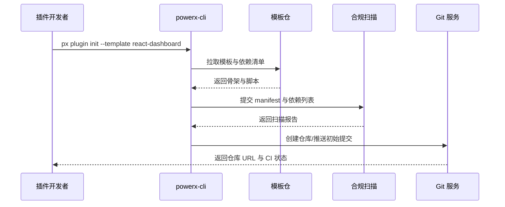

scn_id: SCN-DEV-PLUGIN-CLI-INIT-001
title: CLI 模板生成标准插件工程
status: Draft
version: v0.1.0
owners:
  - name: Michael Hu
    role: Plugin Tech Lead
    contact: tech@artisan-cloud.com
  - name: Grace Lin
    role: Security & Compliance Lead
    contact: compliance@artisan-cloud.com
domains: [dev]
layers: [proto, service, security]
repos:
  - key: powerx-plugin
    scope: plugin-ecosystem
    responsibility: CLI 参数向导、模板管理、依赖锁定与示例代码
  - key: powerx
    scope: core-platform
    responsibility: 初始化验证、合规扫描 API、Git 注册与 CI 引导
related_usecases:
  - doc_id: UC-DEV-PLUGIN-CLI-INIT-001
    layer: proto
    domain: dev
last_reviewed_at: 2025-11-20

---

# Executive Summary

该子场景描述开发者在命令行通过 `px plugin init` 选择模板、生成标准工程、完成依赖安装与 Git 注册的端到端体验。流程需在 1 分钟内完成目录结构、manifest、权限声明、测试样例与 CI 配置生成，并同步触发许可证与漏洞扫描。成功执行后，开发者立即获得可推送至远程仓库的基础工程，具备统一的 lint/test 配置与审计记录。

# Scope & Guardrails

- **In Scope**：CLI 版本校验、模板拉取、工程骨架生成、依赖安装、Git 初始化与首个提交、基础扫描与报告输出。
- **Out of Scope**：后续功能开发、团队协作克隆、第三方源码导入、Marketplace 发布。
- **Environment & Flags**：`PX_PLUGIN_SCAFFOLD_V2`、`plugin-import-audit`；需要访问模板镜像仓、npm/pip 镜像、合规扫描服务与 Git 注册 API。

# Participants & Responsibilities

| Scope | Repository | Layer | 责任与交付物 | Owners |
|-------|------------|-------|--------------|--------|
| plugin-ecosystem | powerx-plugin | proto | CLI 参数解析、模板版本管理、依赖安装脚本、示例代码生成 | Michael Hu（Plugin Tech Lead / tech@artisan-cloud.com） |
| core-platform | powerx | service | 初始化校验、Git 注册、CI 模板下发、审计日志与遥测 | Michael Hu（Plugin Tech Lead / tech@artisan-cloud.com） |
| security | powerx | security | 许可证与依赖扫描、风险报告生成、豁免渠道管理 | Grace Lin（Security & Compliance Lead / compliance@artisan-cloud.com） |

# End-to-End Flow

1. **Stage 1 – CLI 环境校验**：开发者执行 `px plugin init`，CLI 检测本地版本、模板索引与凭据有效性。
2. **Stage 2 – 模板选择与工程生成**：CLI 根据选择的语言与能力拉取模板，生成目录结构、配置文件、示例代码与脚本。
3. **Stage 3 – 依赖安装与扫描**：自动执行依赖安装、触发许可证/漏洞扫描并返回报告，提示潜在风险与修复建议。
4. **Stage 4 – Git 注册与首个提交**：CLI 初始化 Git 仓库、创建首个提交并调用平台 API 注册远程仓，生成 CI 配置与初始分支。

# Key Interactions & Contracts

- **APIs / Events**：`px plugin init <template>`、`px plugin init --check`、`POST /internal/plugins/bootstrap/validate`、`POST /internal/compliance/licensescan`、`POST /internal/git/register`。
- **Configs / Schemas**：`config/plugins/templates/index.yaml`、`docs/standards/powerx-plugin/lifecycle/manifest-mapping.md`、`.powerxci/pipeline.yaml`。
- **Security / Compliance**：CLI 需进行 HMAC 签名验证；扫描阻断高危依赖；Git 注册强制最小权限 PAT；审计事件写入 `audit.plugin.bootstrap`。

# Usecase Links

- `UC-DEV-PLUGIN-CLI-INIT-001` — CLI 初始化标准工程并完成 Git 注册。

# Acceptance Criteria

1. 工程生成耗时 ≤60 秒，目录结构与 manifest 满足标准校验。
2. 依赖安装与基础测试脚本执行通过，扫描报告无高危项或已出具豁免。
3. Git 初始化后自动创建 `main` 与 `develop` 分支，CI 管道处于就绪状态。

# Telemetry & Ops

- 指标：`cli.init.duration_ms`、`cli.init.failure_rate`、`cli.init.template_id`、`cli.init.scan_block_count`。
- 告警阈值：初始化失败率 >5% 或扫描阻断数连续 3 次触发告警；Git 注册超时 >120 秒升级为 P1。
- 观测来源：CLI 遥测、`workflow-metrics.mjs` 报告、合规扫描仪表盘、Git Webhook 审计。

# Open Issues & Follow-ups

| 风险/事项 | 影响范围 | 负责人 | ETA |
|-----------|----------|--------|-----|
| 模板依赖镜像在离线环境不稳定，初始化易失败 | 离线/受限网络 | Michael Hu | 2025-12-08 |
| 扫描豁免流程尚未与 CLI 完整打通，需人工同步 | 合规审计 | Grace Lin | 2025-12-15 |

# Appendix

- `docs/meta/scenarios/powerx/plugin-ecosystem/plugin-lifecycle/plugin-create-and-init/primary.md#子场景-a`
- `docs/standards/powerx-plugin/integration/08_dev_console_and_ui/Common_Tasks_and_Troubleshooting.md`
- `docs/standards/powerx-plugin/integration/04_security_and_compliance/Plugin_Security_Checklist.md`
