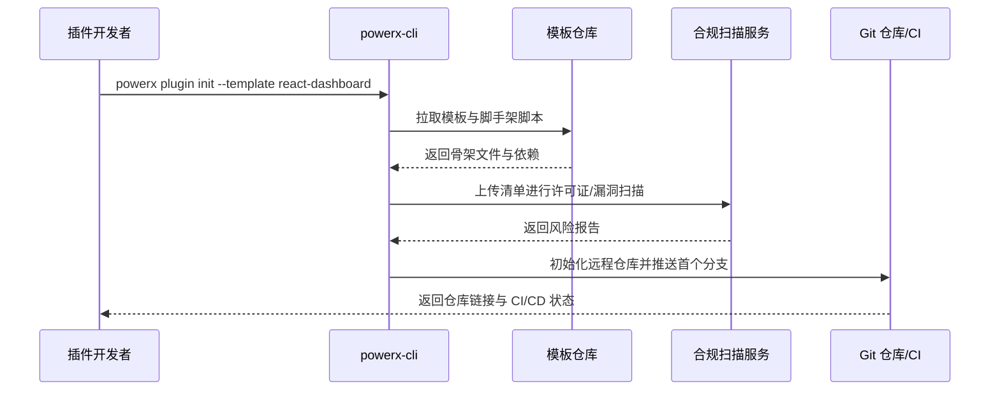

scn_id: SCN-DEV-PLUGIN-INIT-001
title: 插件创建与工程初始化主场景
status: Draft
version: v0.1.0
owners:
  - name: Michael Hu
    role: Plugin Tech Lead
    contact: tech@artisan-cloud.com
  - name: Grace Lin
    role: Security & Compliance Lead
    contact: compliance@artisan-cloud.com
domains: [dev]
layers: [proto, service, security]
repos:
  - key: powerx-plugin
    scope: plugin-ecosystem
    responsibility: CLI 模板、脚手架脚本、默认依赖与示例工程
  - key: powerx
    scope: core-platform
    responsibility: 初始化服务、合规扫描、仓库注册与审计流
related_usecases:
  - doc_id: UC-DEV-PLUGIN-CLI-INIT-001
    layer: proto
    domain: dev
  - doc_id: UC-DEV-PLUGIN-TEAM-CLONE-001
    layer: service
    domain: dev
  - doc_id: UC-DEV-PLUGIN-THIRD-PARTY-IMPORT-001
    layer: security
    domain: dev
last_reviewed_at: 2025-11-20

---

# Executive Summary

该主场景梳理 PowerX 插件从「零开始到可协作开发」的全链路，包括 CLI 模板初始化、团队协作克隆与第三方源码导入。平台需在 1 分钟内完成标准工程生成，自动安装基础依赖、写入配置，并为团队提供一致的目录结构与规范。通过内置的许可证与安全扫描、Git 仓库注册与审计留痕，确保即使引入外部源码也能满足合规要求并快速进入版本管理、CI/CD 与质量基线。

# Scope & Guardrails

- **In Scope**：PowerX CLI 模板选择与初始化、依赖安装、工程骨架生成、Git 仓注册、团队克隆健康检查、第三方源码导入与合规扫描。
- **Out of Scope**：插件功能开发与调试、发布与上架流程、运行时安装/启停治理、Marketplace 审核及计费。
- **Environment & Flags**：`PX_PLUGIN_SCAFFOLD_V2`、`plugin-import-audit`、`gitops-bootstrap`；依赖模板仓、许可证扫描服务、内网 GitLab/GitHub、审计日志总线。

# Participants & Responsibilities

| Scope | Repository | Layer | 责任与交付物 | Owners |
|-------|------------|-------|--------------|--------|
| plugin-ecosystem | powerx-plugin | proto | 维护模板与 CLI、初始化脚本、依赖锁定与示例代码 | Michael Hu（Plugin Tech Lead / tech@artisan-cloud.com） |
| core-platform | powerx | service | 初始化向导、仓库注册、CI/CD 引导、团队协同提示 | Michael Hu（Plugin Tech Lead / tech@artisan-cloud.com） |
| security | powerx | security | 许可证与依赖扫描、第三方源码审计、风险豁免流程与落库 | Grace Lin（Security & Compliance Lead / compliance@artisan-cloud.com） |

# End-to-End Flow

1. **Stage 1 – 模板发现与参数收集**：开发者登录 CLI，选择插件类型、运行时语言与能力包，系统校验 CLI 版本、模板可用性及租户权限。
2. **Stage 2 – 工程生成与依赖安装**：CLI 拉取模板、生成目录结构、写入 manifest/权限声明、执行依赖安装并生成初始分支。
3. **Stage 3 – 合规校验与仓库注册**：初始化服务触发许可证/安全扫描，生成报告并登记 Git 仓库、创建默认流水线与基础守护任务。
4. **Stage 4 – 团队协作与第三方导入**：团队成员运行 `plugin doctor` 获取环境检查，企业技术组导入外部源码包、复用扫描报告并完成适配。

# Key Interactions & Contracts

- **APIs / Events**：`powerx plugin init <template>`、`POST /internal/plugins/bootstrap/validate`、`POST /internal/compliance/licensescan`、`POST /internal/git/register`、`powerx plugin doctor`。
- **Configs / Schemas**：`docs/standards/powerx-plugin/lifecycle/manifest-mapping.md`、`config/plugins/templates/index.yaml`、`config/compliance/external_source_policy.yaml`。
- **Security / Compliance**：CLI 强制校验版本与签名；许可证扫描拦截高危依赖；第三方源码导入要求审批与审计日志；Git 注册需最小权限访问令牌。

# Usecase Links

- `UC-DEV-PLUGIN-CLI-INIT-001` — 开发者通过 CLI 生成标准插件工程并接入 Git。
- `UC-DEV-PLUGIN-TEAM-CLONE-001` — 团队成员克隆现有项目并完成环境健康检查。
- `UC-DEV-PLUGIN-THIRD-PARTY-IMPORT-001` — 企业导入第三方源码包并完成合规适配。

# Acceptance Criteria

1. 全新工程在 1 分钟内生成，依赖安装成功率 ≥98%，并完成 Git 初始化与首个提交。
2. 团队克隆后运行 `plugin doctor`，环境/依赖/配置检查通过率 ≥95%，在 10 分钟内完成开发准备。
3. 第三方源码导入需在 15 分钟内完成扫描与适配，高危许可证或漏洞触发强制阻断并生成审计记录。

# Telemetry & Ops

- 指标：`scaffold.init.duration_ms`、`scaffold.template.usage_count`、`scaffold.compliance.fail_rate`、`scaffold.git.bootstrap_time`.
- 告警阈值：初始化失败率 >5% 或扫描阻断数 >3 次/小时时告警至 `plugin-dev-oncall`；Git 注册超时 >120 秒触发降级策略。
- 观测来源：`workflow-metrics.mjs` 报告、PowerX CLI 遥测、合规扫描仪表盘与 Git Webhook 审计。

# Open Issues & Follow-ups

| 风险/事项 | 影响范围 | 负责人 | ETA |
|-----------|----------|--------|-----|
| 模板库多语言依赖锁定不一致，易导致初始化失败 | 跨语言模板 | Michael Hu | 2025-12-05 |
| 第三方源码扫描报告缺乏自动豁免同步，需要手动补录 | 合规审计 | Grace Lin | 2025-12-12 |

# Appendix

- `docs/meta/scenarios/powerx/plugin-ecosystem/plugin-lifecycle/plugin-create-and-init/primary.md`
- `docs/standards/powerx-plugin/lifecycle/manifest-mapping.md`
- `docs/standards/powerx-plugin/integration/04_security_and_compliance/Plugin_Security_Checklist.md`
- `docs/standards/powerx-plugin/integration/08_dev_console_and_ui/Common_Tasks_and_Troubleshooting.md`
