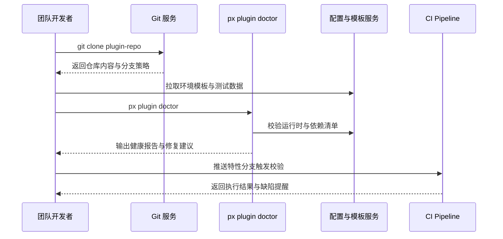

scn_id: SCN-DEV-PLUGIN-TEAM-CLONE-001
title: 团队克隆插件工程与环境健康检查
status: Draft
version: v0.1.0
owners:
  - name: Michael Hu
    role: Plugin Tech Lead
    contact: tech@artisan-cloud.com
  - name: Matrix Ops
    role: Platform Ops Lead
    contact: ops@artisan-cloud.com
domains: [dev]
layers: [service, ops]
repos:
  - key: powerx
    scope: core-platform
    responsibility: `plugin doctor` 健康检查、依赖同步、配置模板分发、CI 规则校验
  - key: powerx-plugin
    scope: plugin-ecosystem
    responsibility: 团队模板维护、环境示例配置、调试脚本与测试数据集
related_usecases:
  - doc_id: UC-DEV-PLUGIN-TEAM-CLONE-001
    layer: service
    domain: dev
last_reviewed_at: 2025-11-20

---

# Executive Summary

该子场景聚焦团队成员克隆既有插件仓库后，在 10 分钟内完成依赖安装、环境变量配置与调试准备。开发者使用 `px plugin doctor` 自动检查语言运行时、依赖锁定、环境变量模板与权限配置，平台同步共享测试数据与编码规范，并在首次提交时校验初始化脚本是否执行。目标是确保跨成员开发保持一致的工程基线与质量保障。

# Scope & Guardrails

- **In Scope**：仓库克隆、环境变量模板同步、依赖安装、`plugin doctor` 健康检查、初始分支与 CI 钩子配置、协作守护提醒。
- **Out of Scope**：CLI 新工程创建、第三方源码导入、Marketplace 发布与运维监控。
- **Environment & Flags**：`PX_PLUGIN_TEAM_SYNC`、`plugin-doctor-v2`；依赖内网包管理、秘密管理服务、CI 校验钩子。

# Participants & Responsibilities

| Scope | Repository | Layer | 责任与交付物 | Owners |
|-------|------------|-------|--------------|--------|
| core-platform | powerx | service | `plugin doctor` 检查项、依赖与运行时同步、CI 守护策略、首提审计 | Matrix Ops（Platform Ops Lead / ops@artisan-cloud.com） |
| plugin-ecosystem | powerx-plugin | proto | 环境模板、示例数据集、调试脚本、团队规范提示 | Michael Hu（Plugin Tech Lead / tech@artisan-cloud.com） |

# End-to-End Flow

1. **Stage 1 – 仓库克隆与凭证校验**：成员获取仓库地址，系统校验权限并同步分支策略与提交规范。
2. **Stage 2 – 环境模板同步**：执行 `npm install` 或语言特定安装脚本，同时复制 `.env.example`、测试数据与调试脚本。
3. **Stage 3 – `plugin doctor` 检查**：CLI 扫描运行时版本、依赖完整性、环境变量、CLI 插件、lint/test 可用性并输出报告。
4. **Stage 4 – 协作基线接入**：生成特性分支、启用 pre-commit 钩子、CI 校验，并向成员推送规范/风险提示。

# Key Interactions & Contracts

- **APIs / Events**：`px plugin doctor`、`POST /internal/plugins/environments/check`、`GET /internal/config/templates/.env`、`EVENT plugin.init.audit`。
- **Configs / Schemas**：`config/plugins/team/onboarding.yaml`、`.powerxci/pre-commit.yaml`、`docs/standards/powerx-plugin/lifecycle/team-handbook.md`。
- **Security / Compliance**：克隆需通过 RBAC 与 PAT 校验；环境模板敏感字段仅在安全通道下发；健康检查结果写入审计日志并保留 30 天。

# Usecase Links

- `UC-DEV-PLUGIN-TEAM-CLONE-001` — 团队成员克隆插件仓并完成环境健康检查。

# Acceptance Criteria

1. 克隆到首次 `plugin doctor` 完成 ≤10 分钟，报告中关键项（运行时/依赖/配置）全部通过。
2. 未通过项提供可执行修复建议并阻止提交（pre-commit 钩子生效）。
3. 首次推送触发的 CI 校验通过率 ≥95%，审计日志包含执行记录。

# Telemetry & Ops

- 指标：`doctor.run.duration_ms`、`doctor.failure_rate`、`doctor.missing_dependency_count`、`doctor.env_template_sync`。
- 告警阈值：健康检查失败率 >10% 或缺失模板同步失败数 >5 次/小时触发告警；CI 首次失败率 >15% 升级至项目负责人。
- 观测来源：CLI 遥测、Git Webhook、`workflow-metrics.mjs` 报告、CI 仪表盘。

# Open Issues & Follow-ups

| 风险/事项 | 影响范围 | 负责人 | ETA |
|-----------|----------|--------|-----|
| `plugin doctor` 对多语言插件的检测覆盖不足 | 混合语言工程 | Michael Hu | 2025-12-10 |
| 环境模板更新后成员未及时同步会导致校验误报 | 团队协作体验 | Matrix Ops | 2025-12-18 |

# Appendix

- `docs/meta/scenarios/powerx/plugin-ecosystem/plugin-lifecycle/plugin-create-and-init/primary.md#子场景-b`
- `docs/standards/powerx-plugin/integration/08_dev_console_and_ui/Common_Tasks_and_Troubleshooting.md#doctor`
- `docs/standards/powerx-plugin/integration/03_runtime_and_ops/Quotas_RateLimits_and_Costs.md`
