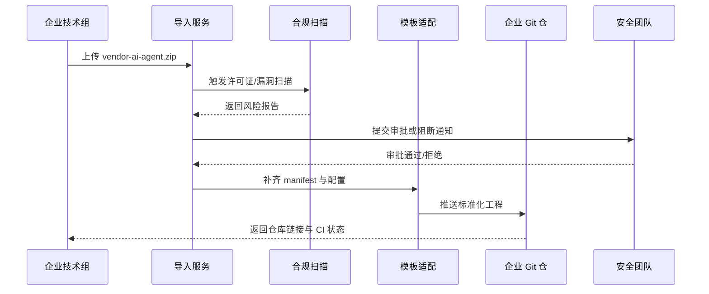

scn_id: SCN-DEV-PLUGIN-THIRD-PARTY-IMPORT-001
title: 第三方插件源码导入与合规适配
status: Draft
version: v0.1.0
owners:
  - name: Grace Lin
    role: Security & Compliance Lead
    contact: compliance@artisan-cloud.com
  - name: Michael Hu
    role: Plugin Tech Lead
    contact: tech@artisan-cloud.com
domains: [dev]
layers: [service, security]
repos:
  - key: powerx
    scope: core-platform
    responsibility: 源码包上传、解包、许可证/漏洞扫描、适配向导与审计
  - key: powerx-plugin
    scope: plugin-ecosystem
    responsibility: 模板重构规则、缺失 manifest 补齐、兼容性校验脚本
related_usecases:
  - doc_id: UC-DEV-PLUGIN-THIRD-PARTY-IMPORT-001
    layer: security
    domain: dev
last_reviewed_at: 2025-11-20

---

# Executive Summary

本子场景面向企业在内网导入第三方供应商提供的插件源码包，要求在 15 分钟内完成上传、解包、许可证与安全扫描、合规审批及模板化适配。平台需自动补齐 PowerX 所需的 manifest、权限配置与 CI 脚本，并生成风险评估报告。若检测到高危许可证或恶意依赖，流程必须强制阻断并通知安全团队，保证导入项目纳入统一治理与审计体系。

# Scope & Guardrails

- **In Scope**：源码包上传、解包、许可证/漏洞扫描、风险报告、模板重构、API 版本适配、Git 仓注册与审计。
- **Out of Scope**：CLI 本地初始化、团队克隆、自研插件开发与 Marketplace 发布。
- **Environment & Flags**：`PX_PLUGIN_IMPORT`、`plugin-import-audit`、`compliance-workflow-v2`；依赖安全扫描服务、许可证数据库、审批与通知系统、企业 Git 仓。

# Participants & Responsibilities

| Scope | Repository | Layer | 责任与交付物 | Owners |
|-------|------------|-------|--------------|--------|
| security | powerx | security | 源码包解包、许可证与漏洞扫描、风险评估、审批与阻断策略 | Grace Lin（Security & Compliance Lead / compliance@artisan-cloud.com） |
| core-platform | powerx | service | 适配向导、manifest 补齐、API 兼容性检测、Git 注册与审计 | Michael Hu（Plugin Tech Lead / tech@artisan-cloud.com） |
| plugin-ecosystem | powerx-plugin | proto | 模板映射规则、缺失脚手架补齐、CI 与测试脚本生成 | Michael Hu（Plugin Tech Lead / tech@artisan-cloud.com） |

# End-to-End Flow

1. **Stage 1 – 源码包上传与预检**：企业技术组上传 `.zip` 或配置仓库地址，系统校验文件来源、签名与大小限制。
2. **Stage 2 – 合规扫描与风险评估**：自动执行许可证、依赖漏洞、恶意代码扫描，生成风险报告并决定是否进入审批。
3. **Stage 3 – 模板化适配**：根据扫描结果与 PowerX 规范重构目录、补齐 manifest/权限声明/脚本，提示需人工确认的兼容项。
4. **Stage 4 – 仓库注册与交付**：审批通过后，自动推送至企业 Git 仓库、生成 CI 配置与审计记录，并向负责人发送导入摘要。

# Key Interactions & Contracts

- **APIs / Events**：`POST /internal/plugins/import`、`POST /internal/compliance/licensescan`、`POST /internal/compliance/vulnscan`、`EVENT plugin.import.blocked`、`POST /internal/git/register`.
- **Configs / Schemas**：`config/compliance/external_source_policy.yaml`、`docs/standards/powerx-plugin/lifecycle/import-checklist.md`、`docs/standards/powerx-plugin/integration/04_security_and_compliance/Plugin_Security_Checklist.md`。
- **Security / Compliance**：高危许可证/漏洞默认阻断；审批需双人；审计日志保留 ≥180 天；所有外部资源需通过白名单下载。

# Usecase Links

- `UC-DEV-PLUGIN-THIRD-PARTY-IMPORT-001` — 企业导入第三方插件源码并完成合规适配。

# Acceptance Criteria

1. 导入流程（上传至仓库注册）≤15 分钟，高危风险为 0 或已提供批准的豁免。
2. 自动生成的工程可直接运行 `npm test`、`npm run lint`（或对应语言命令）并通过。
3. 审计记录包含包来源、扫描结果、审批链与最终仓库地址。

# Telemetry & Ops

- 指标：`import.duration_ms`、`import.scan.block_rate`、`import.adapter.fix_count`、`import.approval.duration_ms`。
- 告警阈值：高危阻断累计 ≥1 次立即通知 `security-oncall`；审批超过 30 分钟未完成触发升级；模板适配失败率 >10% 需发起 RCA。
- 观测来源：合规扫描仪表盘、`workflow-metrics.mjs`、Git 导入日志、审批系统报告。

# Open Issues & Follow-ups

| 风险/事项 | 影响范围 | 负责人 | ETA |
|-----------|----------|--------|-----|
| 厂商未提供 SPDX 清单导致扫描耗时过长 | 导入效率 | Grace Lin | 2025-12-06 |
| 自动适配对 Python+Go 混合仓支持不足，需要扩展脚本 | 模板适配准确性 | Michael Hu | 2025-12-14 |

# Appendix

- `docs/meta/scenarios/powerx/plugin-ecosystem/plugin-lifecycle/plugin-create-and-init/primary.md#子场景-c`
- `docs/standards/powerx-plugin/lifecycle/import-checklist.md`
- `docs/standards/powerx-plugin/integration/04_security_and_compliance/Vulnerability_Response.md`
