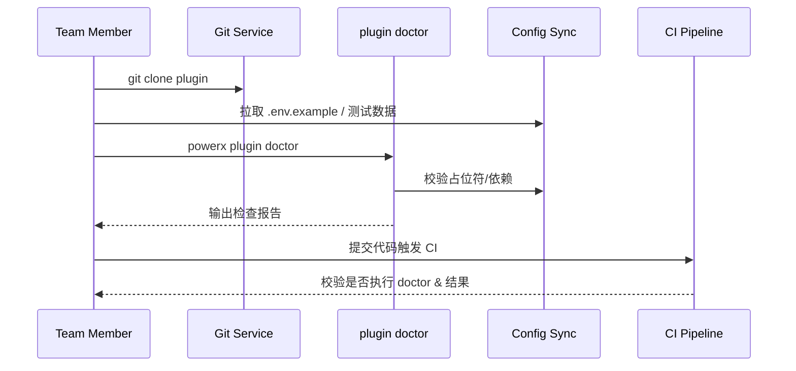

doc_id: UC-DEV-PLUGIN-TEAM-CLONE-001
scn_id: SCN-DEV-PLUGIN-INIT-001
title: 团队克隆工程与环境健康检查
status: Draft
version: v0.1.0
repo_key: powerx
scope: powerx
layer: service
domain: dev
scenario_title: "插件创建与工程初始化主场景"
owners:
  - name: Michael Hu
    role: Plugin Tech Lead
    contact: tech@artisan-cloud.com
  - name: Matrix Ops
    role: Platform Ops Lead
    contact: ops@artisan-cloud.com
contributors: []
linked_requirements:
  - SCN-DEV-PLUGIN-TEAM-CLONE-001
code_refs:
  - repo: powerx
    path: internal/plugins/bootstrap/service/doctor_runner.go
    description: `powerx plugin doctor` 检查项编排、报告生成
  - repo: powerx
    path: internal/plugins/bootstrap/config/env_template_sync.go
    description: 环境模板同步、密钥占位符校验
  - repo: powerx
    path: internal/plugins/bootstrap/git/pre_commit_guard.go
    description: pre-commit 钩子、分支策略与提交规范校验
  - repo: powerx-plugin
    path: scripts/dev/export-testdata.mjs
    description: 示例测试数据导出与同步脚本
feature_flags:
  - PX_PLUGIN_TEAM_SYNC
  - plugin-doctor-v2
  - gitops-bootstrap
optional: false
last_reviewed_at: 2025-11-20

---

# Usecase Overview

- **业务目标**：支持团队成员在克隆插件仓库后快速完成依赖安装、环境变量配置与健康检查，确保 10 分钟内进入可开发状态且遵循统一协作规范。
- **成功度量**：`plugin doctor` 通过率 ≥ 95%；环境配置同步成功率 ≥ 98%；首次提交 CI 通过率 ≥ 95%；诊断报告平均生成时间 ≤ 60 秒。
- **场景关联**：对应主场景 `SCN-DEV-PLUGIN-INIT-001` Stage 4，承接 CLI 初始化后的协作准备，并为后续持续开发与交付打下基线。

> 统一的健康检查与配置同步，保证跨成员协作一致性，减少环境配置缺失导致的缺陷与回滚。

# Context & Assumptions

- **前置条件**
  - 开启 `PX_PLUGIN_TEAM_SYNC`、`plugin-doctor-v2` Feature Flag，Git 仓库注册信息可查询。
  - 成员具备仓库读写以及 `plugin: "doctor` 权限，已配置 PAT 或 SSO。"
  - 包管理器、Secrets 管理服务与测试数据源可用，支持租户隔离。
  - 仓库包含 `.powerxci/` 目录，内置 pre-commit 钩子模板与测试脚本。
- **输入/输出**
  - 输入：仓库 URL、目标分支、团队角色、设备运行时信息。
  - 输出：健康检查报告、依赖安装结果、环境变量填充状态、 pre-commit/CI 启用确认。
- **边界**
  - 不负责 CLI 初始化或第三方导入；不处理应用层业务配置（如租户实际密钥）。
  - 不覆盖运行时部署或插件安装（由运行运维场景负责）。
  - 如果成员未执行 `plugin doctor`，CI 将阻止合并，但本用例不涵盖强制策略实现。

# Solution Blueprint

## 体系分解

| 层 | 模块 | 责任 | 代码入口 |
|----|------|------|---------|
| 健康检查核心 | `internal/plugins/bootstrap/service/doctor_runner.go` | 聚合检测项、执行依赖/运行时/配置检查、生成报告 | `services/bootstrap` |
| 配置同步层 | `internal/plugins/bootstrap/config/env_template_sync.go` | 下载 `.env.example`、校验占位符、生成差异提示 | `services/bootstrap/config` |
| Git 守护层 | `internal/plugins/bootstrap/git/pre_commit_guard.go` | 下发 pre-commit、分支策略、提交规范校验 | `services/bootstrap/git` |
| 数据准备 | `scripts/dev/export-testdata.mjs` | 同步示例数据与调试脚本 | `scripts/dev` |
| 遥测 & 审计 | `internal/plugins/bootstrap/telemetry/doctor_metrics.go` | 记录运行耗时、失败原因、成员信息 | `services/bootstrap/telemetry` |

## 流程与时序

1. **Step 1 – 仓库克隆**：校验成员权限并下载仓库，复制 `.powerxci/` 工具与配置模板。
2. **Step 2 – 依赖安装**：执行 `npm install` 等脚本，校验锁文件与运行时版本。
3. **Step 3 – `plugin doctor` 检查**：`doctor_runner` 执行运行时、依赖、环境变量、脚本可用性检查，生成报告并写入审计。
4. **Step 4 – 守护启用**：根据报告结果启用 pre-commit 钩子与 CI 守护，提示需修复项并阻止推送。
5. **Step 5 – 首次提交**：成员修复问题后提交代码，CI 校验初始化步骤执行情况并存档。

# Contracts & Interfaces

- **Inbound APIs / Events**
  - CLI 命令：`powerx plugin doctor --output report.json`
  - `GET /internal/plugins/bootstrap/templates/.env` — 拉取环境模板与占位符描述。
- **Outbound 调用**
  - `POST /internal/plugins/bootstrap/doctor-report` — 上报检查结果、耗时、失败项。
  - `POST /internal/git/hooks/install` — 注册 pre-commit 钩子与提交策略。
  - `POST /internal/secrets/templates/audit` — 记录敏感占位符校验结果。
- **配置与脚本**
  - `config/plugins/team/onboarding.yaml` — 团队角色、必备检测项、责任人。
  - `scripts/workflows/team-onboard-smoke.mjs` — 自动演练克隆与健康检查流程。

# Implementation Checklist

| 项目 | 描述 | 完成状态 | 负责人 |
|------|------|----------|--------|
| 检查项扩展 | 支持多语言运行时与依赖验证、可插拔检测项 | [ ] | Michael Hu |
| 报告模板 | 增强报告可读性，输出分类与修复建议 | [ ] | Matrix Ops |
| 模板同步 | 自动检测模板更新并提示成员同步 | [ ] | Michael Hu |
| Git 守护 | pre-commit 钩子与 CI 校验联动，防止未经检查推送 | [ ] | Matrix Ops |
| 遥测分析 | 收集失败原因、耗时数据并建立仪表盘 | [ ] | Matrix Ops |

# Testing Strategy

- **单元**：检测项执行、结果聚合、报告格式、失败提示覆盖。
- **集成**：沙箱环境执行 `scripts/workflows/team-onboard-smoke.mjs`，验证依赖安装、模板同步、钩子启用。
- **端到端**：模拟新成员加入，执行 meta 文档用例 B-1/B-2，核对审计与 CI 阻断链路。
- **非功能**：并发执行 20 次 `plugin doctor`，确保锁机制与缓存策略稳定；模拟网络中断验证重试。

# Observability & Ops

- **指标**：`doctor.run.duration_ms`, `doctor.run.failure_total`, `doctor.check.missing_env`, `doctor.check.runtime_mismatch`.
- **日志**：记录成员 ID、租户、失败项、运行时信息、修复建议；敏感值脱敏。
- **告警**：`doctor` 失败率 >10% 或模板同步失败率 >5 次/小时告警；CI 阻断累计 >5 次触发项目负责人提醒。
- **Dashboards**：Team Onboarding Dashboard、`workflow-metrics.mjs` 输出、CI 首次提交成功率面板。

# Rollback & Failure Handling

- **回滚步骤**：关闭 `plugin-doctor-v2` Flag 回到旧版检查；恢复默认 pre-commit 模板。
  - 清理失败缓存，删除误写入的审计记录。
- **补救措施**：提供 `powerx plugin doctor --skip <check>` 临时豁免能力（需审批）；输出手动修复指南。
- **数据修复**：运行 `scripts/workflows/doctor-reconcile.mjs` 对齐审计记录与 Git 钩子状态。

# Follow-ups & Risks

| 风险/事项 | 影响 | 缓解方案 | 负责人 | ETA |
|-----------|------|----------|--------|-----|
| 多语言仓未覆盖导致误报 | 队伍多栈协作受阻 | 增加语言特定插件与样本测试 | Michael Hu | 2025-12-10 |
| 模板更新后成员未同步 | CI 阻断、调试失败 | 推送提醒与自动同步钩子 | Matrix Ops | 2025-12-18 |

# References & Links

- 场景文档：`docs/scenarios/plugin-lifecycle/SCN-DEV-PLUGIN-TEAM-CLONE-001.md`
- 主场景：`docs/scenarios/plugin-lifecycle/SCN-DEV-PLUGIN-INIT-001.md`
- 背景材料：`docs/meta/scenarios/powerx/plugin-ecosystem/plugin-lifecycle/plugin-create-and-init/primary.md`
- 标准文档：`docs/standards/powerx-plugin/integration/08_dev_console_and_ui/Common_Tasks_and_Troubleshooting.md`
