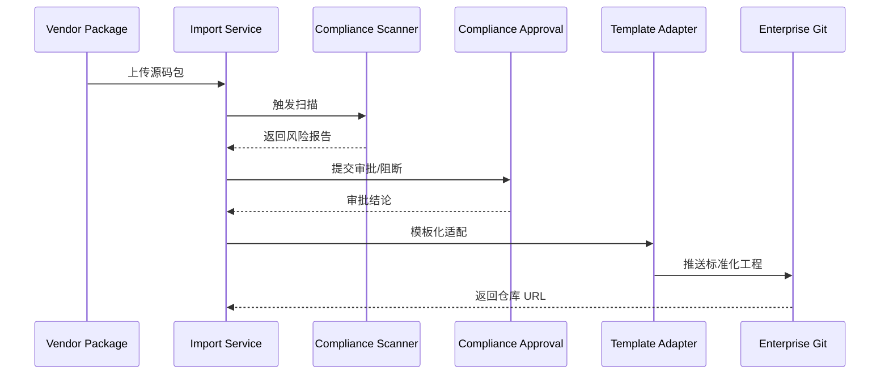

doc_id: UC-DEV-PLUGIN-THIRD-PARTY-IMPORT-001
scn_id: SCN-DEV-PLUGIN-INIT-001
title: 第三方源码导入与合规适配
status: Draft
version: v0.1.0
repo_key: powerx
scope: powerx
layer: security
domain: dev
scenario_title: "插件创建与工程初始化主场景"
owners:
  - name: Grace Lin
    role: Security & Compliance Lead
    contact: compliance@artisan-cloud.com
  - name: Michael Hu
    role: Plugin Tech Lead
    contact: tech@artisan-cloud.com
contributors: []
linked_requirements:
  - SCN-DEV-PLUGIN-THIRD-PARTY-IMPORT-001
code_refs:
  - repo: powerx
    path: internal/plugins/import/service/import_handler.go
    description: 源码包上传、解包、导入流程编排与审计
  - repo: powerx
    path: internal/compliance/scanner/license_scanner.go
    description: 许可证与漏洞扫描、风险评分与报告生成
  - repo: powerx
    path: internal/compliance/approval/workflow.go
    description: 合规审批流、阻断策略、通知与豁免同步
  - repo: powerx-plugin
    path: packages/template-registry/adapters/import_adapter.ts
    description: 模板映射与缺失 manifest/脚本补齐
feature_flags:
  - PX_PLUGIN_IMPORT
  - plugin-import-audit
  - compliance-workflow-v2
optional: false
last_reviewed_at: 2025-11-20

---

# Usecase Overview

- **业务目标**：让企业技术组在 15 分钟内安全导入第三方插件源码包，自动完成合规扫描、风险评估、模板化适配与 Git 注册，确保外部代码纳入可治理体系。
- **成功度量**：导入端到端耗时 ≤ 15 分钟；高危阻断及时率 100%；合规审批 SLA ≤ 30 分钟；适配后基础测试通过率 ≥ 95%。
- **场景关联**：对应主场景 `SCN-DEV-PLUGIN-INIT-001` Stage 3-4，衔接企业导入流程并为后续开发/运营提供安全基线。

> 自动化导入能力保证外部供应商代码在进入企业仓库前受到同级合规约束，降低许可证与安全风险。

# Context & Assumptions

- **前置条件**
  - 已启用 `PX_PLUGIN_IMPORT`、`plugin-import-audit`、`compliance-workflow-v2` Feature Flag。
  - 合规扫描服务具备 SPDX 解析、许可证库、漏洞数据库更新机制。
  - 企业 Git 平台开放导入 API，支持最小权限 PAT、审计钩子。
  - 供应商提供源码压缩包或仓库地址及基础说明（语言、依赖、许可证）。
- **输入/输出**
  - 输入：源码包/仓库地址、供应商信息、预期插件 ID、目标租户、审批备注。
  - 输出：风险报告、审批结论、标准化工程结构、Git 仓库 URL、审计条目。
- **边界**
  - 不负责供应商签约、合同管理；不覆盖 Marketplace 分发。
  - 若高危风险被阻断，需人工跟进（本用例记录但不自动解除）。
  - 对于二进制产物或缺失源码的包体不在处理范围。

# Solution Blueprint

## 体系分解

| 层 | 模块 | 责任 | 代码入口 |
|----|------|------|---------|
| 导入服务 | `internal/plugins/import/service/import_handler.go` | 上传/解包、元数据校验、流程编排、审计写入 | `services/import` |
| 合规扫描 | `internal/compliance/scanner/license_scanner.go` | SPDX 解析、许可证 & 漏洞扫描、报告生成 | `services/compliance/scanner` |
| 审批流 | `internal/compliance/approval/workflow.go` | 风险评级、审批路由、阻断策略、豁免同步 | `services/compliance/approval` |
| 模板适配 | `packages/template-registry/adapters/import_adapter.ts` | 补齐 manifest/权限、重构目录、生成 CI 脚本 | `packages/template-registry/adapters` |
| Git 集成 | `internal/plugins/import/service/git_publisher.go` | 注册仓库、推送初始提交、同步 CI/CD | `services/import` |

## 流程与时序

1. **Step 1 – 上传与预检**：导入服务校验文件大小、来源、Hash 与签名，生成导入任务。
2. **Step 2 – 合规扫描**：构建 SBOM，执行许可证/漏洞扫描，输出风险等级；若命中高危直接阻断并通知。
3. **Step 3 – 审批决策**：根据风险等级路由审批，支持双人审核、豁免记录、时间 SLA 监控。
4. **Step 4 – 模板适配**：审批通过后调用 `import_adapter` 补齐 manifest、权限声明、CI 脚本，输出差异建议。
5. **Step 5 – 仓库注册**：创建企业 Git 仓库、推送标准化工程、生成 `README`/适配清单，并落盘审计。

# Contracts & Interfaces

- **Inbound APIs / Events**
  - `POST /internal/plugins/import` — 接受文件上传或仓库 URL，返回导入任务 ID。
  - `GET /internal/plugins/import/{taskId}` — 查询导入状态、风险报告、审批记录。
- **Outbound 调用**
  - `POST /internal/compliance/licensescan`、`POST /internal/compliance/vulnscan` — 执行许可证与漏洞扫描。
  - `POST /internal/compliance/approval/submit` — 发起审批，字段含风险分级、扫描摘要、供应商信息。
  - `POST /internal/git/register` — 创建仓库、写入 Branch/CI 模板。
  - `EVENT plugin.import.blocked` — 高危阻断通知安全团队。
- **配置与脚本**
  - `config/compliance/external_source_policy.yaml` — 白名单、黑名单、风险判定阈值。
  - `scripts/workflows/import-smoke.mjs` — 导入流程自动回归、生成模拟报告。
  - `docs/standards/powerx-plugin/lifecycle/import-checklist.md` — 适配规范。

# Implementation Checklist

| 项目 | 描述 | 完成状态 | 负责人 |
|------|------|----------|--------|
| 上传链路加固 | 支持大文件分片、断点续传、签名校验 | [ ] | Michael Hu |
| SPDX 解析 | 扩展 SPDX 支持度、补齐供应商常用格式 | [ ] | Grace Lin |
| 审批自动化 | 建立 SLA 监控、逾时升级、豁免回写 | [ ] | Grace Lin |
| 模板适配脚本 | 支持多语言混合项目、差异报告生成 | [ ] | Michael Hu |
| 审计对账 | 导入任务全链路审计、报告归档、查询接口 | [ ] | Grace Lin |

# Testing Strategy

- **单元**：导入参数校验、扫描结果解析、审批状态机、适配脚本差异计算。
- **集成**：在沙箱环境执行 `scripts/workflows/import-smoke.mjs`，覆盖正常与高危阻断路径。
- **端到端**：复现 meta 文档用例 C-1/C-2，核对审批、阻断、审计信息。
- **非功能**：压测 2GB 包体上传、并发 10 个导入任务；注入恶意依赖、GPL 组件验证阻断与告警。

# Observability & Ops

- **指标**：`import.duration_ms`, `import.scan.blocked_total`, `import.approval.pending_total`, `import.adapter.failure_total`.
- **日志**：记录供应商、包名、风险级别、审批人、仓库 URL；敏感字段如许可证详情加密存储。
- **告警**：5 分钟内未开始扫描触发 P1；审批超时 30 分钟触发升级；阻断事件即时通知 `security-oncall`。
- **Dashboards**：Import Compliance Dashboard、审批 SLA 面板、审计检索界面。

# Rollback & Failure Handling

- **回滚步骤**：关闭 `PX_PLUGIN_IMPORT`，恢复手工导入流程；清理未完成的导入任务和临时文件。
- **补救措施**：提供 `import resume` 命令重新执行失败阶段；手动上传扫描报告并记录豁免。
- **数据修复**：运行 `scripts/workflows/import-reconcile.mjs` 对齐导入任务、Git 仓库与审计记录。

# Follow-ups & Risks

| 风险/事项 | 影响 | 缓解方案 | 负责人 | ETA |
|-----------|------|----------|--------|-----|
| 供应商拒绝提供 SPDX，扫描延迟 | 导入耗时超标 | 预置 SPDX 模板、允许合规团队手动补录 | Grace Lin | 2025-12-06 |
| 模板适配对 Python+Go 混合项目不完善 | 适配准确性、测试通过率 | 扩展适配脚本与测试样例 | Michael Hu | 2025-12-14 |

# References & Links

- 场景文档：`docs/scenarios/plugin-lifecycle/SCN-DEV-PLUGIN-THIRD-PARTY-IMPORT-001.md`
- 主场景：`docs/scenarios/plugin-lifecycle/SCN-DEV-PLUGIN-INIT-001.md`
- 背景材料：`docs/meta/scenarios/powerx/plugin-ecosystem/plugin-lifecycle/plugin-create-and-init/primary.md`
- 标准文档：`docs/standards/powerx-plugin/lifecycle/import-checklist.md`
