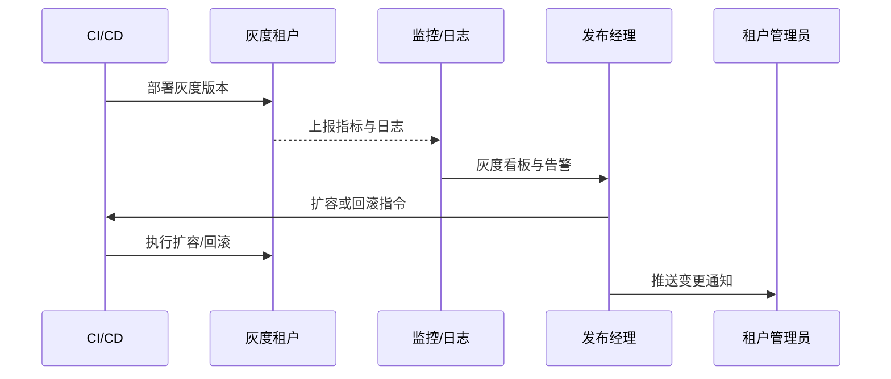

scn_id: SCN-DEV-PLUGIN-CICD-CANARY-001
title: CI/CD 灰度发布生产租户
status: Draft
version: v0.1.0
owners:
  - name: Matrix Ops
    role: Platform Ops Lead
    contact: ops@artisan-cloud.com
  - name: Alex Wei
    role: Release Automation Engineer
    contact: automation@artisan-cloud.com
domains: [dev]
layers: [service, ops]
repos:
  - key: powerx
    scope: core-platform
    responsibility: 发布管道、灰度策略编排、滚动扩容、回滚自动化
  - key: powerx-plugin
    scope: plugin-ecosystem
    responsibility: 运行健康检查脚本、指标埋点、通知模板与变更日志
related_usecases:
  - doc_id: UC-DEV-PLUGIN-CICD-CANARY-001
    layer: ops
    domain: ops
last_reviewed_at: 2025-11-20

---

# Executive Summary

该子场景聚焦批准版本在生产租户执行灰度发布的自动化流程。CI/CD 根据发布计划完成构建与签名后，将插件推送到指定的灰度分组，实时采集性能指标与错误率，发布经理依据阈值决定扩容或回滚。目标是在 30 分钟内完成灰度验证并扩容，异常时 5 分钟内自动回滚，确保 SLA 不受影响并沉淀监控与告警标准。

# Scope & Guardrails

- **In Scope**：灰度策略配置、部署执行、指标采集、回滚与扩容自动化、通知与变更日志同步。
- **Out of Scope**：测试租户验证、离线导入、Marketplace 审核、插件业务配置与计费流程。
- **Environment & Flags**：`publish-canary-orchestrator`、`plugin-gray-observability`、`rollback-automation`；依赖 CI/CD 平台、监控与日志系统、告警渠道、租户管理 API。

# Participants & Responsibilities

| Scope | Repository | Layer | 责任与交付物 | Owners |
|-------|------------|-------|--------------|--------|
| core-platform | powerx | service | 灰度编排、部署流水线、滚动扩容与回滚脚本、发布状态机 | Matrix Ops（Platform Ops Lead / ops@artisan-cloud.com） |
| ops | powerx | ops | 指标采集、告警阈值、运行报表、回滚决策支持 | Alex Wei（Release Automation Engineer / automation@artisan-cloud.com） |
| plugin-ecosystem | powerx-plugin | ops | 健康检查脚本、指标埋点、变更日志与租户通知模板 | Michael Hu（Plugin Tech Lead / tech@artisan-cloud.com） |

# End-to-End Flow

1. **Stage 1 – 灰度准备**：锁定发布计划与灰度分组，预热监控仪表盘与回滚策略。
2. **Stage 2 – 灰度部署**：CI/CD 将插件部署至灰度租户组，执行运行前检查并同步指标。
3. **Stage 3 – 观测与决策**：发布经理监控性能、错误率与用户反馈，判断扩容或回滚。
4. **Stage 4 – 全量与归档**：指标达标后扩容至全量，生成变更日志、通知与审计记录。

# Key Interactions & Contracts

- **APIs / Events**：`powerx publish deploy --strategy canary`、`POST /internal/publish/phase/{canary,full}`、`POST /internal/publish/rollback`、`EVENT publish.gray.alert`、`EVENT publish.gray.completed`.
- **Configs / Schemas**：`config/publish/canary_strategy.yaml`、`config/monitoring/publish_dashboards.json`、`docs/standards/powerx-plugin/integration/08_dev_console_and_ui/Common_Tasks_and_Troubleshooting.md`.
- **Security / Compliance**：发布指令需审批令牌；回滚操作全程审计；灰度期间需记录访问日志与指标数据，确保数据留存 ≥180 天。

# Usecase Links

- `UC-DEV-PLUGIN-CICD-CANARY-001` — 灰度发布与自动回滚。

# Acceptance Criteria

1. 灰度阶段核心指标偏差 <5%，错误率无显著上升，监控看板实时刷新。
2. 回滚策略演练通过，异常触发后 5 分钟内恢复旧版本并通知相关团队。
3. 全量发布后自动更新变更日志、租户通知与审计记录，SLA 指标保持在基线之上。

# Telemetry & Ops

- 指标：`publish.gray.duration_minutes`、`publish.gray.error_rate`、`publish.gray.rollback_total`、`publish.full.deployment_minutes`。
- 告警阈值：灰度错误率 >5%、指标缺失 >5 分钟、回滚失败、扩容耗时 >30 分钟。
- 观测来源：监控平台、日志聚合、CI/CD Telemetry、`workflow-metrics.mjs`。

# Open Issues & Follow-ups

| 风险/事项 | 影响范围 | 负责人 | ETA |
|-----------|----------|--------|-----|
| 与第三方监控的指标命名不一致，需要标准化映射 | 灰度观测一致性 | Alex Wei | 2025-12-14 |
| 回滚脚本仅覆盖单租户，需要扩展多租户并发 | 回滚可靠性 | Matrix Ops | 2025-12-22 |

# Appendix

- `docs/meta/scenarios/powerx/plugin-ecosystem/plugin-lifecycle/plugin-publish-and-release/primary.md#子场景-c`
- `config/publish/canary_strategy.yaml`
- `config/monitoring/publish_dashboards.json`
