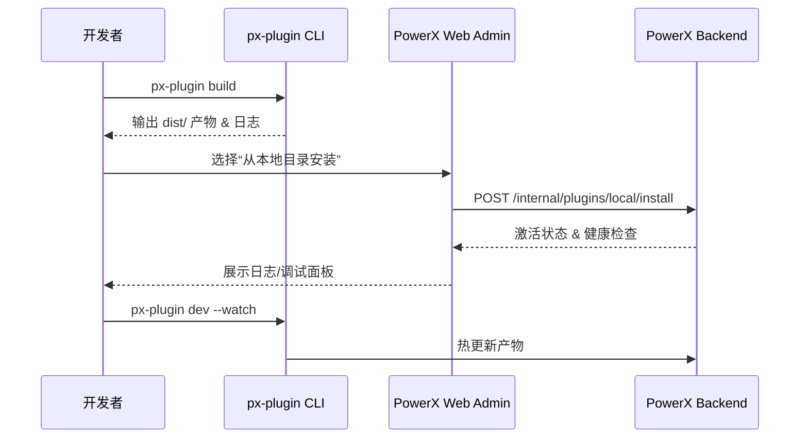

scn_id: SCN-DEV-PLUGIN-LOCAL-DEBUG-001
title: 开发者本地调试链路
status: Draft
version: v0.1.0
owners:
  - name: Michael Hu
    role: Plugin Tech Lead
    contact: tech@artisan-cloud.com
  - name: Lily Zhang
    role: Developer Experience Engineer
    contact: devexp@artisan-cloud.com
domains: [dev]
layers: [dev, app, ops]
repos:
  - key: powerx-plugin
    scope: plugin-ecosystem
    responsibility: `px-plugin build/dev` 命令、产物同步、调试日志工具
  - key: powerx
    scope: core-platform
    responsibility: 本地插件仓库、安装/激活接口、权限校验与审计
  - key: powerx-admin
    scope: admin-web
    responsibility: Web Admin 插件管理界面、健康检查、调试辅助面板
related_usecases:
  - doc_id: UC-DEV-PLUGIN-LOCAL-DEBUG-001
    layer: dev
    domain: dev
last_reviewed_at: 2025-11-20

---

# Executive Summary

该子场景确保插件开发者在正式发布前，能够在本地租户快速迭代、验证与调试插件。通过 `px-plugin build/dev` 生成产物、在 PowerX Web Admin 中执行“从本地目录安装”，并由 PowerX Backend 激活插件，实现分钟级的调试闭环。目标是让单轮迭代耗时 ≤15 分钟，调试日志与权限变更全程可追踪，为后续测试租户与发布流程提供稳定的基础。

# Scope & Guardrails

- **In Scope**：CLI 构建/调试命令、产物同步与清理、本地目录安装、插件激活/重载、调试日志聚合、权限模板提示。
- **Out of Scope**：远程测试租户部署、生产灰度与 Marketplace 发布、插件业务逻辑实现、本地模拟的支付/外部依赖。
- **Environment & Flags**：`px-plugin-local-dev`、`plugin-local-install` Feature Flag；依赖本地或内网 PowerX 环境、开发者 CLI 凭证、调试日志服务。

# Participants & Responsibilities

| Scope | Repository | Layer | 责任与交付物 | Owners |
|-------|------------|-------|--------------|--------|
| plugin-ecosystem | powerx-plugin | dev | CLI 构建/调试命令、产物缓存、热更新脚本、日志导出工具 | Michael Hu（Plugin Tech Lead / tech@artisan-cloud.com） |
| core-platform | powerx | ops | 本地安装与激活 API、权限校验、审计日志、健康检查接口 | Matrix Ops（Platform Ops Lead / ops@artisan-cloud.com） |
| admin-web | powerx-admin | app | Web Admin 插件管理界面、调试面板、健康检查展示 | Lily Zhang（Developer Experience Engineer / devexp@artisan-cloud.com） |

# End-to-End Flow

1. **Stage 1 – 构建与产物准备**：开发者运行 `px-plugin build/dev`，生成调试产物（如 `dist/`）并校验依赖。
2. **Stage 2 – 本地安装与激活**：通过 Web Admin 选择“从本地目录安装”，PowerX Backend 验证签名、版本与权限后激活插件。
3. **Stage 3 – 调试与热更新**：开发者在 Web Admin 或 CLI 中查看日志、执行热更新与接口验证，必要时回滚到上一版本。
4. **Stage 4 – 记录与归档**：调试完成后导出日志、记录变更与权限模板，并准备提交测试租户发布申请。

# Key Interactions & Contracts

- **APIs / Events**：`px-plugin build`、`px-plugin dev --watch`、`POST /internal/plugins/local/install`、`POST /internal/plugins/local/reload`、`EVENT plugin.local.debug.updated`。
- **Configs / Schemas**：`config/plugin/local_dev.yaml`、`config/plugin/permissions_minimal.json`、`docs/standards/powerx-plugin/dev/Local_Debug_Checklist.md`。
- **Security / Compliance**：本地安装需要开发者凭证与最小权限模板；调试日志脱敏后存储；操作写入审计以便回溯。

# Usecase Links

- `UC-DEV-PLUGIN-LOCAL-DEBUG-001` — 开发者本地调试与快速迭代保障。

# Acceptance Criteria

1. 单次构建+安装迭代 ≤ 15 分钟，失败重试保留日志与错误分类。
2. 本地安装需验证签名与权限模板，审计日志记录操作者、时间与版本。
3. 调试面板提供实时日志、健康检查与权限提示；热更新成功率 ≥ 95%。

# Telemetry & Ops

- 指标：`plugin.local.iteration_cycle_time`、`plugin.local.install_success_rate`、`plugin.local.hot_reload_success_rate`。
- 告警阈值：连续三次安装失败、热更新成功率 <95%、调试日志写入失败率 >5%。
- 观测来源：CLI 遥测、PowerX Backend 调试日志、`workflow-metrics.mjs` 本地模式上报。

# Open Issues & Follow-ups

| 风险/事项 | 影响范围 | 负责人 | ETA |
|-----------|----------|--------|-----|
| Windows/Mac 本地路径兼容性差异需统一校验 | 跨平台调试体验 | Lily Zhang | 2025-12-18 |
| 权限模板提示仅支持中文，需补充英文文案 | 国际团队调试体验 | Michael Hu | 2025-12-25 |
| 热更新日志未完全脱敏，存在泄露风险 | 安全合规 | Grace Lin | 2025-12-22 |

# Appendix

- `docs/meta/scenarios/powerx/plugin-ecosystem/plugin-lifecycle/plugin-publish-and-release/primary.md`
- `config/plugin/local_dev.yaml`
- `docs/standards/powerx-plugin/dev/Local_Debug_Checklist.md`
