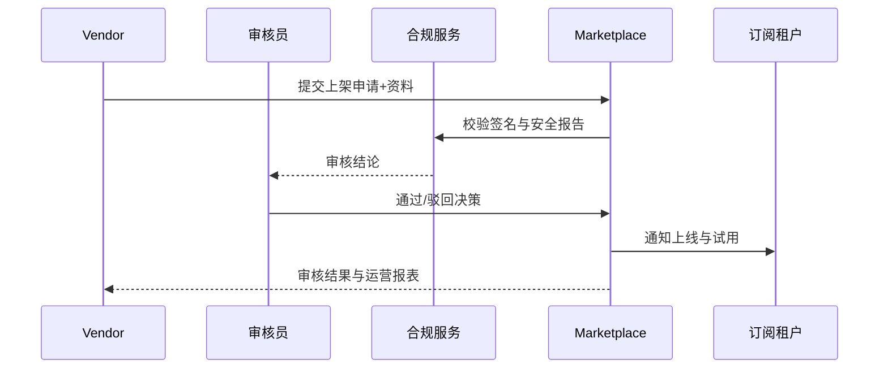

scn_id: SCN-DEV-PLUGIN-MARKETPLACE-LISTING-001
title: Marketplace 审核与上架
status: Draft
version: v0.1.0
owners:
  - name: Ivy Chen
    role: Marketplace Operations Lead
    contact: marketplace@artisan-cloud.com
  - name: Grace Lin
    role: Security & Compliance Lead
    contact: compliance@artisan-cloud.com
domains: [dev]
layers: [marketplace, security]
repos:
  - key: powerx-marketplace
    scope: marketplace
    responsibility: 上架审核工作流、元数据管理、订阅通知与运营报表
  - key: powerx
    scope: core-platform
    responsibility: 发布记录同步、签名与安全报告验证、审核结果回写
related_usecases:
  - doc_id: UC-OPS-PLUGIN-MARKETPLACE-LISTING-001
    layer: marketplace
    domain: ops
last_reviewed_at: 2025-11-20

---

# Executive Summary

该子场景聚焦插件在 Marketplace 提交审核、合规评估、上架发布与订阅通知的全流程。Vendor 在发布控制台填写定价、功能亮点、截图与支持政策，提交签名与安全报告；Marketplace 审核员校验资料、签名与合规性后批准并上架，系统同步元数据、生成运营报表并通知订阅租户。目标是在 3 个工作日内完成审核，确保资料一致、签名有效，并持续监控转化与留存指标。

# Scope & Guardrails

- **In Scope**：上架申请、资料与签名校验、合规审查、列表同步、订阅通知、初始运营报表、审核审计。
- **Out of Scope**：Marketplace 计费与分成结算、插件运行时配置、外部渠道推广与广告、合同签署流程。
- **Environment & Flags**：`marketplace-review-v2`、`marketplace-metadata-sync`、`plugin-marketplace-telemetry`；依赖 Marketplace 管理系统、签名验证服务、发布记录库、通知服务与运营报表平台。

# Participants & Responsibilities

| Scope | Repository | Layer | 责任与交付物 | Owners |
|-------|------------|-------|--------------|--------|
| marketplace | powerx-marketplace | marketplace | 审核流程、资料管理、列表展示、订阅通知、运营报表 | Ivy Chen（Marketplace Operations Lead / marketplace@artisan-cloud.com） |
| security | powerx | security | 签名与安全报告校验、合规 checklist、审计与风控策略 | Grace Lin（Security & Compliance Lead / compliance@artisan-cloud.com） |
| vendor-support | powerx-marketplace | marketplace | Vendor 指引、资料模板、审核沟通与 SLA 跟踪 | Leo Wang（Vendor Success Manager / vendor@artisan-cloud.com） |

# End-to-End Flow

1. **Stage 1 – 上架申请提交**：Vendor 填写插件元数据、定价、支持策略并上传签名与安全报告。
2. **Stage 2 – 合规与签名审核**：审核员校验资料完整性、签名有效性与安全扫描结果，必要时补充材料。
3. **Stage 3 – 上架与同步**：审批通过后同步 Marketplace 列表、设置可见范围、生成通知与初始运营报表。
4. **Stage 4 – 运营监控与反馈**：追踪下载量、订阅率与退订率，监控合规风控事件并与发布记录对齐。

# Key Interactions & Contracts

- **APIs / Events**：`POST /marketplace/listing/apply`、`POST /marketplace/listing/review`、`POST /marketplace/listing/publish`、`EVENT marketplace.listing.approved`、`EVENT marketplace.listing.rejected`.
- **Configs / Schemas**：`config/marketplace/listing_form.yaml`、`config/marketplace/review_checklist.yaml`、`docs/standards/powerx-plugin/integration/04_security_and_compliance/Plugin_Security_Checklist.md`.
- **Security / Compliance**：资料需通过签名与安全报告验证；驳回需记录理由与处理人；审核日志与运营数据需与发布记录对齐并保留 ≥ 365 天。

# Usecase Links

- `UC-OPS-PLUGIN-MARKETPLACE-LISTING-001` — Marketplace 审核与上架同步。

# Acceptance Criteria

1. 审核 SLA ≤3 个工作日，通过率与拒绝原因可追踪；资料缺失需在 24 小时内反馈给 Vendor。
2. 上架后 Marketplace 列表信息与发布版本一致，可搜索、预览且支持试用/订阅流程。
3. 审核稳态运行，安全与合规报告有效，驳回动作自动记录审计并通知相关团队。

# Telemetry & Ops

- 指标：`marketplace.listing.approval_rate`、`marketplace.listing.sla_hours`、`marketplace.listing.conversion_rate`、`marketplace.listing.rejection_total`.
- 告警阈值：审核 SLA 超时、签名校验失败、驳回率异常升高、订阅转化率低于预期阈值。
- 观测来源：Marketplace 审核日志、运营报表、通知系统、`workflow-metrics.mjs`。

# Open Issues & Follow-ups

| 风险/事项 | 影响范围 | 负责人 | ETA |
|-----------|----------|--------|-----|
| 多语言资料模板缺失，国际租户提交困难 | 审核效率 | Leo Wang | 2025-12-06 |
| 安全报告格式不统一，影响自动校验 | 合规准确性 | Grace Lin | 2025-12-15 |

# Appendix

- `docs/meta/scenarios/powerx/plugin-ecosystem/plugin-lifecycle/plugin-publish-and-release/primary.md#子场景-d`
- `config/marketplace/review_checklist.yaml`
- `config/marketplace/listing_form.yaml`
