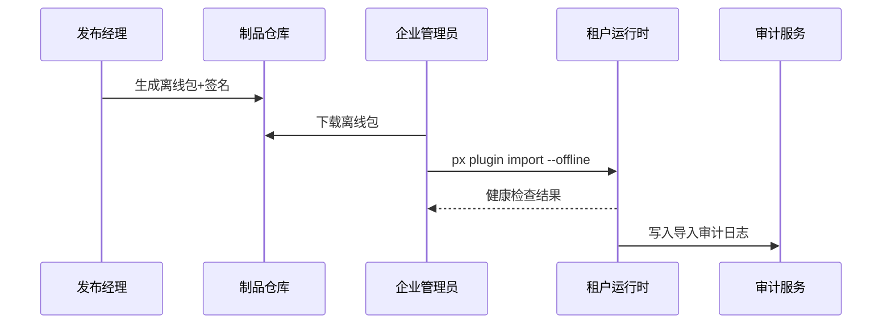

scn_id: SCN-DEV-PLUGIN-OFFLINE-IMPORT-001
title: 离线包导入隔离环境
status: Draft
version: v0.1.0
owners:
  - name: Matrix Ops
    role: Platform Ops Lead
    contact: ops@artisan-cloud.com
  - name: Erin Xu
    role: Enterprise Tenant Admin Lead
    contact: admin@artisan-cloud.com
domains: [dev]
layers: [ops, security]
repos:
  - key: powerx
    scope: core-platform
    responsibility: 离线包生成、签名与校验、导入编排、健康检查脚本
  - key: powerx-plugin
    scope: plugin-ecosystem
    responsibility: 离线依赖打包、校验文件、导入脚本与回滚策略
related_usecases:
  - doc_id: UC-DEV-PLUGIN-OFFLINE-IMPORT-001
    layer: ops
    domain: ops
last_reviewed_at: 2025-11-20

---

# Executive Summary

该子场景面向隔离网络或弱网环境的企业租户，描述从生成签名离线包、分发到导入、健康检查与审计回写的全流程。发布经理在 CI/CD 中生成包含制品、依赖、校验文件的离线包，企业管理员通过 `px plugin import --offline` 完成导入，系统校验签名与兼容性并执行健康检查。目标是在 10 分钟内完成导入且成功率 ≥98%，异常时可自动回滚并记录审计日志。

# Scope & Guardrails

- **In Scope**：离线包生成与分发、签名与校验、依赖打包、导入编排、健康检查、审计与回滚。
- **Out of Scope**：在线渠道推送、Marketplace 上架、租户自定义部署脚本、插件业务逻辑配置。
- **Environment & Flags**：`plugin-offline-distribution`、`plugin-signature-guard`、`offline-import-healthcheck`；依赖制品仓库、签名服务、内网分发库、审计平台。

# Participants & Responsibilities

| Scope | Repository | Layer | 责任与交付物 | Owners |
|-------|------------|-------|--------------|--------|
| core-platform | powerx | ops | 离线包生成流程、签名校验、导入编排、健康检查、审计落库 | Matrix Ops（Platform Ops Lead / ops@artisan-cloud.com） |
| plugin-ecosystem | powerx-plugin | ops | 依赖清单、导入脚本、回滚策略、导入前后版本比对 | Michael Hu（Plugin Tech Lead / tech@artisan-cloud.com） |
| security | powerx | security | 证书托管、签名验证、许可证状态检查、告警规则 | Grace Lin（Security & Compliance Lead / compliance@artisan-cloud.com） |

# End-to-End Flow

1. **Stage 1 – 离线包生成与分发**：CI/CD 生成签名离线包、校验文件与依赖说明，并上传内网分发库。
2. **Stage 2 – 导入准备与校验**：企业管理员下载包体，校验签名指纹、版本兼容性与许可证状态。
3. **Stage 3 – 导入与部署**：执行离线导入命令，系统解压、部署并运行健康检查脚本。
4. **Stage 4 – 启用与审计**：确认服务状态、启用新版本、记录导入人/时间/指纹，并在失败时自动回滚。

# Key Interactions & Contracts

- **APIs / Events**：`px publish package --offline`、`px plugin import --offline`、`POST /internal/offline/signature/verify`、`EVENT plugin.offline.rollback`.
- **Configs / Schemas**：`config/publish/offline_package.json`、`config/plugins/offline/dependencies.yaml`、`scripts/healthcheck/offline-import.mjs`.
- **Security / Compliance**：离线包必须签名并附带证书指纹；导入需记录操作者与时间；失败自动回滚并触发告警；许可证有效性验证不可跳过。

# Usecase Links

- `UC-DEV-PLUGIN-OFFLINE-IMPORT-001` — 离线包生成与隔离环境导入。

# Acceptance Criteria

1. 离线导入成功率 ≥98%，总耗时 <10 分钟，健康检查全部通过后方可启用。
2. 签名或许可证校验失败时流程终止，旧版本保持运行并发送安全告警。
3. 审计日志包含导入人、时间、版本、证书指纹与回滚结果，日志保留 ≥180 天。

# Telemetry & Ops

- 指标：`publish.offline.package_generated_total`、`publish.offline.import_success_rate`、`publish.offline.rollback_total`、`publish.offline.healthcheck_duration_ms`.
- 告警阈值：签名校验失败、导入失败率 >2%、健康检查超时 >5 分钟、回滚触发连续 2 次。
- 观测来源：CI/CD 产物日志、离线分发库审计、租户运行时日志、`workflow-metrics.mjs`。

# Open Issues & Follow-ups

| 风险/事项 | 影响范围 | 负责人 | ETA |
|-----------|----------|--------|-----|
| 大体积包下载耗时长，需支持断点续传与增量包 | 隔离环境导入效率 | Matrix Ops | 2025-12-18 |
| 部分租户缺乏统一健康检查脚本，需要补齐标准模板 | 启用验收 | Erin Xu | 2025-12-08 |

# Appendix

- `docs/meta/scenarios/powerx/plugin-ecosystem/plugin-lifecycle/plugin-publish-and-release/primary.md#子场景-b`
- `config/publish/offline_package.json`
- `scripts/healthcheck/offline-import.mjs`
